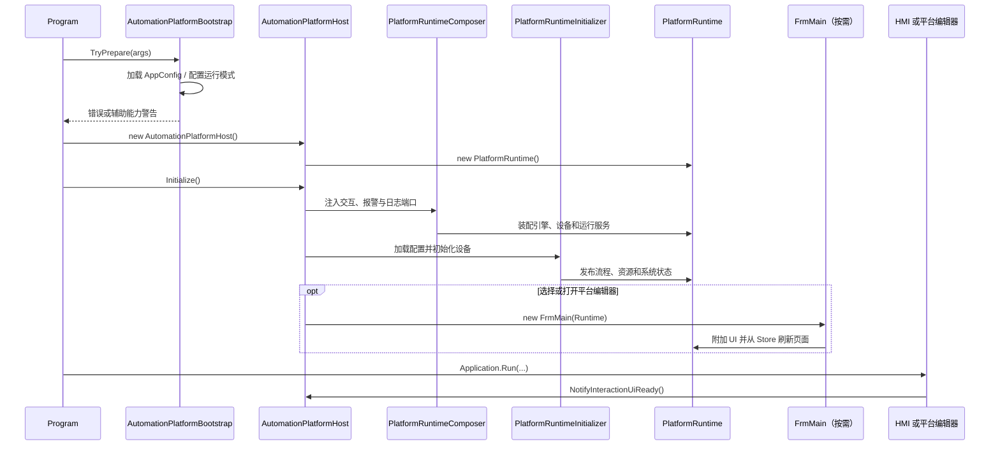

# 启动与生命周期

## 两个进程入口，一个平台宿主

平台仓库入口是 [`Application/Program.cs`](../../Application/Program.cs)，独立设备工程入口是 `../DeviceProject/Program.cs`。两者都先准备配置，再创建 `AutomationPlatformHost`。差异只在最终显示平台编辑器还是各自的 HMI；流程内核、配置目录和安全规则仍属于同一个宿主实例。

## 启动步骤

1. `AutomationPlatformBootstrap.TryPrepare` 初始化全局异常日志，加载或补齐 `AppConfig.json`，并解析唯一合法的启动参数组合。
2. Goose 或 Git 不可用只产生 EW-AI 辅助能力降级，不阻断 HMI 和流程平台初始化。
3. `AutomationPlatformHost` 创建自己的 `PlatformRuntime`，状态从 `Created` 进入 `Initializing`。
4. Host 校验配置目录与 `Work/*.json` 连续索引，创建不依赖 `FrmMain` 的 WinForms 交互协调器和运行日志缓冲。
5. `PlatformRuntimeComposer` 选择真实运动控制或仿真网关，创建 `EngineContext`、`ProcessEngine`、手动运动、设备协调器并回填同一个 `PlatformRuntime`。
6. `PlatformRuntimeInitializer` 恢复未完成事务，加载流程、变量、运动卡、IO、工站、数据结构、通讯、报警和 PLC；随后由 `PlatformDeviceCoordinator` 初始化运动卡/仿真和轴监视，由 `PlatformSystemStatusService` 维护状态变量。
7. Host 进入 `Ready`。如果流程配置故障或安全锁已生效，平台仍可进入界面，但启动闸门保持关闭。
8. 视图显示后调用 `NotifyInteractionUiReady`，此时才允许自动启动流程和展示待处理交互弹窗。

## HMI 与平台编辑器模式

| `StartupView` | 可见主窗体 | 平台编辑器实例 | AI 基础设施 |
| --- | --- | --- | --- |
| HMI | 内置或设备工程 HMI | 不创建；用户打开平台编辑器时按需创建 | 正常 HMI 启动不主动启动；打开平台编辑器或 AI 页面时按需启动 |
| PlatformEditor | `FrmMain` | 启动视图确定后创建并附加已初始化运行时 | `FrmMain.Shown` 后按需启动 Bridge/MCP |

HMI 只能通过 `IAutomationPlatform` 调用流程、变量和窗口能力。设备工程不得直接拿 `PlatformRuntime`、Store、引擎或运动对象。

## 生命周期状态

| 状态 | 含义 | 允许的关键动作 |
| --- | --- | --- |
| `Created` | Host 已创建，平台尚未初始化 | `Initialize` |
| `Initializing` | 配置和运行时正在装配 | 不接受重复初始化 |
| `Ready` | 平台可用；具体流程仍需通过 readiness 和安全闸门 | 读写 SDK、流程控制、显示编辑器 |
| `Faulted` | 平台实例存在但关键状态异常 | 允许读取和停止，不允许新的危险控制 |
| `ShuttingDown` | 正在安全释放 | 幂等等待，不再接受启动 |
| `Stopped` | 已释放 | 无 |

状态定义和转换以 `AutomationPlatformHost` 为准。

## 降级与失败原则

- 配置文件或字段缺失时，由对应 Storage 按当前契约生成默认值并持久化。
- 已有值格式错误或越界时不猜测修复；平台尽量进入 HMI，受影响能力降级并报警。
- 流程配置加载或校验异常时设置 `ProcConfigFaulted`，停止全部流程并禁止启动，但不因该故障跳过 HMI 创建。
- 运动卡、通讯、PLC、AI 等子系统故障不得让可创建的 HMI 消失；危险动作必须保持关闭。

## 安全关闭顺序

纯 HMI 模式由 `AutomationPlatformHost.ShutdownRuntimeCore` 释放运行时；已经创建编辑器时，`FrmMain.ShutdownPlatform` 还负责先释放编辑器专属资源。共同顺序为：

1. 标记关闭只执行一次，停止所有流程和手动运动入口。
2. 关闭断点、诊断和性能窗口。
3. 先释放 Goose 客户端，再停止 MCP 和 Bridge，避免 UI 同步调用与子进程读取线程互锁。
4. 停止轴监视任务并等待流程进入 `Stopped`，超时后记录错误并继续释放。
5. 保存需要在退出时落盘的变量、数据结构和报警状态。
6. 释放 PLC、通讯、运动连接、黑匣子和流程引擎。
7. 如果编辑器已创建则关闭并释放 `FrmMain`；Host 进入 `Stopped`。

关闭链当前包含有限时同步等待；其进一步解耦记录在技术债清单中。
