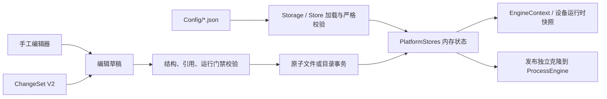

# 配置与持久化

## 总体数据流

配置文件、编辑态内存和运行态对象不是同一个层次。正常提交顺序应是：草稿校验成功、持久化成功、更新正式内存、发布运行态；任何一步失败都要保留或恢复提交前状态。

## 路径与配置集合

`PlatformPaths` 在 `PlatformRuntime` 创建时确定路径并保持不变：

- `ConfigPath` 默认是当前可执行文件目录下的 `Config/`。
- `WorkPath` 是 `Config/Work/`。
- 独立设备工程使用自身可执行文件旁的 `Config/`，不会共享平台编辑器输出目录。
- 运行日志统一写入 `D:\AutomationLogs\`，不写入配置目录。

## 当前配置所有权

| 配置 | 当前内存所有者 | 主要加载/保存入口 | 运行时消费者 |
| --- | --- | --- | --- |
| `AppConfig.json` | `AppConfigStorage` 缓存 | `AutomationPlatformBootstrap` | 启动模式、诊断和性能开关 |
| `GooseConfig.json` | `GooseConfigStorage` | Bootstrap、AI 基础设施 | Goose、MCP 管理器、AI 前台 |
| `Work/*.json` | `ProcessDefinitionRepository.Items` | `ProcessWorkDirectoryTransaction.Load/Rebuild`、`ProcessEditingService`、`ProcessVariableConfigurationTransaction` | `ProcessEngine.Context.Procs` 的发布克隆 |
| `value.json` | `ValueConfigStore` | Store 自身事务方法 | 流程、HMI、PLC、运动复位闸门 |
| `DataStruct.json` | `DataStructStore` | Store 自身事务方法 | 数据结构指令 |
| `AlarmInfo.json` | `AlarmInfoStore` | Store 自身 | 报警指令和界面 |
| `card.json` | `CardConfigStore` | Store 自身；`Card/Axis` 是独立配置模型 | `MotionCtrl`、轴监视和编辑器 |
| `IOMap.json` | `IoConfigurationStore` | `Load/TryCommit` | `EngineContext.IoMap`、IO 指令 |
| `DataStation.json` | `StationDefinitionStore` | `Load/TryCommit/TryPersistCurrent` | 工站运动和编辑器 |
| `IODebugMap.json` | `IoDebugConfigurationStore` | `IoDebugConfigurationEditorService` 构造草稿，Store `Load/TryCommit` | IO 调试页 |
| `value_debug.json` | `ValueDebugConfigurationStore` | `VariableDebugService` 以稳定 `VariableId` 提交候选快照，Store `Load/TryCommit` | 变量调试页；已删除变量保留为可移除的失效项，不按槽位重绑定 |
| `SocketInfo.json`、`SerialPortInfo.json` | `CommunicationConfigStore` | Store 自身 | `CommunicationHub`、通讯指令 |
| `PlcConfig.json` | `PlcConfigStore` | Store 自身 | `PlcRuntimeService`、PLC 指令 |

窗体和 Bridge 只向 Store 提交候选快照，不直接调用 `AtomicJsonFileStore`。`ArchitectureBoundaryRegression.ps1` 固化了这条边界。

## 流程配置的三个相近名称

这三个类型目前职责不同，阅读时不要混为一个 Store：

| 类型 | 实际职责 |
| --- | --- |
| `ProcessDefinitionRepository` | 当前可编辑流程定义的内存事实源；提供整体替换和深克隆快照。 |
| `ProcessWorkDirectoryTransaction` | `Work/` 连续索引目录的整体重建、交换与断电恢复；它是目录事务工具。 |
| `ProcessRuntimeControl` | 对 `ProcessEngine` 的启动、暂停、继续、单步、停止和快照做窄接口投影；它不管理磁盘。 |

## 流程保存的两条当前路径

### 单流程草稿提交

`ProcessEditingService.TryCommitProcDraft` 用于手工编辑的单流程提交：

1. 检查 UI、引擎、安全锁和维护锁。
2. 克隆提交前对象，归一化并校验流程、稳定 ID 和跳转目标。
3. 用独立克隆验证运行时发布。
4. 原子保存对应 `Work/{index}.json`。
5. 更新 `ProcessDefinitionRepository`，发布到 `ProcessEngine`。
6. 发布失败时恢复文件、正式内存和运行时；回滚不完整则进入安全锁。

### 结构重排或多对象提交

- 手工增删、复制和重排流程使用 `ProcessWorkDirectoryTransaction.Rebuild`，通过 `Work_tmp`、`Work_bak` 和 `.complete` 做目录交换与启动恢复。
- 流程与变量的联合写入由 `ProcessVariableConfigurationService` 统一协调刷新、历史和失败回滚，底层使用 `ProcessVariableConfigurationTransaction`；AI ChangeSet 和手工流程编辑复用同一应用服务与持久化事务。
- `FrmMain.InitializePlatform` 在读取正式配置前先恢复这两类未完成事务。

IO 调试页不直接修改 Store 的正式快照。`IoDebugConfigurationEditorService` 克隆当前 `IODebugMap`，在草稿上完成选择、备注、排序和输入输出关联，再通过 `IoDebugConfigurationStore.TryCommit` 原子替换正式内存；提交失败时窗体继续显示原快照。

## 缺失、错误与运行就绪

三种状态要分开处理：

| 状态 | 保存 | 启动 | 处理方式 |
| --- | --- | --- | --- |
| 文件或字段缺失 | 允许补默认值并落盘 | 取决于补齐后的配置 | 自动生成当前契约默认值 |
| 结构可保存但业务未补齐 | 允许 | 不允许 | 标为 `incomplete`，由 `ProcessReadinessService` 返回阻塞项 |
| 已有值格式错误或违反约束 | 拒绝相关提交或加载 | 不允许受影响功能 | 明确报警并按范围降级，不做宽松解析 |

## 当前必须遵守的持久化原则

- 正式配置只在校验和持久化都成功后替换。
- Store 向运行时暴露的长期引用需要原地更新时，不应偷偷替换容器对象。例如 `IoConfigurationStore.ByName` 会原地重建索引。
- 配置值和运行值分层；修改变量定义不能顺便把当前运行值重置为初始值。
- 跨多个文件的变更必须走事务，不允许逐文件成功一半。
- 回滚结果不可验证时进入安全锁，不能继续假装配置一致。

集中持久化所有权已经完成；发现新的直接文件写入或半提交路径时，按[技术债清单](07-技术债清单.md)的证据门槛重新登记。
