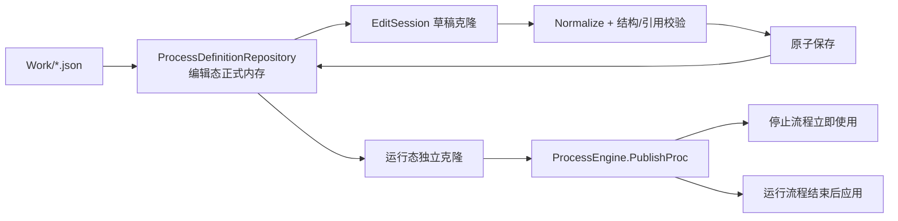
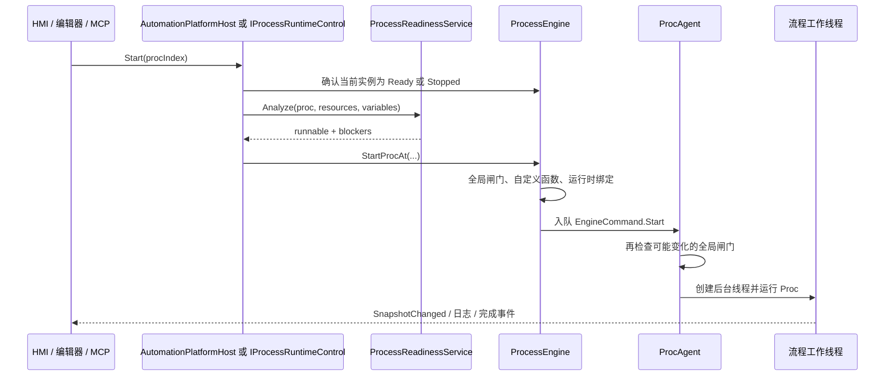

# 流程编辑与运行

## 模型与身份

平台核心模型是 `Proc -> Step -> OperationType`。显示索引用于当前界面定位，跨编辑阶段的身份使用稳定 `Guid`：

- 流程：`proc.head.Id`
- 步骤：`step.Id`
- 指令：`operation.Id`

物理索引会因插入、删除和重排改变。AI ChangeSet 内可以用局部 `key` 关联同阶段新对象，但提交后必须读取 `createdObjects/affectedProcesses` 返回的稳定身份，不能继续把预演索引当成正式身份。

## 编辑态与运行态

编辑器不直接修改正在执行的对象。`ProcessDefinitionRepository` 保存可编辑正式定义，发布给引擎的始终是独立克隆。

运行中的流程可以接收一个待应用的新修订：`PublishProc` 更新引擎的已发布定义并记录 revision，但当前执行句柄继续使用启动时对象；流程进入非活动状态后 `ApplyPendingUpdateAfterStop` 才将新定义应用到该句柄。这样不会在指令执行中途替换对象图。

## 手工编辑链

1. 窗体根据当前选择创建对象图克隆。
2. `EditorSessionCoordinator.Begin` 持有一个活动 `EditSession<T>`。
3. Inspector 修改草稿；撤销和重做只作用于草稿或已记录的正式提交快照。
4. 保存时进入对应应用服务。流程草稿统一走 `ProcessEditingService.TryCommitProcDraft`。
5. 提交服务处理 ID、跳转重写、结构验证、文件事务、运行时发布和 UI 刷新。
6. 失败时活动草稿仍可修正；正式状态不应被部分修改。

`ProcessEditingPolicy` 负责判断某流程当前是否允许结构编辑。窗体不应各自复制运行状态判断。

## 流程启动链

重复启动未结束流程属于错误。`TryValidateProcessInactive` 返回当前真实状态并保留原实例，不通过强制结束再重启来掩盖生命周期问题。

## 启动闸门分层

### 全局闸门

`ProcessEngine.TryValidateStartGate` 检查：

- 是否正在执行配置维护；
- 是否处于安全锁；
- 流程配置是否已故障；
- 设备配置还原后是否要求重启。

### 单流程就绪

`ProcessReadinessService.Analyze` 检查当前流程是否存在启用的可执行指令，以及变量、报警、流程引用、跳转、通信重试与结果判定和指令运行必填项是否满足。其结果区分 `ready`、`incomplete`、`invalid`，并给出明确的 `RunBlockers`。

### 运动指令闸门

运动类指令还要检查复位状态、运动配置重启标记、卡和轴状态、回原、伺服报警、急停以及轴/坐标系资源占用。详见[运动控制与安全](06-运动与安全.md)。

## 运行内核

- 每个流程索引由一个 `ProcAgent` 串行处理启动、暂停、继续、单步和停止命令。
- 一个活动执行上下文包含 `ProcHandle`、`ProcessControl`、等待器和工作线程。
- `ProcessControl` 以取消、暂停和单步信号协调执行，不依赖 `Application.DoEvents`。
- 指令由 `ProcessEngine.ExecuteOperation` 分发到 `ProcessEngine.Operations.*` 的类型实现。
- `CT探针` 只在流程图的显式业务位置取样，使用单调时钟按当前 `runId + TaskKey` 隔离任务；样本同步事件化并保留每个任务的最新值，不依赖位置快照或轮询，因此快速流程的开始和分段也不会丢失。最新值进入运行快照的 `cycleTimeSamples`，每次样本同时进入有界运行黑匣子；正常热路径不直接写盘。
- 重试只属于 TCP/串口发送、接收、发送并接收以及 PLC 读写数据通信指令。`RetryCount` 表示首次通信后的额外重试次数，范围0..10；`RetryIntervalMs` 是每次失败后的固定间隔，不使用退避。可重试失败仅包括掉线、超时、无回应、通讯运行时异常，以及接收数据不满足显式结果条件；本地配置或变量错误不重试。`RetryCount=0` 时只通信一次并跳过结果判定，最终失败才进入原有 `AlarmType` 策略。
- 流程非活动状态分为 `Ready` 和 `Stopped`：初始状态与自然完成进入 `Ready`；人工停止、外部停止和异常终止进入 `Stopped`。二者都允许再次启动和编辑，但不能合并判断。“等待流程状态”的“等待就绪”模式只允许选择“运行”或“就绪”，绝不把 `Stopped` 当成可等待的正常结果；需要区分结果时使用“状态跳转”或“获取状态”。
- “等待流程状态”三个工作模式互斥：“等待就绪”保留多目标集合，每个目标可分别选择“运行”或“就绪”，所有条件满足后使用统一完成后延时；“状态跳转”使用一个单一目标，将 `Ready`、`Alarming/Stopped`、其余活动或过渡状态分别送往就绪、异常、运行中地址；“获取状态”使用一个单一目标，将完整 `ProcRunState` 写入变量，`double` 保存0..7数值，`string` 保存枚举英文名称。
- `EngineSnapshot` 是 UI、SDK、诊断和 AI 读取运行状态的统一投影。步骤或指令位置变化只标记当前活动流程，按 UI 节流周期合并发布；无位置变化时不重复创建快照。性能与存活指标使用独立低频心跳，且只扫描活动 `ProcAgent`。启动、报警、停止和完成仍通过明确状态快照或生命周期事件发布，快速流程不依赖心跳才能被观察。
- 流程完成、失败和停止都会释放所占运动资源；停止失败或设备状态不可确认时进入安全锁。

## 保存、验证和运行不是一回事

| 证据 | 能证明什么 | 不能证明什么 |
| --- | --- | --- |
| 配置提交成功 | 当前阶段已持久化并发布 | 流程具备全部运行条件 |
| `validate_proc` | 结构和引用可验证 | 实机行为正确 |
| `readinessStatus/runnable` | 当前资源事实下允许启动 | 流程已实际运行完成 |
| `run_proc_test` | 有界窗口内的实际观测 | 长时间生产稳定性 |

任何调用方都不应把这四层合并成一个“全部完成”的结论。
