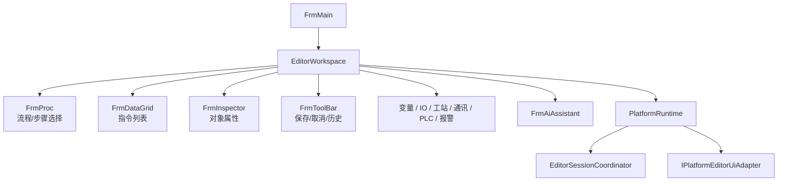

# 平台编辑器

## 当前组成

`FrmMain` 是按需创建的平台编辑器主窗体。它创建流程树、指令表格、Inspector、变量、IO、运动、通讯、报警、日志和 AI 等页面，并把它们装入主工作区；它不再是 HMI 运行时初始化的前置条件。设备与流程内核构造位于 `PlatformRuntimeComposer`，配置/设备初始化位于 Runtime 服务，流程弹窗实现与通用页面宿主位于 `UI/`。

`EditorWorkspace` 是窗体协作对象。参与者实现 `IEditorWorkspaceParticipant` 后获得同一个 workspace 实例，通过明确属性访问兄弟页面和 `PlatformRuntime`，不再读取静态窗体字段。

## 两条协作边界

### UI 内部：`EditorWorkspace`

用于已知属于平台编辑器的窗体之间协作，例如流程树选择改变后刷新指令表格、Inspector 和导航历史。它允许 UI 代码承认 WinForms 结构，但仍要求实例显式传递。

### 非 UI 模块：`IPlatformEditorUiAdapter`

Bridge、Store 或应用服务需要选择上下文、刷新页面、写信息日志或显示确认时，通过 UI 适配器表达意图。非 UI 模块不应持有 `FrmMain`、`FrmProc` 等具体窗体。

适配器当前由 `WinFormsPlatformEditorUiAdapter` 实现，集中处理 UI 线程和具体页面调用。这是后续更换界面实现或进行无界面测试的主要隔离缝。

## 编辑会话

`EditorSessionCoordinator` 保证同一实例只有一个活动编辑会话：

- `Begin`：开始草稿编辑，并清理上一个会话。
- `ReplaceDraft/CaptureSnapshot`：更新草稿及会话内历史。
- `TryUndo/TryRedo`：回放草稿快照或正式提交历史。
- `TryCommit`：执行会话注入的校验和提交动作。
- `Cancel/End`：丢弃草稿并恢复 Inspector、工具栏状态。

`EditSession<T>` 本身不理解流程、IO 或工站规则；具体业务提交应由对应服务或 Store 实现，避免把校验复制进通用会话容器。

## UI 线程规则

- Host 生命周期和窗口操作必须在创建 Host 的 UI 线程执行。
- 引擎和设备后台事件通过 `BeginInvoke` 或 SDK 事件分发回 UI。
- 快照先进入线程安全缓存，再由 WinForms Timer 批量刷新流程树和高亮。
- 已删除的 `Application.MessageLoop` 和 `Application.DoEvents` 由架构回归脚本阻止重新引入。
- 后台设备状态不可确认时先安全停机和记录，再尝试刷新界面；界面更新失败不能恢复危险动作。

## 当前阅读热点

| 功能 | 入口 |
| --- | --- |
| UI 页面装配 | `FrmMain(PlatformRuntime)` |
| 设备与流程内核组合 | `PlatformRuntimeComposer.Compose` |
| 配置和设备初始化 | `PlatformRuntimeInitializer.Initialize`、`PlatformDeviceCoordinator` |
| 页面挂接 | `EditorWorkspace` 构造函数 |
| 流程树加载和目录事务 | `FrmProc.RefreshProcList/RebuildWorkConfig` |
| 指令编辑 | `FrmDataGrid`、`Inspector/` |
| 草稿和历史 | `EditorSessionCoordinator`、`EditorHistoryService` |
| 非 UI 刷新请求 | `IPlatformEditorUiAdapter` |
| 页面导航历史 | `FrmMain` 的 `EditorNavigationLocation` 相关方法 |

## 当前限制

`EditorWorkspace` 解决了静态全局窗体引用，但没有自动把大窗体拆成可读模块。`FrmMain`、`FrmAiAssistant`、`FrmIODebug`、`FrmValue`、`FrmProc` 和 Inspector 仍承载大量状态与业务分支。后续应先抽取应用服务和页面控制器，再考虑程序集或 UI 框架变化；直接按文件夹拆项目不会自然降低阅读复杂度。
