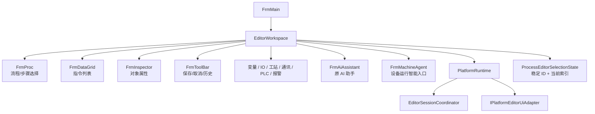

# 平台编辑器

## 当前组成

`FrmMain` 是与运行内核分离的平台编辑器主窗体。它创建流程树、指令表格、Inspector、变量、IO、运动、通讯、报警、日志和 AI 等页面，并把它们装入主工作区；它不再是 HMI 运行时初始化的前置条件。HMI 显示并进入空闲后会在同一 UI 线程隐藏创建编辑器及主窗口句柄，再由 `UiWarmupCoordinator` 分片预热缓存；窗口保持不可见，且不会提前启动 AI、Bridge 或 MCP。设备与流程内核构造位于 `PlatformRuntimeComposer`，配置/设备初始化位于 Runtime 服务，编辑器源码按功能位于 `Editor/`，完整目录导航见 [`Editor/README.md`](../../Editor/README.md)。

`EditorWorkspace` 是窗体协作对象。参与者实现 `IEditorWorkspaceParticipant` 后获得同一个 workspace 实例，通过明确属性访问兄弟页面和 `PlatformRuntime`，不再读取静态窗体字段。

## 账户入口与操作权限

`FrmToolBar` 始终保留纯人物图标登录/退出入口，以灰色、绿色、蓝色和橙色分别表达未登录、操作员、工程师和系统管理员，用户名与精确级别只放在悬停提示中，避免挤占工具栏；编辑器底部状态栏最右侧显示当前账户级别。HMI 顶栏最右侧复用同一人物图标、登录窗口和认证会话，并按其他 HMI 顶部命令的大图标、小文字布局显示“登录/退出”；HMI 入口不显示悬停提示，避免跟随鼠标的提示窗口影响操作流畅度。编辑器窗口和工作区内容不以登录状态作为创建、显示或查看前提；未登录或当前账户缺少 `platform.editor.open` 时仍完整显示平台界面，只禁用受控入口，并由 Host 门面和对应应用服务在实际执行边界再次拒绝操作。登录成功后，菜单、运行按钮、程序设置、诊断、版本和 AI 入口按账户保存的完整权限集合即时刷新。

“程序设置”的“账户与权限”打开独立管理窗，只允许拥有 `account.manage` 的系统管理员使用。三级账户只决定新建时的默认勾选；账户保存普通两态复选框形成的完整权限清单，不在运行时叠加级别模板。修改已有账户级别时先确认，再以新级别默认权限覆盖当前勾选，用户仍可继续调整。

```mermaid
flowchart TD
    Main["FrmMain"] --> Workspace["EditorWorkspace"]
    Workspace --> Proc["FrmProc\n流程/步骤选择"]
    Workspace --> Grid["FrmDataGrid\n指令列表"]
    Workspace --> Inspector["FrmInspector\n对象属性"]
    Workspace --> Toolbar["FrmToolBar\n保存/取消/历史"]
    Workspace --> ConfigPages["变量 / IO / 工站 / 通讯 / PLC / 报警"]
    Workspace --> Ai["FrmAiAssistant\n原 AI 助手"]
    Workspace --> Machine["FrmMachineAgent\n设备运行智能入口"]
    Workspace --> Runtime["PlatformRuntime"]
    Workspace --> Selection["ProcessEditorSelectionState\n稳定 ID + 当前索引"]
    Runtime --> Session["EditorSessionCoordinator"]
    Runtime --> UiAdapter["IPlatformEditorUiAdapter"]
```

## 两条协作边界

### UI 内部：`EditorWorkspace`

用于已知属于平台编辑器的窗体之间协作，例如流程树选择改变后刷新指令表格、Inspector 和导航历史。它允许 UI 代码承认 WinForms 结构，但仍要求实例显式传递。

### 非 UI 模块：`IPlatformEditorUiAdapter`

Bridge、Store 或应用服务需要选择上下文、刷新页面、写信息日志或显示确认时，通过 UI 适配器表达意图。非 UI 模块不应持有 `FrmMain`、`FrmProc` 等具体窗体。

适配器当前由 `WinFormsPlatformEditorUiAdapter` 实现，集中处理 UI 线程和具体页面调用。这是后续更换界面实现或进行无界面测试的主要隔离缝。

## 编辑会话

`EditorSessionCoordinator` 保证同一实例只有一个活动编辑会话：

- `Begin`：开始草稿编辑，并清理上一个会话。
- `ReplaceDraft/CaptureSnapshot`：更新草稿及会话内历史。
- `TryUndo/TryRedo`：回放草稿快照或正式提交历史。
- `TryCommit`：执行会话注入的校验和提交动作。
- `Cancel/End`：丢弃草稿并恢复 Inspector、工具栏状态。

`EditSession<T>` 本身不理解流程、IO 或工站规则；具体业务提交应由对应服务或 Store 实现，避免把校验复制进通用会话容器。

工作区页面切换只改变页面呈现，不结束活动编辑会话。切回流程工作区时，如果活动草稿是指令，`EditorWorkspace` 必须重新把同一个草稿实例绑定到指令表和 Inspector，并保留 `ProcessEditorSelectionState` 中的流程、步骤和指令选择；不得根据“新增/修改”标志清空 Inspector 或重新克隆草稿。

## UI 线程规则

- Host 生命周期和窗口操作必须在创建 Host 的 UI 线程执行。
- 引擎和设备后台事件通过 `BeginInvoke` 或 SDK 事件分发回 UI。
- 快照先进入线程安全缓存，再由 WinForms Timer 批量刷新流程树和高亮。
- 已删除的 `Application.MessageLoop` 和 `Application.DoEvents` 由架构回归脚本阻止重新引入。
- 后台设备状态不可确认时先安全停机和记录，再尝试刷新界面；界面更新失败不能恢复危险动作。

## 当前阅读热点

| 功能 | 入口 |
| --- | --- |
| UI 页面装配 | `FrmMain(PlatformRuntime)` |
| 设备与流程内核组合 | `PlatformRuntimeComposer.Compose` |
| 配置和设备初始化 | `PlatformRuntimeInitializer.Initialize`、`PlatformDeviceCoordinator` |
| 页面挂接 | `EditorWorkspace` 构造函数 |
| 流程/步骤/指令共享选择 | `ProcessEditorSelectionState` |
| 流程树加载和目录事务 | `FrmProc.RefreshProcList/RebuildWorkConfig` |
| 流程-变量联合提交 | `ProcessVariableConfigurationService` 协调持久化事务、刷新、历史和回滚 |
| 变量查询与提交 | `VariableEditorService`；`FrmValue` 负责交互和渲染 |
| IO 调试读取与配置 | `IoDebugMonitorService` 读取设备快照；`IoDebugConfigurationEditorService` 提交布局草稿 |
| Machine Agent 工作台 | `FrmMachineAgent` 是一级设备运行智能入口，独立承载设备对话、运行总览、状态时间线和拓扑子模块；设备动作只允许形成冻结预演并经前台二次确认后进入现有 `ProcessEngine` |
| 设备拓扑孪生 | `FrmEquipmentTopologyTwin` 作为 Machine Agent 子模块承载 WebView 编辑与时间线回放；`TopologyRuleInferenceService` 按指令类型、参数和控制流生成候选节点、关系、状态绑定及节点技能；`EquipmentTopologyStore` 校验并原子提交 |
| 指令结构编辑 | `OperationEditingService`；`FrmDataGrid` 只保留选择、确认和视觉反馈 |
| 指令字段编辑 | `Editor/Process/Inspector/InspectorDefinitions.cs`、`InspectorFieldValueService`；集合增删移动保留在唯一使用它的集合控件中 |
| AI 任务执行 | `AiConversationCoordinator` 统一管理会话与单轮状态；`FrmAiAssistant` 负责输入、气泡和 Web 渲染 |
| 草稿和历史 | `EditorSessionCoordinator`、`EditorHistoryService` |
| 非 UI 刷新请求 | `IPlatformEditorUiAdapter` |
| 页面导航历史 | `FrmMain.Navigation.cs` |
| 编辑器初始化与关闭 | `FrmMain.Lifecycle.cs`、`PlatformShutdownCoordinator` |
| 登录与账户管理 | `FrmToolBar`、`FrmAppConfig`、`Editor/Security/`、`AccountSecurityService` |

设备状态历史以 `EquipmentStateHistoryService` 的全局顺序时间线为事实源，`EquipmentStatePerceptionService` 只轮询已确认拓扑绑定的 IO，并把命令反馈、现场反馈和节点语义变化写入时间线。节点当前状态和历史时刻状态都是时间线投影，不按节点各自维护互不一致的历史。感知器把 `StateChangedAtUtc` 与 `LastSuccessfulObservationAtUtc` 分开：稳定状态持续读取时只刷新后者，不重复制造历史心跳，也不会因为状态长期不变被误判过期；读取失败则保留最后成功时间并把质量降级。页面关闭后感知仍由平台运行时持有；页面仅查询最近窗口、基线快照并在前端回放，不参与采集，也不发出设备动作。

`EquipmentProcessTimelineService` 同时把 ProcessEngine 的启动、位置、指令失败和结束事件，以及 Machine Agent 动作关联结果写入这条全局时间线。时间线异步写入 `D:\AutomationLogs\StateHistory\yyyy-MM-dd\equipment-state.jsonl`，启动时恢复保留期内的序列、基线和当前投影；损坏行按行跳过并报告降级，写盘或恢复异常都不改变流程与设备状态。

`FrmMachineAgent` 只组合现有运行时事实和子页面，不持有第二份拓扑、流程或状态缓存。其运行总览、独立对话和状态时间线由 WebView 呈现，拓扑子模块仍直接使用同一 `EquipmentTopologyStore` 与 `EquipmentStateHistoryService`。节点技能不是新的流程 DSL，而是把节点能力绑定到工程师已编写流程中的稳定 `procId/opId`，并明确 `single_operation` 或 `continue_flow` 执行模式、目标、期望结果、前置条件及证据状态。

Machine Agent 的设备控制采用“读取当前事实 → 生成冻结预演 → WebView 展示 → Windows 原生确认 → 运行时复核 → 调用现有 ProcessEngine”的单一路径。模型工具面没有正式执行工具；页面也不直接写 IO、运动卡或其他硬件。`MachineAgentRuntimeService` 以已确认节点技能作为外部交互入口，并在执行前复核技能、流程修订、引擎已发布/应用修订、拓扑修订、相关状态序列、可求值前置条件和拓扑防呆关系；设备动作还要求状态感知正在运行且相关节点最后成功观测新鲜可信。未知副作用和自定义函数失败关闭。`single_operation` 复用 `RunSingleOpOnce`，`continue_flow` 复用 `StartProcAt`，两者都保留既有流程引擎的运行门禁和行为语义。

## 当前限制

`EditorWorkspace` 解决了静态全局窗体引用，并以 `ProcessEditorSelectionState` 统一流程树和指令表的当前选择。`FrmIODebug` 的设备监视和配置草稿分别进入 `IoDebugMonitorService`、`IoDebugConfigurationEditorService`；`FrmValue` 的作用域、引用统计和配置提交进入 `VariableEditorService`；`FrmProc` 的流程-变量联合事务和 `FrmDataGrid` 的指令结构操作已进入实例服务。Inspector 按视觉控件、字段控件和值转换组织，集合结构变更与唯一使用它的控件共置；AI 会话与单轮执行由 `AiConversationCoordinator` 统一管理。`FrmMain.cs` 只保留页面装配与运行状态展示，导航和生命周期位于独立 partial。当前主要页面债务转为 AI 配置交互、IO 调试布局/事件渲染，以及流程树和指令表自身的交互状态。

流程定义全量刷新会按稳定 `procId/stepId` 复用树节点。复用同一 `TreeNode` 时 WinForms 不会再次触发 `AfterSelect`，因此刷新链必须显式把稳定 ID 映射为当前索引，并重新绑定指令表、Inspector 和运行状态；不得依赖选择事件偶然完成换源。
