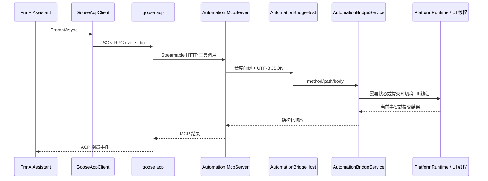
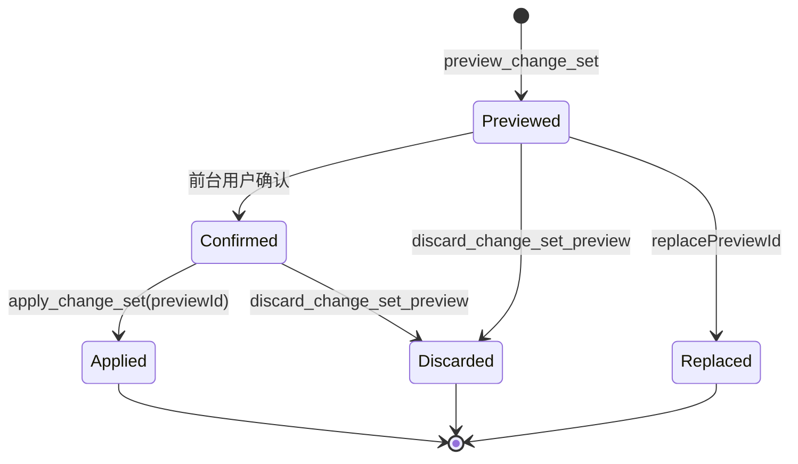

# EW-AI、MCP 与 Bridge

## 当前链路

Goose 不直接连接 WinForms，也不直接访问 Named Pipe。它只看到 MCP Profile 暴露的工具；MCP 进程通过 `AutomationBridgeClient` 与当前平台实例的 Bridge 通讯。

## 按需启动

正常 HMI 启动不主动启动 AI 辅助进程。以下场景调用 `FrmMain.EnsureAiInfrastructureStarted`：

- 平台编辑器首次显示；
- HMI 打开平台编辑器；
- 用户进入 AI 功能。

启动顺序是：验证 Goose 配置和托管上下文、启动 `AutomationBridgeHost`、再由 `AutomationMcpServerManager` 启动独立 MCP 进程。任一步失败只禁用 EW-AI 并报警，不改变流程运行状态。

关闭时顺序相反：先释放 Goose 客户端，再停止 MCP，最后停止 Bridge，防止子进程读取线程与 UI 同步授权请求形成互锁。

## ACP 会话

`GooseAcpClient` 隐藏启动 `goose acp`，通过标准输入输出发送换行分隔 JSON-RPC：

1. `initialize`
2. `session/new`，注入当前 Automation MCP HTTP 地址
3. `session/prompt`
4. 必要时 `session/cancel`

每轮 prompt 会附加当前编辑器实际选择到的最深层对象。选择只帮助定位，不代表用户授权修改。Provider、Model、平台集成上下文和 UTF-8 Git Bash 环境只覆盖当前 Goose 子进程。

所有会话按 `GooseConfig.json` 的 `SkillsProjectOnly`（缺省补写 `true`）注入 `GOOSE_SKILLS_PROJECT_ONLY`：`true` 时 Goose 的 skills 扩展只暴露项目目录（`<cwd>/.agents| .goose|.claude/skills`）与内置 Skill，隔离 `~/.claude/skills` 等本机全局 Skill 对 system prompt 的噪声；`false` 时显式移除该环境变量，保持 Goose 上游默认发现行为。该开关由 EW-AI 维护的 Goose 补丁识别（`E:\project\goose`，设计见该仓库根目录 `GOOSE_SKILLS_PROJECT_ONLY.md`）；官方 Goose 忽略未知环境变量，`GooseExecutablePath` 指回官方 exe 时行为不变。

## 工具 Profile

`McpServer/McpToolProfile.cs` 是当前工具集合的权威来源：

- `Editor`：平台知识、配置读取、有限诊断、ChangeSet V2 写入和明确授权的运行工具。
- `Diagnostic`：兼容的诊断模式。
- `RuntimeDiagnostic`：独立诊断实例，只提供运行现场取证，不提供平台开发和配置写入。

`McpServer/Program.cs --verify-profile` 校验必需工具、退役工具、Schema 结构和工具描述。文档不复制完整工具清单，以免与 Profile 漂移。

## ChangeSet V2 写入链

当前公开的流程结构写入只有以下状态机：

预演阶段由 `AiChangeSetCompiler` 在流程、变量和资源快照上编译语义或原生指令，计算可保存性和 readiness，并冻结编译结果与基础状态哈希。前台确认只更新预演记录的确认状态。

`apply_change_set` 只接受 `previewId`。Bridge 再检查确认状态、过期时间和基础状态哈希，然后提交冻结结果；它不在 apply 时重新接收或重新编译模型生成的 ChangeSet。提交结果返回稳定对象身份和受影响流程，供下一阶段精确读取。

## Bridge 线程边界与传输

- 管道名固定为 `AutomationBridgePipe`。
- 报文是 4 字节长度前缀加 UTF-8 JSON；请求和响应都有大小上限。
- Named Pipe 接受和基础 JSON 处理在后台线程进行。
- 读取 WinForms/Store 当前状态、预演注册和正式提交通过 `ExecuteOnUiThread` 串行进入 UI 线程。
- 基础参数类型、数量和大小应尽量在 MCP 或 Bridge 工作线程拒绝，避免无效请求占用 UI 线程。

## 日志与取证

- AI 执行分析：`D:\AutomationLogs\AIExecution\Analysis\`
- AI 完整底层报文：`D:\AutomationLogs\AIExecution\` 的对应会话目录
- Bridge 异常：`D:\AutomationLogs\Bridge\`
- 统一结构化旁路：`D:\AutomationLogs\Structured\`

`turnId/seq` 用于关联用户输入、模型片段、工具开始/结束、预演、确认、提交和轮次结束。正常排查先看紧凑分析日志，只有证据不足时再看完整 ACP/MCP/Bridge 报文。

## 已收敛边界与剩余问题

旧 intent、patch、`create_batch` 路由、处理器和模板已经删除，源码只保留 ChangeSet V2 写入状态机。Profile 和运行时仍保留退役工具名作为反向门禁，用于阻止这些工具重新暴露；`ArchitectureBoundaryRegression.ps1` 同时检查 Bridge 不得恢复旧路由。

ChangeSet 状态机、迁移配置、运行诊断和流程详情读取已分别移动到 `AutomationBridgeService.ChangeSet.cs`、`Migration.cs`、`Diagnostics.cs` 和 `ProcessInspection.cs`。Bridge 主文件仍然偏大，资源配置用例和大量参数映射尚未继续拆分，这是当前 AI 链路的主要可读性债务，见 `D-007`。
