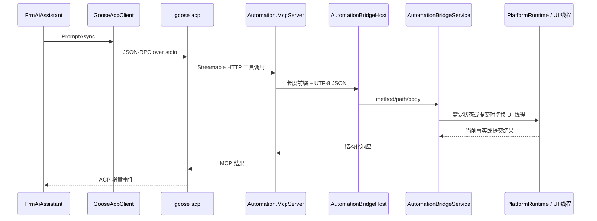
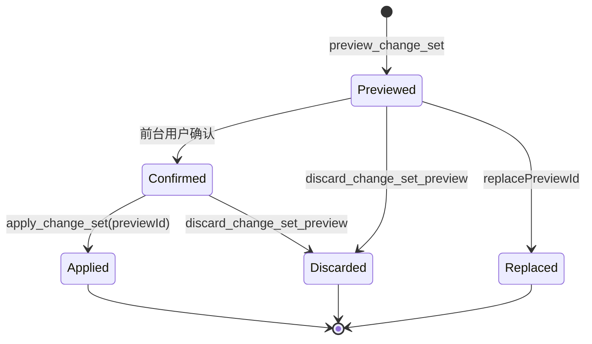

# EW-AI、MCP 与 Bridge

## 当前链路

Goose 不直接连接 WinForms，也不直接访问 Named Pipe。它只看到 MCP Profile 暴露的工具；MCP 进程通过 `AutomationBridgeClient` 与当前平台实例的 Bridge 通讯。

## 按需启动

正常 HMI 启动不主动启动 AI 辅助进程。以下场景调用 `FrmMain.EnsureAiInfrastructureStarted`：

- 平台编辑器首次显示；
- HMI 打开平台编辑器；
- 用户进入 AI 功能。

启动顺序是：验证 Goose 配置和托管上下文、启动 `AutomationBridgeHost`、再由 `AutomationMcpServerManager` 启动独立 MCP 进程。任一步失败只禁用 EW-AI 并报警，不改变流程运行状态。

关闭时顺序相反：先释放 Goose 客户端，再停止 MCP，最后停止 Bridge，防止子进程读取线程与 UI 同步授权请求形成互锁。

## ACP 会话

`GooseAcpClient` 隐藏启动 `goose acp`，通过标准输入输出发送换行分隔 JSON-RPC：

1. `initialize`
2. `session/new`，注入当前 Automation MCP HTTP 地址
3. `session/prompt`
4. 必要时 `session/cancel`

每轮 prompt 会附加当前编辑器实际选择到的最深层对象。选择只帮助定位，不代表用户授权修改。Provider、Model、平台集成上下文和 UTF-8 PowerShell 环境只覆盖当前 Goose 子进程。

AI 前台内部按当前职责分层：`AiConversationCoordinator` 统一拥有会话、任务运行时、单轮执行、取消和历史收尾，`GooseAcpEventReader` 解析 ACP 工具结果，`AiPreviewConfirmationCoordinator` 归一化预演状态并去重，`AutomationBridgePreviewClient` 是前台确认/拒绝的最小 Named Pipe 客户端。`FrmAiAssistant` 只组合这些对象并负责输入、气泡和 Web 展示；模板、渲染和审核对话框分别位于对应 partial 文件。

## 工具 Profile

`McpServer/McpToolProfile.cs` 是当前工具集合的权威来源：

- `Editor`：平台知识、配置读取、有限诊断、ChangeSet V2 写入和明确授权的运行工具。
- `Diagnostic`：兼容的诊断模式。
- `RuntimeDiagnostic`：独立诊断实例，只提供运行现场取证，不提供平台开发和配置写入。

`McpServer/Program.cs --verify-profile` 校验必需工具、退役工具、Schema 结构和工具描述。文档不复制完整工具清单，以免与 Profile 漂移。

## ChangeSet V2 写入链

当前公开的流程结构写入只有以下状态机：

预演阶段由 `AiChangeSetCompiler` 在流程、变量和资源快照上编译语义或原生指令，计算可保存性和 readiness，并冻结编译结果与基础状态哈希。前台确认只更新预演记录的确认状态。

`apply_change_set` 只接受 `previewId`。Bridge 再检查确认状态、过期时间和基础状态哈希，然后把冻结的流程与变量快照交给 `ProcessVariableConfigurationService`；它与手工编辑复用同一刷新、失败回滚和底层事务，不在 apply 时重新接收或重新编译模型生成的 ChangeSet。提交结果返回稳定对象身份和受影响流程，供下一阶段精确读取。

## Bridge 线程边界与传输

- 管道名固定为 `AutomationBridgePipe`。
- 报文是 4 字节长度前缀加 UTF-8 JSON；请求和响应都有大小上限。
- Named Pipe 接受和基础 JSON 处理在后台线程进行。
- 读取 WinForms/Store 当前状态、预演注册和正式提交通过 `ExecuteOnUiThread` 串行进入 UI 线程。
- 基础参数类型、数量和大小应尽量在 MCP 或 Bridge 工作线程拒绝，避免无效请求占用 UI 线程。

## 日志与取证

- AI 执行分析：`D:\AutomationLogs\AIExecution\Analysis\`
- AI 完整底层报文：`D:\AutomationLogs\AIExecution\` 的对应会话目录
- Bridge 异常：`D:\AutomationLogs\Bridge\`
- 统一结构化旁路：`D:\AutomationLogs\Structured\`

`turnId/seq` 用于关联用户输入、模型片段、工具开始/结束、预演、确认、提交和轮次结束。正常排查先看紧凑分析日志，只有证据不足时再看完整 ACP/MCP/Bridge 报文。

## 已收敛边界与剩余问题

旧 intent、patch、`create_batch` 路由、处理器和模板已经删除，源码只保留 ChangeSet V2 写入状态机。Profile 和运行时仍保留退役工具名作为反向门禁，用于阻止这些工具重新暴露；`ArchitectureBoundaryRegression.ps1` 同时检查 Bridge 不得恢复旧路由。

`AutomationBridgeService.cs` 现在只保存实例依赖、共享限制和内部预演记录。路由、协议响应、流程查询/控制、变量、工站、数据结构、IO、硬件资源和预演状态位于同名 partial 模块。原聚合的序列化职责继续拆为 `ProcessProjection`、`OperationProjection`、`ProtocolSupport`、`ValueConversion`；诊断拆为 `RuntimeDiagnostics`、`ReferenceDiagnostics`、`AuditDiagnostics`。架构门禁限制主文件不超过 250 行、单个职责文件不超过 1000 行，并阻止旧 `Serialization.cs/Diagnostics.cs` 回流。

这次拆分没有改变 Named Pipe 路由或 JSON 契约。仍待偿还的是 handler 对 `JObject/JArray` 的依赖和更细粒度的契约测试：公共参数应继续向 `Automation.Protocol` 强类型 DTO 收敛，而不是在 partial 文件之间复制参数规则。
