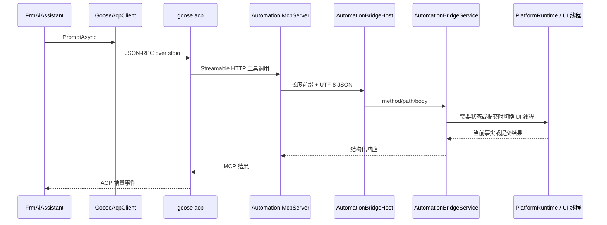
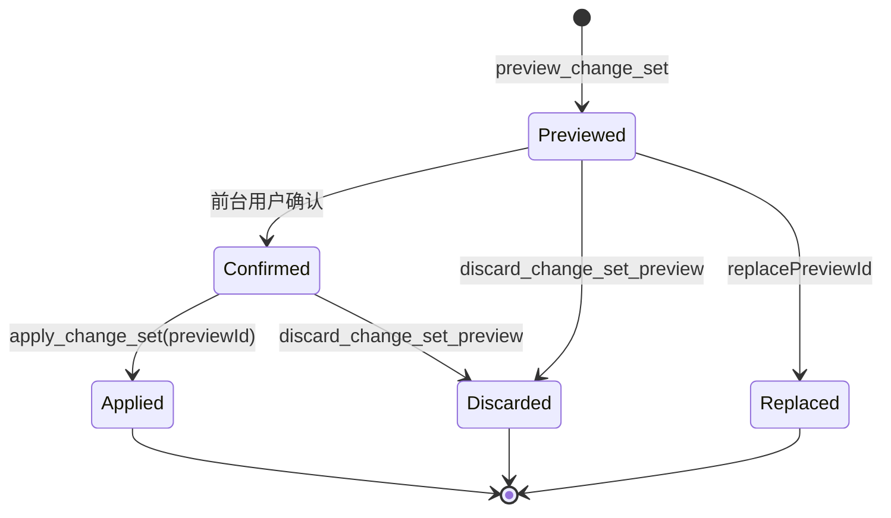

# EW-AI、MCP 与 Bridge

## 当前链路

Goose 不直接连接 WinForms，也不直接访问 Named Pipe。它只看到 MCP Profile 暴露的工具；MCP 进程通过 `AutomationBridgeClient` 与当前平台实例的 Bridge 通讯。

## 按需启动

正常 HMI 启动不主动启动 AI 辅助进程。以下场景调用 `FrmMain.EnsureAiInfrastructureStarted`：

- 平台编辑器首次显示；
- HMI 打开平台编辑器；
- 用户进入 AI 功能。

启动顺序是：验证 Goose 配置和托管上下文、启动 `AutomationBridgeHost`、再由 `AutomationMcpServerManager` 启动独立 MCP 进程。任一步失败只禁用 EW-AI 并报警，不改变流程运行状态。

关闭时顺序相反：先释放 Goose 客户端，再停止 MCP，最后停止 Bridge，防止子进程读取线程与 UI 同步授权请求形成互锁。

## ACP 会话

`GooseAcpClient` 隐藏启动 `goose acp`，通过标准输入输出发送换行分隔 JSON-RPC：

1. `initialize`
2. `session/new`，注入当前 Automation MCP HTTP 地址
3. `session/prompt`
4. 必要时 `session/cancel`

每轮 prompt 会附加当前编辑器实际选择到的最深层对象。选择只帮助定位，不代表用户授权修改。Provider、Model、平台集成上下文和 UTF-8 PowerShell 环境只覆盖当前 Goose 子进程。

AI 前台内部按当前职责分层：`AiConversationCoordinator` 统一拥有会话、任务运行时、单轮执行、取消和历史收尾，`GooseAcpEventReader` 解析 ACP 工具结果，`AiPreviewConfirmationCoordinator` 归一化预演状态并去重，`AutomationBridgePreviewClient` 是前台确认/拒绝的最小 Named Pipe 客户端。`FrmAiAssistant` 只组合这些对象并负责输入、气泡和 Web 展示；模板、渲染和审核对话框分别位于对应 partial 文件。

## 工具 Profile

`McpServer/McpToolProfile.cs` 是当前工具集合的权威来源：

- `Editor`：平台知识、配置读取、有限诊断、ChangeSet V2 写入和明确授权的运行工具。
- `Diagnostic`：兼容的诊断模式。
- `RuntimeDiagnostic`：独立诊断实例，只提供运行现场取证，不提供平台开发和配置写入。

`McpServer/Program.cs --verify-profile` 校验必需工具、退役工具、Schema 结构和工具描述。文档不复制完整工具清单，以免与 Profile 漂移。

## ChangeSet V2 写入链

当前公开的流程结构写入只有以下状态机：

预演阶段由 `AiChangeSetCompiler` 在流程、变量和资源快照上编译语义或原生指令，计算可保存性和 readiness，并冻结编译结果与基础状态哈希。前台确认只更新预演记录的确认状态。

`apply_change_set` 只接受 `previewId`。Bridge 再检查确认状态、过期时间和基础状态哈希，然后把冻结的流程与变量快照交给 `ProcessVariableConfigurationService`；它与手工编辑复用同一刷新、失败回滚和底层事务，不在 apply 时重新接收或重新编译模型生成的 ChangeSet。提交结果返回稳定对象身份和受影响流程，供下一阶段精确读取。

## Bridge 线程边界与传输

- 管道名固定为 `AutomationBridgePipe`。
- 报文是 4 字节长度前缀加 UTF-8 JSON；请求和响应都有大小上限。
- Named Pipe 接受和基础 JSON 处理在后台线程进行。
- 读取 WinForms/Store 当前状态、预演注册和正式提交通过 `ExecuteOnUiThread` 串行进入 UI 线程。
- 基础参数类型、数量和大小应尽量在 MCP 或 Bridge 工作线程拒绝，避免无效请求占用 UI 线程。

## 日志与取证

- AI 执行分析：`D:\AutomationLogs\AIExecution\Analysis\`
- AI 完整底层报文：`D:\AutomationLogs\AIExecution\` 的对应会话目录
- Bridge 异常：`D:\AutomationLogs\Bridge\`
- 统一结构化旁路：`D:\AutomationLogs\Structured\`

`turnId/seq` 用于关联用户输入、模型片段、工具开始/结束、预演、确认、提交和轮次结束。正常排查先看紧凑分析日志，只有证据不足时再看完整 ACP/MCP/Bridge 报文。

## 已收敛边界

旧 intent、patch、`create_batch`、流程 create/delete/reorder/copy 路由和 ChangeSet `processes/deleteProcesses` 字段已经删除，源码只保留 ChangeSet V2 写入状态机。Profile 和架构测试中的退役词只用于反向门禁，不是可调用能力。

`AutomationBridgeService.cs` 只保存实例依赖、共享限制和预演状态。路由、协议、流程、变量、资源、迁移和诊断位于职责 partial；`JObject/JArray` 只保留在 JSON 传输、动态原生指令字段和响应投影边界，公共 MCP 参数使用强类型 DTO。Bridge/Profile/Schema 和预演状态机由 `Automation.Core.Tests` 自动验证。

## 上下文与 Prompt 分层

- `Assets/Goose/system.md` 以 Goose 官方 `crates/goose/src/prompts/system.md` 为功能规则基底，只替换 EW-AI 品牌身份并追加真实性、工业安全等跨任务约束。修改前先对照官方当前模板；同步官方变化后重新应用自定义区块，并递增 `GooseRuntimeProvisioner.SystemPromptVersion`。
- `Assets/Goose/automation.md` 只保存 Automation 跨任务路由方法，使用独立的 `IntegrationContextVersion` 和 `.automation-context-version`；修改时不联动 System Prompt 版本。
- 两个托管 Markdown 同时作为 Manifest 资源和程序目录副本发布。运行时优先读 Manifest，失败后读目录副本；两者均失败只禁用 EW-AI 并报警，不阻断 HMI 或平台初始化。
- 具体参数、枚举、模式矩阵、数量边界、资源候选和指令技巧来自 Schema、行为 Catalog、资源工具和按需 Guide，不复制到常驻 Prompt。
- Automation 源码开发知识由 `get_platform_development_context` 按 `hmi`、`platform-api`、`custom-function` 精确加载；目标不明确时才读取 `catalog`。
- Prompt 只陈述长期稳定的事实和通用方法。模型经常误用时先检查工具命名、参数 Schema、资源发现、编译器和错误结构，不用新增训话掩盖契约缺陷。

## AI 事实权威来源

| 事实 | 权威来源 |
| --- | --- |
| 工具是否存在及所属 Profile | `McpServer/McpToolProfile.cs` |
| MCP 参数入口 | `Automation.Protocol` DTO、`AutomationMcpTools` 签名和生成 Schema |
| 原生指令类型与字段 | `OperationDefinitionRegistry`、`StructuredOperationCompiler` |
| 原生运行行为和字段联动 | `OperationBehaviorCatalog`、`ProcessEngine.Operations.*` |
| 语义 kind、Schema 和编译结果 | `SemanticOperationKinds`、`AiOperationCompilerRegistry` 及对应编译器 |
| 资源配置 | 对应 Store；Bridge/MCP 只做候选和详情投影 |
| 配置可保存性 | `AiChangeSetCompiler`、`ProcessDefinitionService` |
| 流程可运行性 | `ProcessReadinessService` 和实际启动闸门 |
| 预演、确认、哈希和提交状态 | `AutomationBridgeService` 的结构化响应 |
| 已提交对象身份 | `createdObjects/affectedProcesses` 返回的稳定 ID |

其他层只能引用、投影或验证这些事实。出现冲突时删除非权威副本并修正生成链，不在更上层增加一句 Prompt 压制冲突。

## ChangeSet 与工具设计约束

- 一个 ChangeSet 是可独立审查和保存的阶段，不要求一次完成用户的全部目标。分阶段读取、提交、回读和修正是正常路径，不重新引入会话外草稿缓存或大而全的单次协议。
- 配置保存只检查结构、`saveRequired` 和确定性不变量；缺少 `runRequired`、晚绑定资源或未完成业务目标可以保存为 `incomplete`。启动闸门再严格拦截。
- 变量公开语义保持：列表分页读取、按名称或索引精确读取、配置按单变量增删改、运行值按单变量设置。ChangeSet 只承载与流程同阶段提交的逐变量声明，配置提交默认保留当前运行值。
- 预演中的局部 `key` 只在本阶段关联新对象；提交后使用稳定 ID。符号跳转在结构变化后重算，不以旧物理索引继续编辑。
- 工具描述保持短而完整，参数类型和基础校验由 Schema/MCP/Bridge 工作线程承担，行为知识按需读取。不要设置首次必读缓存、`TOOL_GUIDE_REQUIRED` 或近义工具来规避一次模型误用。
- 数量和体积限制必须来自协议、内存、UI 或实测模型边界，并由服务端执行；大对象优先摘要、分页、步骤读取或有限稳定 ID 批量读取。

## 修改联动检查

| 修改内容 | 必须同步检查 |
| --- | --- |
| 原生指令 | 模型默认值、Registry、Engine 分发、递归 Schema、行为 Catalog、资源引用、readiness、编译与运行测试 |
| 语义 kind | Protocol DTO、kind 集合、Schema、编译器注册、字段/资源策略、readiness、Profile 测试 |
| 资源类型 | Store/API、发现与精确读取、Bridge/Client/MCP、Profile、引用类型、资源快照、保存/运行缺失策略 |
| ChangeSet | DTO、MCP Schema、后台基础校验、编译器、冻结预演、状态哈希、前台确认、事务提交、稳定身份和 Profile 回归 |
| 跳转或结构移动 | 稳定 ID、局部 key、跨步骤目标、未解析标签、物理地址重算、删除失效证据和提交后回读 |
| Prompt 或 Goose 部署 | 官方模板差异、自定义区块、Manifest/目录副本、独立版本号、进程环境变量、缺失降级和哈希日志 |
| 工具或路由 | `McpToolProfile`、`Program --verify-profile`、强类型参数、退役工具门禁及是否真的提供新能力 |
| AI 前台 | UI 线程、取消/关闭竞态、单活动预演、选择层级、内部事件隔离和 Markdown 渲染 |
| 日志 | `turnId/seq` 全链关联、主日志紧凑事实、完整报文仅作取证、高速循环不逐指令同步写盘 |

删除或回滚方案时，同步删除代码、Profile、描述、Schema、Markdown、版本、测试和日志字段；任一层残留都会重新制造错误路由。
