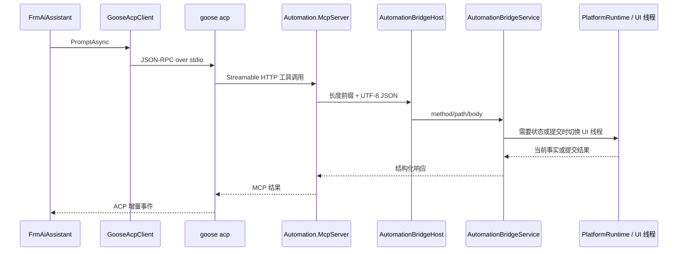
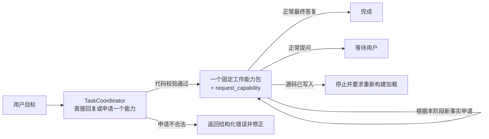
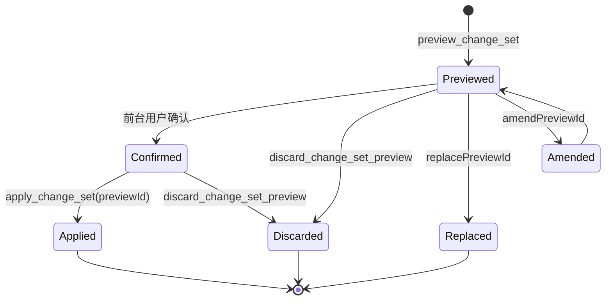

# EW-AI、MCP 与 Bridge

## 当前链路

```mermaid
sequenceDiagram
    participant UI as FrmAiAssistant
    participant ACP as GooseAcpClient
    participant Goose as goose acp
    participant MCP as Automation.McpServer
    participant Pipe as AutomationBridgeHost
    participant Bridge as AutomationBridgeService
    participant Runtime as PlatformRuntime / UI 线程

    UI->>ACP: PromptAsync
    ACP->>Goose: JSON-RPC over stdio
    Goose->>MCP: Streamable HTTP 工具调用
    MCP->>Pipe: 长度前缀 + UTF-8 JSON
    Pipe->>Bridge: method/path/body
    Bridge->>Runtime: 需要状态或提交时切换 UI 线程
    Runtime-->>Bridge: 当前事实或提交结果
    Bridge-->>MCP: 结构化响应
    MCP-->>Goose: MCP 结果
    Goose-->>UI: ACP 增量事件
```

Goose 不直接连接 WinForms，也不直接访问 Named Pipe。它只看到 MCP Profile 暴露的工具；MCP 进程通过 `AutomationBridgeClient` 与当前平台实例的 Bridge 通讯。

## 按需启动

正常 HMI 启动不主动启动 AI 辅助进程。以下场景调用 `FrmMain.EnsureAiInfrastructureStarted`：

- 平台编辑器首次显示；
- HMI 打开平台编辑器；
- 用户进入 AI 功能。

启动顺序是：验证 Goose 配置和托管上下文、启动 `AutomationBridgeHost`、再由 `AutomationMcpServerManager` 启动独立 MCP 进程。任一步失败只禁用 EW-AI 并报警，不改变流程运行状态。

关闭时顺序相反：先释放 Goose 客户端，再停止 MCP，最后停止 Bridge，防止子进程读取线程与 UI 同步授权请求形成互锁。

## ACP 会话

`GooseAcpClient` 隐藏启动 `goose acp`，通过标准输入输出发送换行分隔 JSON-RPC：

1. `initialize`
2. `session/new`，注入当前 Automation MCP HTTP 地址
3. `session/prompt`
4. 必要时 `session/cancel`

每轮 prompt 会附加当前编辑器实际选择到的最深层对象。选择只帮助定位，不代表用户授权修改。Provider、Model、平台集成上下文和 UTF-8 PowerShell 环境只覆盖当前 Goose 子进程。

ACP 流式过程仍可在当前前台显示并进入底层取证日志，正常完成持久化当前工作阶段的最终 assistant 答复。工具过程、推理片段、重复阶段总结和多阶段拼接文本不另行复制进业务历史；用户停止或后续异常时才用已完成阶段的有限输出形成部分结果。同一条用户请求的能力阶段复用一个 Goose 原生会话，能力切换时不重复注入完整目标或阶段摘要；请求到达完成、停止或失败终态后标记可信滚动，下一条用户请求建立新原生会话，只恢复有限最终消息、结构化交接和机械阶段事实。业务 `conversationId` 继续保持，当前用户语句只作为本轮 prompt 发送一次，从而保留对话连续性而不跨请求累积工具 Schema、推理草稿和大型结果。

每条用户请求持有一个 Goose ACP `sessionId`，同一请求的所有能力阶段连续复用它。请求开始先把工具面切到只含 `request_capability` 的 `TaskCoordinator`；不需要平台工具或需要用户补充时直接正常回复，需要工作能力时才提交一个 `run_stage`。代码批准后在当前 `sessionId` 内切换到固定 Profile。协调器和工作阶段使用同一会话级输出配置，默认输出预算为 16384 tokens、temperature 为 0.3；旧平台默认 8192/0.7 在加载时迁移，其他用户自定义值保持不变。所有工作 Profile 都保留同一个轻量控制工具，但它只负责换能力；当前能力足以完成或需要用户信息时直接输出。每轮第一条成功能力申请立即锁定并结束该模型轮；系统不提前生成完整阶段序列，也没有关键词路由或规划失败兜底。

MCP 进程按固定 Profile 共享复用，各业务对话的 ACP 会话、取消和阶段状态彼此独立。能力变化通过 Goose 1.46 的会话扩展接口 `_goose/unstable/session/extensions/add/remove/list` 原地重挂 Automation MCP；Automation TOM 只在工作 Profile 挂载，流程评审/创建/修改再挂载对应 Skills。Developer 扩展全量常驻所有能力面，工具面不做 `available_tools` 过滤；文件修改与 Shell 执行由前台权限闸门限制在 Editor 权限外壳 + SourceDevelopment 能力。`_goose/unstable/tools/list` 同时核对模型实际可见的完整 Automation 工具名集合和 `request_capability` 输入 Schema；所有 Profile 的控制 Schema 必须完全一致并通过指纹复核，缺字段、同名缓存漂移或必需工具缺失都立即停止当前任务。同一请求内切换成功必须保持原 `sessionId`；附件只发送一次并由该请求的原生会话保留。

AI 前台内部按当前职责分层：`AiConversationCoordinator` 统一拥有会话、任务运行时、单轮执行、取消和历史收尾，`GooseAcpEventReader` 解析 ACP 工具结果，`AiPreviewConfirmationCoordinator` 归一化预演状态并去重，`AutomationBridgePreviewClient` 是前台确认/拒绝的最小 Named Pipe 客户端。`FrmAiAssistant` 只组合这些对象并负责输入、气泡和 Web 展示；模板、渲染和审核对话框分别位于对应 partial 文件。

标准测试仍以场景 ID 绑定固定夹具和机械验收规则，但每个场景的逐轮用户语句可以在前台直接编辑、增加或删除。运行时请求必须携带实际语句，服务端校验场景 ID、1～12 轮、单轮 1～4000 字符及单场景总计不超过 20000 字符；未保存的当前编辑值也可直接运行。“保存语句”只把相对内置默认值的差异写入当前配置目录的 `AiStandardTests.json`，“恢复默认语句”清空这些覆盖，不修改测试夹具和验收代码。`standard_test.started` 记录本次真实语句，保证后续日志分析能够区分默认测试和人工改写。

## 工具 Profile

`Automation.Protocol/AutomationToolProfiles.cs` 保存档位名称和任务 Profile 的精确工具名集合，`McpServer/McpToolProfile.cs` 负责权限外壳、工具过滤和输入 Schema 收窄。档位分两层：

- `Editor`、`Diagnostic`：用户选择的权限外壳，不直接作为常规任务的模型工具面。
- `RuntimeDiagnostic`：独立诊断实例，只提供运行现场取证，不提供平台开发和配置写入。
- `TaskCoordinator`：每次用户请求先切入此工具面，只开放无副作用的 `request_capability` Automation 工具，不加载 Skills 或 Automation TOM，不读取平台事实；无需平台工具时直接正常回复，需要工作能力时以第一条成功申请为准。Goose 原生 developer 扩展全量常驻所有能力面，协调阶段也可读取用户引用的外部文件。
- `ProcessDesign`、`ProcessReview`、`ProcessCreate`、`ProcessEdit`、`ResourceEdit`、`RuntimeControl`、`SourceReview`、`SourceDevelopment`、`PlatformConfiguration`：工作阶段的最小业务工具加轻量 `request_capability` 控制面。独立变量、数据结构和报警维护归入 `ResourceEdit`，源码只读与写入分离；Automation TOM 在工作阶段启用，流程 Skill 只挂到评审/创建/修改能力。developer 扩展全量常驻且不做工具面过滤；write/edit/shell 调用由 Editor 权限外壳、SourceDevelopment 能力要求、Hmi 目录边界和前台确认闸门放行或拦截。

能力申请不会改变用户权限。只读权限申请写入、运行或源码开发，或未开启完全权限时申请平台迁移，代码会拒绝该申请并让协调模型改为询问用户或结束；不会擅自降级成另一任务。`McpServer/Program.cs --verify-profile` 校验能力包边界、申请 Schema、必需工具、退役工具和工具描述。文档不复制完整工具清单，以免与 Profile 漂移。

## 动态能力调度

复合请求不把多个 Profile 并成一个大工具集，也不要求最初就知道全部步骤。`AiConversationCoordinator` 在协调轮和工作轮之间循环：

```mermaid
flowchart LR
    U["用户目标"] --> C["TaskCoordinator\n直接回复或申请一个能力"]
    C -->|"代码校验通过"| W["一个固定工作能力包\n+ request_capability"]
    W -->|"根据本阶段新事实申请"| W
    W -->|"正常最终答复"| F["完成"]
    W -->|"正常提问"| Q["等待用户"]
    C -->|"申请不合法"| S["返回结构化错误并修正"]
    W -->|"源码已写入"| B["停止并要求重新构建加载"]
```

动态决定仍受机械边界约束：

- `ProcessReview` 进入写入或运行前，必须至少成功读取当前流程、资源或运行状态；只读取 Schema、Guide 或让模型复述历史不算当前事实。
- `ProcessReview` 只评审静态配置：单流程先用 `inspect_process` 一次取得紧凑概览、Readiness、确定性流程图和流程引用；默认不附加全部指令字段，只有字段级结论确实需要时才设置 `includeOperationDetails=true` 或精确钻取。Profile 不再同时暴露四个重复基础入口。日志、快照和“为什么刚才没动作”等现场症状必须切到 `RuntimeDiagnostic`。
- `ProcessReview` 的普通评审文字直接正常完成；只有需要把已证明 finding 交给后续修复时才调用独立 `submit_review_handoff`，该工具不结束模型轮。未提交时宿主合成 `unresolved` 安全交接，不为包装普通结论消耗工具轮，也绝不授权修复。只有 `status=proven_defect`、finding 逐项引用宿主机械事实且 `repairability=safe_without_external_facts`，才能以 `basis=proven_review_finding` 进入 `ProcessEdit`。
- `ProcessReview` 中成功的校验、概览、流程图、指令详情、引用、变量使用和批量审计结果由宿主机械绑定为 `verifiedFacts`，记录对象、事实键、工具调用、JSON Pointer 和结果哈希；占位节点还绑定 `operation.placeholder`、计划出口数量和计划目标。已配置跳转边绑定 `operation.outgoingTarget.<field>`，`get_op_details` 字段值绑定 `operation.field.<field>`，预演计划边目标绑定 `operation.plannedTarget.<field>`。模型 finding 通过 `evidenceFactRefs` 声明所需事实，宿主再绑定并校验；引用不存在的键被驳回时错误消息列出当前可用事实键候选（同一主体优先、最多 20 条），模型据此一轮修正。`verifiedFacts` 不开放给模型提交或改写。占位说明不是实现证据：外部动作或结果未决属于配置缺口；用户已明确且无需外部事实的控制策略若不在机械结构中，可据“明确要求 + 当前结构事实”证明为结构缺陷。最终交接最多携带 100 项机械事实，先保留 finding 明确引用的事实，再补流程与批量审计摘要。
- `ProcessCreate/ProcessEdit` 必须取得 `change_set.apply` 的 committed 与 `configurationSaved`；`PlatformConfiguration` 必须取得对应 migration apply 证据；`ResourceEdit` 必须明确返回 `configurationSaved`。`ResourceEdit` 的 `update_io_note` 把用户口述的 IO 角色、极性、机构绑定等现场事实写入 IO 备注并持久化（snapshot→TryCommit 原子提交，同步引擎 IoMap 引用），是会话级澄清沉淀为项目长期事实的唯一通道；备注经资源目录回读，后续会话不重复求证。无副作用的预演编译失败返回 `issues[path/rule/message/suggestedRepair]` 和 `recovery.sideEffects=none/safeToRetry=true`；模型按当前修复包整体处理这些问题，需要时可继续修正，同阶段最终成功提交后只保留失败计数用于分析，不标记为不安全部分写入。
- 配置阶段只有实际调度过写入工具后才建立 mutation 状态；只加载 Skill、读取契约或因为 `max_tokens` 暂停不会伪造“未提交写入”。实际写入失败且不能证明 `sideEffects=none`，或写入尝试最终没有取得保存证据时，才禁止继续写入和运行。预演被拒绝、用户说“先给我看/确认后再做”也立即停在边界。
- 流程写入直接进入 `ProcessCreate`，不先绕行纯方案阶段。设计知识由 `get_process_design_guide` 按当前目标需要读取，不设置首次必读或完成闸门；简单且事实充分时可一次创建，复杂或知识依赖明显时先提交安全骨架，再使用提交结果中的创建工作区凭据留在 `ProcessCreate` 按稳定 ID 续建。普通文本声称“已参考知识库”不算读取证据，但没有知识依赖时也不要求仪式性调用。
- `SourceReview/SourceDevelopment` 使用 `search_platform_source` 做根目录内的受限字面量检索，再配合 Developer 只读工具精确读取。纯读取不使运行实例过期；direct `write/edit` 标记源码已改变，`SourceDevelopment` 中的 Shell 标记修改状态不确定，两者都停止后续能力并要求重新构建加载。
- 协调模型的申请不是授权或事实；当前请求的原生会话保留阶段对话和工具结果，但代码只接受工具结果中的机械证据。宿主从成功的作者资源目录、指令能力解析、ChangeSet apply 和 validate 结果提取阶段产物，包括已观察资源、已创建对象、稳定 ID、创建工作区凭据和 Readiness 摘要。阶段摘要不在同一请求的正常切换时重复注入；请求终态后的可信滚动或原生会话意外丢失只注入这些结构化产物和有限最终输出，也不扩大副作用授权。每个业务对话额外持久化有界的最近机械事实与观察时间，供下一请求理解“按刚才建议”等承接语义；用户说明配置已变化时必须重新读取。已完成阶段的输出和副作用事实保留，后续失败或用户停止时不恢复整单请求，防止重复提交。
- 工作轮有正常 assistant 最终输出时即完成当前任务；只有模型既未完成输出、也未申请下一能力时才从当前进度续写。续写不以工具调用数判断思考是否有进展：模型可以在原会话跨输出分段继续必要分析或调用工具。输出分段数、能力阶段数、自然语言目标重复和固定纠错次数都不作为自动中断条件；不合法申请不执行，并把结构化校验错误交回模型修正。任务只在用户停止、正常完成/提问、Provider 或用户配置的真实资源预算到达、运行实现无法恢复，或权限、安全、事实与证据完整性、事务一致性等机械契约拒绝继续时停止。能力切换记录 `transition.started/prepared/completed/failed/cancelled`，Goose 实际核验工具面后记录 `surface.verified`。取消请求额外记录 `task.cancellation_requested.source`，执行端观察到取消后记录 `task.cancelled`；用户停止、标准测试停止和运行时释放不得再共用不可区分的“已取消”事实。
- 阶段轨迹按能力记录工具调用数、工具结果体积、`modelSegmentBytes`、估算会话上下文、非工具耗时、首次预演尝试/成功耗时、首次成功前失败数以及聚合解析调用数；这些阈值只生成诊断信号，不改变调度。少量已恢复的工具失败只记录为 `recovered`。Provider 累计 token 不直接当作真实上下文大小；同一请求内无论这些观测值如何都保持原生连续性，请求终态后统一安排可信滚动，下一请求只恢复有限可信上下文。
- 跨进程错误识别只用稳定错误码标记，不匹配自然语言文案：McpToolProfile 拒绝未开放工具时异常消息以 `AutomationMcpErrorCodes.ToolNotAvailable`（`TOOL_NOT_AVAILABLE`，定义在 `Automation.Protocol`）开头，ACP 客户端按同一常量识别并把该失败归类为 `sideEffects=none` 的可恢复错误；调整文案不得移除标记。Goose 能力面校验失败时，错误消息必须附 Goose 实际返回的事实（实际公布扩展清单、原始工具目录、工具对象实际键名），保证外部升级导致的契约偏差可快速定位而不是静默误杀。

`request_capability` 只有 `run_stage`：接收一个能力、当前目标、修改依据和可选授权证据，不承载最终消息、问题、评审交接或“阶段后暂停”开关。是否继续使用当前能力、切换能力、直接回复或询问用户由模型根据新事实自然决定，不通过额外布尔字段制造人工断点。普通流程与资源写入由 ChangeSet 预演确认形成最终闸门，不再要求协调器从自然语言中逐字截取授权；运行控制、平台配置和源码修改仍必须在 `authorizationQuote` 中逐字引用当前用户消息。历史、附件和模型生成内容不能单独扩大这些高风险副作用授权。

## ChangeSet V2 写入链

当前公开的流程结构写入只有以下状态机：

```mermaid
stateDiagram-v2
    [*] --> Previewed: preview_change_set
    Previewed --> Confirmed: 前台用户确认
    Previewed --> Discarded: discard_change_set_preview
    Previewed --> Replaced: replacePreviewId
    Previewed --> Amended: amendPreviewId
    Confirmed --> Applied: apply_change_set(previewId)
    Confirmed --> Discarded: discard_change_set_preview
    Applied --> [*]
    Discarded --> [*]
    Replaced --> [*]
    Amended --> Previewed
```

未确认预演支持两类修正：`replacePreviewId` 整体重写旧阶段；`amendPreviewId` 在冻结编译结果上只编译追加动作，新建对象跨修正累积，提交覆盖整个未提交阶段。追加修正的目标使用预演响应 `createdObjects` 返回的稳定 ID（局部 key 不跨预演）；由前台用户确认的预演不得再被替换或修正（`PREVIEW_ALREADY_CONFIRMED`），自动批准预演不受此限制。追加修正编译失败不替换旧预演，可用同一 `amendPreviewId` 重试。

`ProcessCreate` 与既有流程修改共用 `preview_change_set`。首阶段省略 `authoringLeaseId`，必须且只能创建一个 `autoStart=false` 的新流程，并用 `process.key`、`step.key` 串联当前 ChangeSet 的新对象；成功提交后，MCP 根据机械创建结果签发不可猜测的 `authoringLease`。后续阶段原样传入其 `leaseId`，即可在同一 `ProcessCreate` 工具面按稳定 `procId/stepId/opId` 增删改该新流程，也可用当前 ChangeSet 局部 key 组合本阶段对象。凭据把所有流程目标和流程变量归属机械收窄到首次创建的流程，不能修改、创建或删除其他流程，且不替代每个 ChangeSet 的前台预演确认。这样复杂、带回环或资源未决的目标可先保存安全骨架、回读检查，再逐块补齐；原子性只约束当前提交的数据一致性，不要求一次写完整流程。凭据丢失、过期或目标本来就是独立既有流程时，才切换 `ProcessEdit`。

当前 ChangeSet 内的符号跳转使用 `operationKey`：先在当前步骤解析，跨步骤全局唯一时直接解析，只有同名歧义时才要求附加 `stepId/stepKey`；提交后优先使用稳定 `operationId`，即使同时提供冗余步骤信息也以该 ID 为权威。重试优先使用真实指令已有的 `RetryCount`；需要流程级重试时，模型直接用变量复位/累加、结果分支、成功/耗尽出口和回跳表达。平台不提供重试宏，也不根据表面回环形状自动分类或改写。用户只要求成功/失败出口不等于授权报警、停机、复位、重试或提示等额外副作用。结果条件未决时可使用一等 `config.placeholder` 保留计划出口，但不伪造结果。入口不可达等尚未完成的控制流进入 Readiness：允许以 `incomplete` 保存并返回警告，但启动闸门阻止运行；悬空目标或无法编译的引用仍拒绝预演。

预演阶段由 `AiChangeSetCompiler` 在流程、变量和资源快照上编译语义或原生指令，计算可保存性和 readiness，并冻结编译结果与基础状态哈希。前台确认只更新预演记录的确认状态。预演响应带 `nextStep` 机械反馈：`confirmed=true`（含前台自动批准）时明确"必须用同一 previewId 提交"，已确认的预演不得以存在业务假设为由跳过，事务悬挂由预演过期机制回收；`confirmed=false` 时等待前台确认结果。预演和提交响应都携带 `pendingItems`（占位、留空跳转、待示教点位的结构化清单，含稳定 opId 与修复方式）与 `processSnapshot`（受影响流程的步骤/指令目录），作为分阶段续建的施工导航，模型下一阶段不再为重建结构认知而重复 `inspect_process`。

前台确认 ChangeSet 预演时可勾选"续建自动确认"（确认请求携带 `continueAutoApprove`）：该阶段全部目标流程登记为已授权批次，此后只触及这批流程的 ChangeSet 预演自动确认并续期（响应 `confirmedBy=continuation_auto_approve`）；触及其他流程仍需人工确认。手动取消任一预演即收回该授权，作用域 2 小时无活动自动过期。

`apply_change_set` 只接受 `previewId`。Bridge 再检查确认状态、过期时间和基础状态哈希，然后把冻结的流程与变量快照交给 `ProcessVariableConfigurationService`；它与手工编辑复用同一刷新、失败回滚和底层事务，不在 apply 时重新接收或重新编译模型生成的 ChangeSet。提交结果返回稳定对象身份和受影响流程，供下一阶段精确读取。

存在活动 `EditorSession` 时，`apply_change_set` 以 `EDITOR_SESSION_ACTIVE` 无副作用拒绝提交，避免正式对象换源破坏人工草稿。仅取消草稿时可重试原已确认预演；若先保存草稿导致基础状态变化，则必须重新预演。

## Bridge 线程边界与传输

- 管道名固定为 `AutomationBridgePipe`。
- 报文是 4 字节长度前缀加 UTF-8 JSON；请求和响应都有大小上限。
- Named Pipe 接受和基础 JSON 处理在后台线程进行。
- 读取 WinForms/Store 当前状态、预演注册和正式提交通过 `ExecuteOnUiThread` 串行进入 UI 线程。
- 基础参数类型、数量和大小应尽量在 MCP 或 Bridge 工作线程拒绝，避免无效请求占用 UI 线程。

## 日志与取证

- AI 执行分析：`D:\AutomationLogs\AIExecution\Analysis\`
- AI 完整底层报文：`D:\AutomationLogs\AIExecution\` 的对应会话目录
- Bridge 异常：`D:\AutomationLogs\Bridge\`
- 统一结构化旁路：`D:\AutomationLogs\Structured\`

`turnId/seq` 用于关联用户输入、模型片段、工具开始/结束、预演、确认、提交和轮次结束。正常排查先看紧凑分析日志，只有证据不足时再看完整 ACP/MCP/Bridge 报文。

轮次结束同时记录任务能力包、工具调用数、失败数、工具结果字节、`promptInputBytes`、`modelSegmentBytes`、`estimatedSessionContextTokens` 和 `trajectory` 评估。标准测试增加 `standard_test.run_started/run_completed` 的整轮关联，并保留每场景事件。持久输出体积使用 `assistantResponseChars/decisionMessageChars/persistedCandidateChars` 区分；能力决定记录 `termination_requested`，轮次结束再用 `terminationObserved/terminationOutcome` 区分取消是否真正被 ACP 观察。轨迹预算只标记需要复盘的低效路径，不中断模型。

## 已收敛边界

旧 intent、patch、`create_batch`、流程 create/delete/reorder/copy 路由和 ChangeSet `processes/deleteProcesses` 字段已经删除，源码只保留 ChangeSet V2 写入状态机。Profile 和架构测试中的退役词只用于反向门禁，不是可调用能力。

`AutomationBridgeService.cs` 只保存实例依赖、共享限制和预演状态。路由、协议、流程、变量、资源、迁移和诊断位于职责 partial；`JObject/JArray` 只保留在 JSON 传输、动态原生指令字段和响应投影边界，公共 MCP 参数使用强类型 DTO。Bridge/Profile/Schema 和预演状态机由 `Automation.Core.Tests` 自动验证。

## AI 助手优化目标与决策原则

AI 助手的首要目标是：让模型在当前能力包内顺畅取得完成任务所需的事实，连续完成读取、判断、预演、确认、提交和验证，并在证据不足时明确停在需要补充事实的位置。外围能力的价值是缩短完成路径并守住真实安全边界，不是让模型不断撞上本可预先消除的校验错误。衡量优化是否有效，优先看首次有效预演时间、完成目标所需失败次数和无归属耗时，而不是新增了多少规则或拦截了多少请求。

整体设计分成两层：

- **模型工作台**：每个 Profile 提供足以完成当前阶段的紧凑工具面、目的感知的聚合查询和正向短工作流。工作阶段允许顺序调用多个工具；复杂流程可以先提交可独立审查和保存的安全功能块，再按稳定 ID 续建，不要求一次预演完成全部业务目标。
- **代码护栏**：权限、状态机、Schema、稳定身份、资源兼容性、编译、readiness、安全和证据绑定由代码确定性执行。能够机械完成的身份解析、局部关联、默认序列化和错误归并由工具或编译器处理；业务重试、复位、报警等结构只有用户目标或真实能力契约明确时才生成。护栏正常时应处在后台，只在存在真实歧义、无效结构或副作用风险时阻止推进，并返回可以直接指导下一次修正的结构化结果。

未知事实与已知策略必须分层：外部动作、设备资源或结果条件可以保持占位；用户已经明确的重试次数、分支方向、清理顺序和成功/失败出口必须进入结构化契约。出口只确定控制流方向，不自动授权报警、停机、复位、重试或提示。自然语言说明不能代替机械结构，也不能因为部分事实未决就丢掉已经确定的业务策略。

后续遇到低效、反复试错或错误结果时，按以下顺序归因，不先假定是 Prompt 问题：

1. 模型拿不到当前事实：修正上下文路由、聚合查询契约或知识数据质量，使一次目的明确的调用返回候选、兼容性和证据缺口。
2. 模型无法表达合理意图：修正 Profile 工具面、强类型 Schema、语义操作或编译器，不要求模型猜原生类型名、私有字段或隐含迁移。
3. 模型反复写错确定性结构：由代码合成、规范化或给出多问题修复包，避免用 Prompt 教模型手工拼接机械样板。
4. 工具已经提供充分事实与表达能力，但模型仍在语义判断、歧义处理或风险取舍上稳定出错：才在对应 Prompt 或 Skill 增加 1～3 句短而通用的正向规则，并删除重叠表述。
5. 工具没有开始、会话状态丢失、轮次异常终止或日志链断裂：按运行实现问题处理，不通过业务规则掩盖。

明确禁止把以下做法作为默认优化方向：

- 不因单次测试失败追加案例化训话、否定句清单或近义规则；先用日志恢复实际轨迹并确认稳定问题类别。
- 不要求复杂流程一次性完整生成、一次性通过全部运行条件；ChangeSet 阶段只需自身可审查、可保存且不制造虚假可运行状态。
- 不把所有工具、展开复制的递归 Schema、完整历史或重复阶段摘要同时塞给模型；复合写入 Schema 共享字段并用紧凑的 `type/kind` 字段映射表达差异。基础 Schema 支持熟悉的简单动作直接预演；陌生、歧义或原生动作才批量按需解析，唯一命中在同一结果中附带精确契约。减少无关输入，但不得通过隐藏真实状态制造表面简洁，也不得把按需读取变成所有任务的前置仪式。
- 不为现有指令已经能清晰表达的重试、跳转和分支再增加一层宏或自动生成协议；模型直接组合真实指令，编译器只解析当前 ChangeSet 局部 key 并守住结构一致性。
- 不把“校验更严格”直接等同于“AI 更可靠”。校验必须对应明确不变量，并尽可能在模型提交前通过解析结果、Schema 和语义工具给出可行动信息。
- 不用工具调用数、输出分段数、能力阶段数、是否立即调用工具、自然语言目标重复、固定纠错次数或耗时等代理指标自动判定模型没有进展；这些数据只用于观测。新增硬限制必须保护可机械验证的权限、安全、事实与证据完整性、事务一致性、数据/传输边界或用户配置资源预算，并在实现前说明正向收益、误杀风险以及为什么不能改善工具、Schema、状态机或错误反馈来替代。证据门槛只能阻止无依据的完成声明或副作用，不能阻止模型向用户澄清缺失事实。
- 不用猜测资源、变量、原生指令类型或删减版探针预演来探索平台能力；流程编写先按目标相关类别查看有界作者资源目录，陌生动作再使用能力解析。
- 不用增加输出 Token 掩盖工具发现、Schema 体积、错误反馈或会话连续性问题。默认输出预算为 `16384`，它提供复杂阶段的完成余量，但不是允许无限探索的阶段预算。

每项 AI 优化在实现前至少检查：它是否减少模型取得事实所需的往返；是否缩短 `firstPreviewAttemptMs` 或 `firstSuccessfulPreviewMs`；是否减少首次成功前的工具失败、输入 Token、工具结果字节和无归属耗时；是否能由代码消除一次确定性重试；是否仍由机械契约守住权限和安全；是否在其他 Prompt、Skill、Schema 或文档中已有重复规则。简单完整流程应优先一次创建，复杂或事实不全的流程应优先形成安全骨架和短闭环，两者不应被统一成大而全的单次提交策略。

验证优化时先从分析日志还原 `request_capability`、事实读取、解析、预演、提交和回读的真实阶段轨迹，再判断瓶颈属于模型、上下文、工具契约、知识数据还是运行实现。短测试验证直接改动的契约；真实 AI 标准测试由用户显式启动并记录准确开始时间，不在构建或普通回归中自动执行。设计目标不是消灭模型的一切错误，而是在机械安全边界内提供可恢复、可分阶段、低试错成本的自主工作路径。

无人值守回归由已运行的正常平台实例通过 Bridge 管道触发：`POST /bridge/ai-test/start`（body `{autoApprove:true, prompts:[...], turnTimeoutMinutes:N}`，缺 autoApprove 直接拒绝；1..12 轮、单句 ≤4000 字符）在 UI 线程异步执行 `FrmAiAssistant` 完整能力切换与发送链路，`POST /bridge/ai-test/status` 轮询 `runId/running/completedPrompts/passedCount/failedCount/reportPath` 快照；测试进行中或 AI 助手有任务时 start 返回 409。配套客户端脚本 `Tools/AiHeadlessTest/Invoke-AiHeadlessTest.ps1` 封装管道帧协议（触发、轮询、摘要输出），示例语句见同目录 `prompts-sample.json`。该模式开启预演自动批准（`ai_headless_test.prepared` 事件显式记录 `autoApprove=true`，等价于前台逐次确认）、同一会话连续对话、每句独立超时并按 `conversationCoordinator.Cancel` 停止。过程事件 `ai_headless_test.run_started/prompt_started/prompt_completed/run_completed` 写入 `D:\AutomationLogs\AIExecution\Analysis`，Markdown 报告写 `D:\AutomationLogs\AIExecution\HeadlessTests`。语句内容自动批准后会产生真实配置写入与真实运行风险，语句来源必须与手工测试同样经过用户确认。

## 上下文与 Prompt 分层

- `Assets/Goose/system.md` 以 Goose 官方 `crates/goose/src/prompts/system.md` 为功能规则基底，只替换 EW-AI 品牌身份并追加真实性、工业安全等跨任务约束。修改前先对照官方当前模板；同步官方变化后重新应用自定义区块，并递增 `GooseRuntimeProvisioner.SystemPromptVersion`。
- `Assets/Goose/automation.md` 只保存 Automation 跨任务路由、事实边界和稳定工具反馈方法：纯方案不进入写入工作流，现有流程评审与当前配置写入分别路由到独立 Skill；项目存在可用资源不自动扩大目标。流程写入按目标/失败出口、聚合解析、功能块预演、提交回读的短闭环推进；复杂流程允许安全骨架后逐块补齐。结构化错误按当前修复包整体处理，不构造删减版探针，也不规定固定修正次数；使用独立的 `IntegrationContextVersion` 和 `.automation-context-version`，修改时不联动 System Prompt 版本。
- 两个托管 Markdown 同时作为 Manifest 资源和程序目录副本发布。运行时优先读 Manifest，失败后读目录副本；两者均失败只禁用 EW-AI 并报警，不阻断 HMI 或平台初始化。
- 只读流程检查使用 `automation-process-review` Skill；创建、修改、重构和复制使用 `automation-process-authoring` Skill。新建与修改都使用 ChangeSet V2；`ProcessCreate` 首阶段创建新流程，提交后使用目标收窄的创建工作区凭据连续完善该流程；独立既有对象修改使用 `ProcessEdit`。
- 受管 Prompt、上下文和 Skill 在版本相同时仍核对内置资源内容；同版本内容漂移会重新同步，避免不同机器以同一版本运行不同规则。高于内置版本的本机文件仍按既有策略保留并校验。
- 具体参数、枚举、模式矩阵、数量边界、资源候选和指令技巧来自 Schema、行为 Catalog、资源工具和按需 Guide，不复制到常驻 Prompt。
- `get_process_design_guide` 是唯一的按需流程设计知识入口。服务端自动附带短 `core`，调用方通常只选一个主主题；默认 `detail=compact`，主题正文也必须返回真正的紧凑投影，并给出可直接传给作者目录的 `goalCoverage.resourceRequests`、结构化功能槽、完成证据、失败恢复和 `evidenceGapPolicy`，只有确实需要完整背景时才请求 `full`。功能槽用于最终核对已实现、占位和证据缺口，不规定固定工具顺序，也不把复杂目标变成一次提交闸门。相关资源存在而精确目标、角色、极性或终态证据缺失时，缺口不能被解释为该功能无需实现；替代机构会改变用户目标含义时应询问或保留占位。Readiness 只证明结构满足当前保存/启动契约，不替代用户目标覆盖判断。已审核知识块包含该场景自身的失败、超时和恢复写法，另一主题承担独立职责时才追加。
- `McpServer/ProcessKnowledge/` 只保存已完成甄别的可用规范：`catalog.json` 负责能力、设备、工艺和风险标签，`blocks/*.md` 保存完整写法，内部来源摘要不返回给运行时 AI。旧项目证据和审核过程留在 Transform 运行目录；AI 完成审核与归纳后才把结果登记到目录，并由 `get_process_design_guide` 按主题返回。知识体系按三层组织：`automation.md`「整机流程族」段常驻路由（一台设备由什么构成）、`composition` 主题按需返回 `device-frame.*` 单机设备框架（功能单元表、单元间衔接、变化点、搭建顺序；多机台产线编排不收录）、其余功能块按单主主题返回内部写法；层间只索引不复制。`get_process_design_guide` 支持可选 `patternIds`：先 compact 取索引，再按响应中的 patternId 精确钻取目标块，知识库增长不放大单次返回。主题是硬契约：条目 `topics` ⊆ `ProcessDesignGuideCatalog.SupportedTopics` 并与 `schema.json` 枚举、工具描述一致，每个非 core 主题在 `Guides/ProcessDesignGuide.md` 有区块标记；`Program.cs` 启动时校验整个目录，不同步直接拒启（exit code 2），错误消息指明问题条目而非请求主题。目录契约与库存现状详见 `McpServer/ProcessKnowledge/README.md`。
- Automation 源码开发知识由 `get_platform_development_context` 按 `hmi`、`platform-api`、`custom-function` 精确加载；目标不明确时才读取 `catalog`。源码定位使用 `search_platform_source` 的字面量、目录、扩展名和最多 100 条结果边界，不把 Shell 开放给只读源码能力。
- Prompt 主要陈述长期稳定的身份、真实性和安全边界；平台路由进入 `automation.md`，任务步骤进入 Skill，字段与行为进入工具契约。某类可靠复现的问题若不能仅靠代码契约表达，允许增加 1～3 句短而通用的行为规则并递增对应资源版本；确定性、安全和数据完整性仍由代码执行，不为单次措辞或单个案例增加补丁式训话。

## 批量审计覆盖契约

`audit_proc_batch` 对每个 `procOffset/procLimit` 流程批次生成保持原始顺序的完整 finding 集合。单页最多返回 300 条，并同时返回 `findingOffset/findingLimit/returnedFindingCount/hasMoreFindings/nextFindingOffset`；续读必须携带上一页 `indexRevision`，配置变化时以 `AUDIT_REVISION_CHANGED` 拒绝混合不同快照。只有当前批次 finding 读完后才返回可用的 `nextProcOffset`。

`findingSummary.bySeverity/byCode` 是完整批次的附加导航索引，不替代、隐藏或合并 `findings`。禁用步骤和禁用指令始终保留为精确配置事实；是否构成缺陷由 Readiness、引用、运行证据或已验证业务目标判断。

## AI 事实权威来源

| 事实 | 权威来源 |
| --- | --- |
| 任务工具名及所属 Profile | `AutomationToolProfiles.GetTaskToolNames` |
| 权限外壳、工具过滤和输入 Schema | `McpServer/McpToolProfile.cs` |
| MCP 参数入口 | `Automation.Protocol` DTO、`AutomationMcpTools` 签名和生成 Schema |
| 原生指令类型与字段 | `OperationDefinitionRegistry`、`StructuredOperationCompiler` |
| 原生运行行为、通信重试和接收结果判定 | `OperationBehaviorCatalog`、`ProcessEngine.Operations.*` |
| 语义 kind、Schema 和编译结果 | `SemanticOperationKinds`、`AiOperationCompilerRegistry` 及对应编译器 |
| 资源配置 | 对应 Store；Bridge/MCP 只做候选和详情投影 |
| 配置可保存性 | `AiChangeSetCompiler`、`ProcessDefinitionService` |
| 流程可运行性 | `ProcessReadinessService` 和实际启动闸门 |
| 运行实例、终态与 CT 样本 | `EngineSnapshot.RunId/State/TerminationReason`、`ProcessEngine.GetLatestCycleTimeSamples`、运行黑匣子 |
| 预演、确认、哈希和提交状态 | `AutomationBridgeService` 的结构化响应 |
| 已提交对象身份 | `createdObjects/affectedProcesses` 返回的稳定 ID |

其他层只能引用、投影或验证这些事实。出现冲突时删除非权威副本并修正生成链，不在更上层增加一句 Prompt 压制冲突。

## ChangeSet 与工具设计约束

- 一个 ChangeSet 是可独立审查和保存的阶段，不要求一次完成用户的全部目标。分阶段读取、提交、回读和修正是正常路径，不重新引入会话外草稿缓存或大而全的单次协议。
- 目标流程名称不确定时使用 `resolve_proc_target` 一次提交多个线索。流程编写所需现场对象未明确时，使用唯一的 `list_authoring_resources` 按 `motion/io_input/io_output/variable/communication/plc/alarm/process/data_struct` 查看当前目录；设计指南已有 `goalCoverage.resourceRequests` 时可原样作为类别请求，名称过滤只在目录较大或已看到目标后收窄。`motion` 聚合工站、实际轴配置以及 `planned/taught` 点位，底层 `list_stations/list_points/list_io` 等继续服务其他权限面与实现复用，不在创建/编辑工具面形成重叠入口。目录项返回类型化 `resourceRef`；运动工站缺少命名点位时，`authoringGaps` 明确允许模型从业务目标规划点位名并先用于流程。流程经预演确认并提交后，模型可切到 `ResourceEdit` 调用批量 `plan_motion_points`，只登记固定槽位和名称；它不接收坐标，也不执行运动。新点位以 `IsTaught=false` 持久化，流程可保持 `incomplete` 保存，人工编辑坐标、工站取点或真实采集后转为已示教，Readiness 和运行时防线在此之前拒绝相关运动；旧命名点位没有该字段时按已示教兼容。语义 IO 编译同时接受稳定引用和精确名称，并在落入运行模型前解析为当前规范名称。新流程私有变量直接在当前 ChangeSet 使用 `ownerProcess.key` 声明，既有流程变量通过稳定 `ownerProcess.procId` 归属。目录项证明资源存在及其配置字段，不自动证明气缸方向、安全位或业务角色；单个输入未激活不证明相反机械终态。
- 作者资源目录的请求类别、可选名称过滤和返回边界由 Schema 约束；默认只返回创建决策需要的紧凑身份、类型、作用域和绑定字段，引用影响、运行值等编辑详情不混入创建目录。无效参数在 MCP 内返回结构化 `INVALID_ARGUMENT`，不把普通错误升级成 ACP 传输失败。资源绑定失败返回路径、所需资源类型和最多三个带 `resourceRef` 的相近候选，不重复返回动作 Schema。`motion` 目录的每个工站项附 `motionOperations`（来自 `list_operation_types` 的 `stationScoped` 标记），给出工站范围原生指令精确 operaType，模型不再猜测运动指令类型名。`io_input/io_output/communication/plc/alarm` 目录首页同样附 `operations` 操作菜单（`list_operation_types` 按行为契约字段与类型名称保守分类的 `domains` 标记），各资源域可用指令类型一次可见。原生指令类型未命中时，`get_native_operation_schemas` 等入口返回 `OPERA_TYPE_NOT_FOUND` 并附按类型名/显示名/`intentAliases` 包含与共享二元组排序的最多三个 `suggestions`。熟悉且基础 Schema 足够的语义 kind 可直接预演；陌生、歧义或原生业务动作再用 `resolve_operation_capability` 一次提交多个意图。语义动作别名来自协议目录，原生动作别名来自 `OperationBehaviorCatalog`；别名匹配按连续包含与共享二元组评分，`resolutionStatus=missing` 时附最多五个 `nearbyTypes` 相近注册类型并明确"missing 只证明措辞未命中，不证明平台缺少该能力"。`resolutionStatus=exact` 的作用域仅为动作类型和字段契约，响应必须明确 `resourceBindingValidation=not_performed`，不能暗示意图文字中的 IO、变量、工站或点位已验证。既有原生指令做少量同类型字段修改时使用 `get_native_operation_field_contract` 获取紧凑字段契约，只有改类型或递归结构不明确时才读取完整原生契约。
- 新建与修改共用一套 ChangeSet V2 DTO、编译、预演、确认和提交链；不为创建再定义一套需要翻译的中间 DSL。
- 配置保存只硬拦截 Schema、重复身份、悬空引用、不可编译控制流、原子一致性等结构/`saveRequired` 确定性不变量；缺少 `runRequired`、晚绑定资源、占位功能块或尚未完成整个业务目标可以保存为 `incomplete`。启动闸门再检查资源就绪、设备状态、完整运行闭环和安全条件。不能通过放松结构错误让坏流程落盘，也不能把仅影响运行的缺口提前升级成保存失败。
- 用户要求占位或骨架时，未知动作或真实结果条件使用一等 `config.placeholder`，可声明仅用于设计期的计划出口；Readiness 保持 `incomplete` 并阻止启动。固定延时、普通弹框、猜测变量和常量状态不能作为缺失能力的替代品。
- 占位指令及其 `Note/message` 不是可执行事实，也不能证明其中描述的重试、超时、清理或出口已经实现。保持 `config.placeholder` 时可用 `operation.update` 修订名称、说明和计划出口；确认真实动作后必须用 `operation.replace` 完整替换，不允许用 `operation.update` 渐进改造成猜测配置。
- 字符串置空使用显式语义 `string.clear`，编译为 `ModifyValue.ClearOutput`；double 清零使用 `number.zero`，编译为替换写入数值 `0`。两者按变量类型严格校验，`variable.set value=""` 和自然语言“清零”不再承担互相冲突的含义。
- 同类型变量复制使用 `variable.copy(sourceVariable,targetVariable)`；编译器负责生成原生 `ModifyValue`、填充变量操作数并校验源目标类型，不要求模型读取原生“修改变量” Schema。
- 变量公开语义保持：列表分页读取、按名称或索引精确读取、配置按单变量增删改、运行值按单变量设置。ChangeSet 只承载与流程同阶段提交的逐变量声明，配置提交默认保留当前运行值。
- 预演中的局部 `key` 只在本阶段关联新对象；`operationKey` 必须指向当前 ChangeSet 最终结构内的新指令并在预演时解析，先查当前步骤，跨步骤全局唯一时直接解析，只有同名歧义时才附加 `stepId/stepKey`。提交后的目标优先使用稳定 `opId`，冗余步骤选择器不覆盖稳定身份。历史 `#PENDING-GOTO#` 只兼容读取并阻止启动，不再生成、跨阶段补齐或自动解析。符号跳转在结构变化后重算，不以旧物理索引继续编辑。
- 工具描述保持短而完整，参数类型和基础校验由 Schema/MCP/Bridge 工作线程承担，行为知识按需读取。`ProcessCreate` 与 `ProcessEdit` 共用 `preview_change_set` 工具名和底层 DTO，但动态 Profile 必须返回各自的实际工具实例和专用 Schema：创建面同时表达首阶段与凭据续建两种模式，并开放聚合 `inspect_process` 供必要回读；编辑面面向独立既有流程。动作和语义指令共享一次字段定义，通过紧凑类型字段映射支持已知动作直达。`resolve_operation_capability` 只处理陌生、歧义或原生动作，一次批量返回唯一命中的精确小契约；`preview_change_set` 失败按错误类型返回修复信息：资源错误返回 `bindingRepair`，字段或行为错误只返回能从问题路径或消息确定的 kind/operaType 小契约，不把整个 ChangeSet 的全部契约重复发送。逐类型精确约束只由 Bridge/编译器维护，MCP 不复制第二套语义判断。`apply_change_set` 对模型只返回提交状态、Readiness、阻塞、新建稳定身份和必要的创建工作区凭据，完整 Bridge 结果保留在底层日志。所有工作 Profile 共享同一轻量 `request_capability`；仅 `ProcessReview` 额外开放独立的 `submit_review_handoff`，控制面不承担评审结构。不要设置首次必读缓存、`TOOL_GUIDE_REQUIRED`、人为 Schema 体积指标或近义工具来规避一次模型误用。
- 数量和体积限制必须来自协议、内存、UI 或实测模型边界，并由服务端执行；大对象优先摘要、分页、步骤读取或有限稳定 ID 批量读取。

## 修改联动检查

| 修改内容 | 必须同步检查 |
| --- | --- |
| 原生指令 | 模型默认值、Registry、Engine 分发、递归 Schema、行为 Catalog、资源引用、readiness、编译与运行测试 |
| 语义 kind | Protocol DTO、kind 集合、Schema、编译器注册、字段/资源策略、readiness、Profile 测试 |
| 资源类型 | Store/API、发现与精确读取、Bridge/Client/MCP、Profile、引用类型、资源快照、保存/运行缺失策略 |
| ChangeSet | DTO、MCP Schema、后台基础校验、编译器、冻结预演、状态哈希、前台确认、事务提交、稳定身份和 Profile 回归 |
| 跳转或结构移动 | 稳定 ID、局部 key 作用域、跨步骤目标、预演严格解析、物理地址重算、历史异常阻断、删除失效证据和提交后回读 |
| Prompt 或 Goose 部署 | 官方模板差异、自定义区块、Manifest/目录副本、独立版本号、进程环境变量、缺失降级和哈希日志 |
| 工具或路由 | `McpToolProfile`、`Program --verify-profile`、强类型参数、退役工具门禁及是否真的提供新能力 |
| AI 前台 | UI 线程、取消/关闭竞态、单活动预演、选择层级、内部事件隔离和 Markdown 渲染 |
| 日志 | `turnId/seq` 全链关联、主日志紧凑事实、完整报文仅作取证、高速循环不逐指令同步写盘 |

删除或回滚方案时，同步删除代码、Profile、描述、Schema、Markdown、版本、测试和日志字段；任一层残留都会重新制造错误路由。
