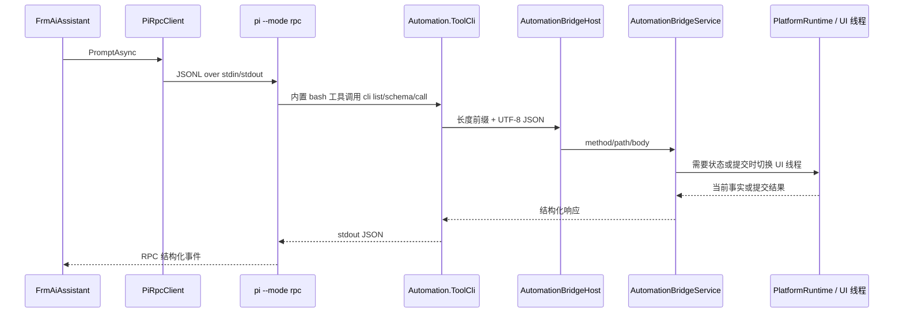
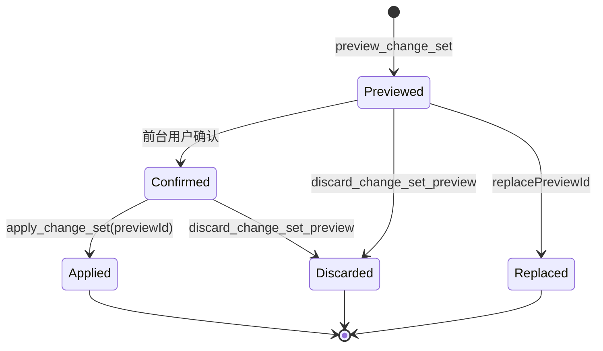

# EW-AI、ToolCli 与 Bridge

## 当前链路

```mermaid
sequenceDiagram
    participant UI as FrmAiAssistant
    participant RPC as PiRpcClient
    participant Pi as pi --mode rpc
    participant CLI as Automation.ToolCli
    participant Pipe as AutomationBridgeHost
    participant Bridge as AutomationBridgeService
    participant Runtime as PlatformRuntime / UI 线程

    UI->>RPC: PromptAsync
    RPC->>Pi: JSONL over stdin/stdout
    Pi->>CLI: 内置 bash 工具调用 cli list/schema/call
    CLI->>Pipe: 长度前缀 + UTF-8 JSON
    Pipe->>Bridge: method/path/body
    Bridge->>Runtime: 需要状态或提交时切换 UI 线程
    Runtime-->>Bridge: 当前事实或提交结果
    Bridge-->>CLI: 结构化响应
    CLI-->>Pi: stdout JSON
    Pi-->>UI: RPC 结构化事件
```

Pi 不直接连接 WinForms，也不直接访问 Named Pipe。它只看到内置 bash/read 等工具和显式加载的 Skill；平台工具由 `Automation.ToolCli.exe` 经 `AutomationBridgeClient` 与当前平台实例的 Bridge 通讯。

## 按需启动

正常 HMI 启动不主动启动 AI 辅助进程。以下场景调用 `FrmMain.EnsureAiInfrastructureStarted`：

- 平台编辑器首次显示；
- HMI 打开平台编辑器；
- 用户进入 AI 功能。

启动顺序是：验证 AI 配置和托管上下文、启动 `AutomationBridgeHost`；Pi RPC 子进程在首个 AI 会话建立时由前台启动。任一步失败只禁用 EW-AI 并报警，不改变流程运行状态。

关闭时顺序相反：先释放 Pi 客户端，再停止 Bridge，防止子进程读取线程与 UI 同步授权请求形成互锁。

## Pi RPC 会话

`PiRpcClient` 隐藏启动 `pi --mode rpc --no-skills --skill <skill目录>... [--provider X] [--model Y]`，通过标准输入输出收发换行分隔 JSONL：

- 命令：`prompt`、`abort`、`new_session`、`set_model`、`get_state`。
- 事件：`message_update`（`text_delta`/`thinking_delta`）、`tool_execution_start/end`、`turn_end`、`compaction_start/end` 等。

每轮 prompt 会附加当前编辑器实际选择到的最深层对象。选择只帮助定位，不代表用户授权修改。Provider、Model、集成上下文和 UTF-8 Git Bash 环境只覆盖当前 Pi 子进程。

Skill 隔离由 Pi 原生能力完成：`--no-skills` 关闭全部自动发现（含 `~/.agents/skills`），`--skill` 显式加载部署到 `%APPDATA%\Automation\Pi\skills\<name>\SKILL.md` 的平台 Skill，不再需要 Goose 时代的补丁。集成上下文经 `PI_CODING_AGENT_DIR` 指向 `%APPDATA%\Automation\Pi\agent`（仅当前子进程），其中的 `APPEND_SYSTEM.md` 由 `Assets/Pi/automation-cli.md` 部署而来。

## 工具 Profile

`ToolCli/AiToolProfile.cs` 是当前工具集合的权威来源：

- `Editor`：平台知识、配置读取、有限诊断、ChangeSet V2 写入和明确授权的运行工具。
- `Diagnostic`：兼容的诊断模式。
- `RuntimeDiagnostic`：独立诊断实例，只提供运行现场取证，不提供平台开发和配置写入。

`ToolCli/Program.cs --verify-profile` 校验必需工具、退役工具、Schema 结构和工具描述。文档不复制完整工具清单，以免与 Profile 漂移。

## ChangeSet V2 写入链

当前公开的流程结构写入只有以下状态机：

```mermaid
stateDiagram-v2
    [*] --> Previewed: preview_change_set
    Previewed --> Confirmed: 前台用户确认
    Previewed --> Discarded: discard_change_set_preview
    Previewed --> Replaced: replacePreviewId
    Confirmed --> Applied: apply_change_set(previewId)
    Confirmed --> Discarded: discard_change_set_preview
    Applied --> [*]
    Discarded --> [*]
    Replaced --> [*]
```

预演阶段由 `AiChangeSetCompiler` 在流程、变量和资源快照上编译语义或原生指令，计算可保存性和 readiness，并冻结编译结果与基础状态哈希。前台确认只更新预演记录的确认状态；前台从 Pi 结构化事件 `tool_execution_end.result.content[].text` 中解析预演 JSON（判定 `data.previewId` + `confirmed=false`），不再扫描 shell 输出文本。

`apply_change_set` 只接受 `previewId`。Bridge 再检查确认状态、过期时间和基础状态哈希，然后提交冻结结果；它不在 apply 时重新接收或重新编译模型生成的 ChangeSet。提交结果返回稳定对象身份和受影响流程，供下一阶段精确读取。

## Bridge 线程边界与传输

- 管道名固定为 `AutomationBridgePipe`。
- 报文是 4 字节长度前缀加 UTF-8 JSON；请求和响应都有大小上限。
- Named Pipe 接受和基础 JSON 处理在后台线程进行。
- 读取 WinForms/Store 当前状态、预演注册和正式提交通过 `ExecuteOnUiThread` 串行进入 UI 线程。
- 基础参数类型、数量和大小应尽量在 ToolCli 或 Bridge 工作线程拒绝，避免无效请求占用 UI 线程。

## 日志与取证

- AI 执行分析：`D:\AutomationLogs\AIExecution\Analysis\`
- AI 完整底层报文：`D:\AutomationLogs\AIExecution\` 的对应会话目录
- Bridge 异常：`D:\AutomationLogs\Bridge\`
- 统一结构化旁路：`D:\AutomationLogs\Structured\`

`turnId/seq` 用于关联用户输入、模型片段、工具开始/结束、预演、确认、提交和轮次结束；会话身份字段为 `agentSessionId`。正常排查先看紧凑分析日志，只有证据不足时再看完整 Pi RPC/ToolCli/Bridge 报文。

## 已收敛边界与剩余问题

旧 intent、patch、`create_batch` 路由、处理器和模板已经删除，源码只保留 ChangeSet V2 写入状态机。Profile 和运行时仍保留退役工具名作为反向门禁，用于阻止这些工具重新暴露；`ArchitectureBoundaryRegression.ps1` 同时检查 Bridge 不得恢复旧路由。

Goose ACP、MCP HTTP 注入（Tools 模式）与 `ToolMode` 双模式已整体删除：工具通道收敛为 ToolCli 单模式，设计见 [ToolCli 工具接入模式](09-ToolCli工具接入模式.md)。

ChangeSet 状态机、迁移配置、运行诊断和流程详情读取已分别移动到 `AutomationBridgeService.ChangeSet.cs`、`Migration.cs`、`Diagnostics.cs` 和 `ProcessInspection.cs`。Bridge 主文件仍然偏大，资源配置用例和大量参数映射尚未继续拆分，这是当前 AI 链路的主要可读性债务，见 `D-007`。
