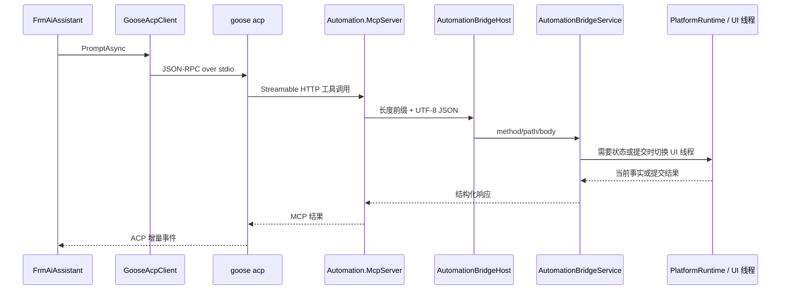
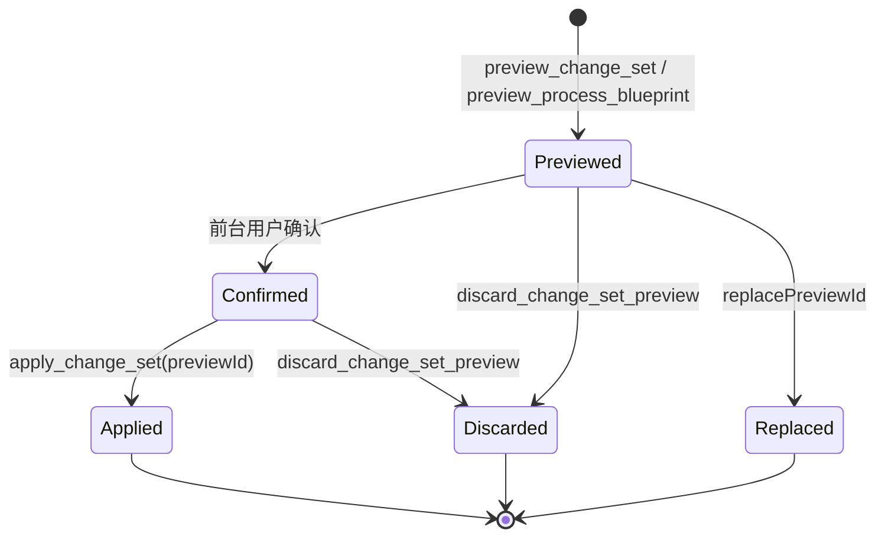

# EW-AI、MCP 与 Bridge

## 当前链路

```mermaid
sequenceDiagram
    participant UI as FrmAiAssistant
    participant ACP as GooseAcpClient
    participant Goose as goose acp
    participant MCP as Automation.McpServer
    participant Pipe as AutomationBridgeHost
    participant Bridge as AutomationBridgeService
    participant Runtime as PlatformRuntime / UI 线程

    UI->>ACP: PromptAsync
    ACP->>Goose: JSON-RPC over stdio
    Goose->>MCP: Streamable HTTP 工具调用
    MCP->>Pipe: 长度前缀 + UTF-8 JSON
    Pipe->>Bridge: method/path/body
    Bridge->>Runtime: 需要状态或提交时切换 UI 线程
    Runtime-->>Bridge: 当前事实或提交结果
    Bridge-->>MCP: 结构化响应
    MCP-->>Goose: MCP 结果
    Goose-->>UI: ACP 增量事件
```

Goose 不直接连接 WinForms，也不直接访问 Named Pipe。它只看到 MCP Profile 暴露的工具；MCP 进程通过 `AutomationBridgeClient` 与当前平台实例的 Bridge 通讯。

## 按需启动

正常 HMI 启动不主动启动 AI 辅助进程。以下场景调用 `FrmMain.EnsureAiInfrastructureStarted`：

- 平台编辑器首次显示；
- HMI 打开平台编辑器；
- 用户进入 AI 功能。

启动顺序是：验证 Goose 配置和托管上下文、启动 `AutomationBridgeHost`、再由 `AutomationMcpServerManager` 启动独立 MCP 进程。任一步失败只禁用 EW-AI 并报警，不改变流程运行状态。

关闭时顺序相反：先释放 Goose 客户端，再停止 MCP，最后停止 Bridge，防止子进程读取线程与 UI 同步授权请求形成互锁。

## ACP 会话

`GooseAcpClient` 隐藏启动 `goose acp`，通过标准输入输出发送换行分隔 JSON-RPC：

1. `initialize`
2. `session/new`，注入当前 Automation MCP HTTP 地址
3. `session/prompt`
4. 必要时 `session/cancel`

每轮 prompt 会附加当前编辑器实际选择到的最深层对象。选择只帮助定位，不代表用户授权修改。Provider、Model、平台集成上下文和 UTF-8 PowerShell 环境只覆盖当前 Goose 子进程。

发送前由 `AiTaskCapabilityRouter` 根据本轮请求、最近用户上下文、当前权限外壳和上一能力包确定任务档位。各并发任务挂载按档位复用、工具集合固定的独立 MCP 实例；任务档位变化且 Goose 内置工具集合相同时热换 MCP，源码开发与流程任务互转时重建 Goose 并恢复当前对话历史。不得通过全局 `/tool-profile` 切换活动任务，避免并发会话串台。

AI 前台内部按当前职责分层：`AiConversationCoordinator` 统一拥有会话、任务运行时、单轮执行、取消和历史收尾，`GooseAcpEventReader` 解析 ACP 工具结果，`AiPreviewConfirmationCoordinator` 归一化预演状态并去重，`AutomationBridgePreviewClient` 是前台确认/拒绝的最小 Named Pipe 客户端。`FrmAiAssistant` 只组合这些对象并负责输入、气泡和 Web 展示；模板、渲染和审核对话框分别位于对应 partial 文件。

## 工具 Profile

`Automation.Protocol/AutomationToolProfiles.cs` 保存档位名称，`McpServer/McpToolProfile.cs` 是工具集合的权威来源。档位分两层：

- `Editor`、`Diagnostic`：用户选择的权限外壳，不直接作为常规任务的模型工具面。
- `RuntimeDiagnostic`：独立诊断实例，只提供运行现场取证，不提供平台开发和配置写入。
- `ProcessDesign`、`ProcessReview`、`ProcessCreate`、`ProcessEdit`、`ResourceEdit`、`RuntimeControl`、`SourceDevelopment`、`PlatformConfiguration`：单轮任务的最小能力包。每包只开放完成该类任务所需的工具；独立变量、数据结构和报警维护归入 `ResourceEdit`，源码开发才启用 Goose Developer，流程任务只启用 Skills/TOM。

只读权限请求写入、运行或平台迁移时，路由器会机械降级到 `ProcessReview` 并向模型注入当前权限事实；平台迁移还要求完全权限。`McpServer/Program.cs --verify-profile` 校验能力包边界、必需工具、退役工具、Schema 结构和工具描述。文档不复制完整工具清单，以免与 Profile 漂移。

## ChangeSet V2 写入链

当前公开的流程结构写入只有以下状态机：

```mermaid
stateDiagram-v2
    [*] --> Previewed: preview_change_set / preview_process_blueprint
    Previewed --> Confirmed: 前台用户确认
    Previewed --> Discarded: discard_change_set_preview
    Previewed --> Replaced: replacePreviewId
    Confirmed --> Applied: apply_change_set(previewId)
    Confirmed --> Discarded: discard_change_set_preview
    Applied --> [*]
    Discarded --> [*]
    Replaced --> [*]
```

`preview_process_blueprint` 是新建单个完整流程的模型友好入口：输入流程、变量、顺序步骤和语义指令，由 `ProcessBlueprintCompiler` 确定性展开为同一个 ChangeSet V2 阶段。它不新增 Bridge 写入协议；修改既有流程继续使用原子动作 `preview_change_set`。

预演阶段由 `AiChangeSetCompiler` 在流程、变量和资源快照上编译语义或原生指令，计算可保存性和 readiness，并冻结编译结果与基础状态哈希。前台确认只更新预演记录的确认状态。

`apply_change_set` 只接受 `previewId`。Bridge 再检查确认状态、过期时间和基础状态哈希，然后把冻结的流程与变量快照交给 `ProcessVariableConfigurationService`；它与手工编辑复用同一刷新、失败回滚和底层事务，不在 apply 时重新接收或重新编译模型生成的 ChangeSet。提交结果返回稳定对象身份和受影响流程，供下一阶段精确读取。

存在活动 `EditorSession` 时，`apply_change_set` 以 `EDITOR_SESSION_ACTIVE` 无副作用拒绝提交，避免正式对象换源破坏人工草稿。仅取消草稿时可重试原已确认预演；若先保存草稿导致基础状态变化，则必须重新预演。

## Bridge 线程边界与传输

- 管道名固定为 `AutomationBridgePipe`。
- 报文是 4 字节长度前缀加 UTF-8 JSON；请求和响应都有大小上限。
- Named Pipe 接受和基础 JSON 处理在后台线程进行。
- 读取 WinForms/Store 当前状态、预演注册和正式提交通过 `ExecuteOnUiThread` 串行进入 UI 线程。
- 基础参数类型、数量和大小应尽量在 MCP 或 Bridge 工作线程拒绝，避免无效请求占用 UI 线程。

## 日志与取证

- AI 执行分析：`D:\AutomationLogs\AIExecution\Analysis\`
- AI 完整底层报文：`D:\AutomationLogs\AIExecution\` 的对应会话目录
- Bridge 异常：`D:\AutomationLogs\Bridge\`
- 统一结构化旁路：`D:\AutomationLogs\Structured\`

`turnId/seq` 用于关联用户输入、模型片段、工具开始/结束、预演、确认、提交和轮次结束。正常排查先看紧凑分析日志，只有证据不足时再看完整 ACP/MCP/Bridge 报文。

轮次结束同时记录任务能力包、工具调用数、失败数、工具结果总字节和 `trajectory` 评估。轨迹预算只标记需要复盘的低效路径，不中断模型；权限与副作用仍由能力包、Schema、确认状态机和 Bridge 契约机械约束。

## 已收敛边界

旧 intent、patch、`create_batch`、流程 create/delete/reorder/copy 路由和 ChangeSet `processes/deleteProcesses` 字段已经删除，源码只保留 ChangeSet V2 写入状态机。Profile 和架构测试中的退役词只用于反向门禁，不是可调用能力。

`AutomationBridgeService.cs` 只保存实例依赖、共享限制和预演状态。路由、协议、流程、变量、资源、迁移和诊断位于职责 partial；`JObject/JArray` 只保留在 JSON 传输、动态原生指令字段和响应投影边界，公共 MCP 参数使用强类型 DTO。Bridge/Profile/Schema 和预演状态机由 `Automation.Core.Tests` 自动验证。

## 上下文与 Prompt 分层

- `Assets/Goose/system.md` 以 Goose 官方 `crates/goose/src/prompts/system.md` 为功能规则基底，只替换 EW-AI 品牌身份并追加真实性、工业安全等跨任务约束。修改前先对照官方当前模板；同步官方变化后重新应用自定义区块，并递增 `GooseRuntimeProvisioner.SystemPromptVersion`。
- `Assets/Goose/automation.md` 只保存 Automation 跨任务路由和事实边界：纯方案不进入写入工作流，现有流程评审与当前配置写入分别路由到独立 Skill；使用独立的 `IntegrationContextVersion` 和 `.automation-context-version`，修改时不联动 System Prompt 版本。
- 两个托管 Markdown 同时作为 Manifest 资源和程序目录副本发布。运行时优先读 Manifest，失败后读目录副本；两者均失败只禁用 EW-AI 并报警，不阻断 HMI 或平台初始化。
- 只读流程检查使用 `automation-process-review` Skill；创建、修改、重构和复制使用 `automation-process-authoring` Skill。新建完整流程由 Skill 指导使用 Process Blueprint，既有对象修改使用原子 ChangeSet；两者最终进入同一预演、确认和提交状态机。
- 受管 Prompt、上下文和 Skill 在版本相同时仍核对内置资源内容；同版本内容漂移会重新同步，避免不同机器以同一版本运行不同规则。高于内置版本的本机文件仍按既有策略保留并校验。
- 具体参数、枚举、模式矩阵、数量边界、资源候选和指令技巧来自 Schema、行为 Catalog、资源工具和按需 Guide，不复制到常驻 Prompt。
- `get_process_design_guide` 是唯一的按需流程设计知识入口。服务端自动附带短 `core`，调用方通常只选一个主主题；已审核知识块包含该场景自身的失败、超时和恢复写法，另一主题承担独立职责时才追加。功能块可以包含经人工指定、AI 甄别和抽象后的历史项目写法，但只影响职责分层、阶段组织和闭环检查。
- `McpServer/ProcessKnowledge/` 只保存已完成甄别的可用规范：`catalog.json` 负责能力、设备、工艺和风险标签，`blocks/*.md` 保存完整写法，内部来源摘要不返回给运行时 AI。旧项目证据和审核过程留在 Transform 运行目录；AI 完成审核与归纳后才把结果登记到目录，并由 `get_process_design_guide` 按主题返回。
- Automation 源码开发知识由 `get_platform_development_context` 按 `hmi`、`platform-api`、`custom-function` 精确加载；目标不明确时才读取 `catalog`。
- Prompt 只陈述长期稳定的身份、真实性和安全边界；平台路由进入 `automation.md`，任务步骤进入 Skill，字段与行为进入工具契约。模型误用时优先做规则去重和契约下沉，不为单次措辞增加重复训话。

## 批量审计覆盖契约

`audit_proc_batch` 对每个 `procOffset/procLimit` 流程批次生成保持原始顺序的完整 finding 集合。单页最多返回 300 条，并同时返回 `findingOffset/findingLimit/returnedFindingCount/hasMoreFindings/nextFindingOffset`；续读必须携带上一页 `indexRevision`，配置变化时以 `AUDIT_REVISION_CHANGED` 拒绝混合不同快照。只有当前批次 finding 读完后才返回可用的 `nextProcOffset`。

`findingSummary.bySeverity/byCode` 是完整批次的附加导航索引，不替代、隐藏或合并 `findings`。禁用步骤和禁用指令始终保留为精确配置事实；是否构成缺陷由 Readiness、引用、运行证据或已验证业务目标判断。

## AI 事实权威来源

| 事实 | 权威来源 |
| --- | --- |
| 工具是否存在及所属 Profile | `McpServer/McpToolProfile.cs` |
| MCP 参数入口 | `Automation.Protocol` DTO、`AutomationMcpTools` 签名和生成 Schema |
| 原生指令类型与字段 | `OperationDefinitionRegistry`、`StructuredOperationCompiler` |
| 原生运行行为、通信重试和接收结果判定 | `OperationBehaviorCatalog`、`ProcessEngine.Operations.*` |
| 语义 kind、Schema 和编译结果 | `SemanticOperationKinds`、`AiOperationCompilerRegistry` 及对应编译器 |
| 资源配置 | 对应 Store；Bridge/MCP 只做候选和详情投影 |
| 配置可保存性 | `AiChangeSetCompiler`、`ProcessDefinitionService` |
| 流程可运行性 | `ProcessReadinessService` 和实际启动闸门 |
| 运行实例、终态与 CT 样本 | `EngineSnapshot.RunId/State/TerminationReason`、`ProcessEngine.GetLatestCycleTimeSamples`、运行黑匣子 |
| 预演、确认、哈希和提交状态 | `AutomationBridgeService` 的结构化响应 |
| 已提交对象身份 | `createdObjects/affectedProcesses` 返回的稳定 ID |

其他层只能引用、投影或验证这些事实。出现冲突时删除非权威副本并修正生成链，不在更上层增加一句 Prompt 压制冲突。

## ChangeSet 与工具设计约束

- 一个 ChangeSet 是可独立审查和保存的阶段，不要求一次完成用户的全部目标。分阶段读取、提交、回读和修正是正常路径，不重新引入会话外草稿缓存或大而全的单次协议。
- Process Blueprint 只简化单个新流程的声明，不保存第二份模型、不绕过 ChangeSet，也不用于既有对象的局部修改。
- 配置保存只检查结构、`saveRequired` 和确定性不变量；缺少 `runRequired`、晚绑定资源或未完成业务目标可以保存为 `incomplete`。启动闸门再严格拦截。
- 用户要求占位或骨架时，未知动作使用 `config.placeholder`，由 Readiness 保持 `incomplete` 并阻止启动；固定延时、普通弹框、猜测变量和常量状态不能作为缺失动作或反馈的替代品。
- 变量公开语义保持：列表分页读取、按名称或索引精确读取、配置按单变量增删改、运行值按单变量设置。ChangeSet 只承载与流程同阶段提交的逐变量声明，配置提交默认保留当前运行值。
- 预演中的局部 `key` 只在本阶段关联新对象；`operationKey` 必须指向当前 ChangeSet 最终结构内的新指令并在预演时解析，提交后的目标统一使用稳定 `opId`。历史 `#PENDING-GOTO#` 只兼容读取并阻止启动，不再生成、跨阶段补齐或自动解析。符号跳转在结构变化后重算，不以旧物理索引继续编辑。
- 工具描述保持短而完整，参数类型和基础校验由 Schema/MCP/Bridge 工作线程承担，行为知识按需读取。不要设置首次必读缓存、`TOOL_GUIDE_REQUIRED` 或近义工具来规避一次模型误用。
- 数量和体积限制必须来自协议、内存、UI 或实测模型边界，并由服务端执行；大对象优先摘要、分页、步骤读取或有限稳定 ID 批量读取。

## 修改联动检查

| 修改内容 | 必须同步检查 |
| --- | --- |
| 原生指令 | 模型默认值、Registry、Engine 分发、递归 Schema、行为 Catalog、资源引用、readiness、编译与运行测试 |
| 语义 kind | Protocol DTO、kind 集合、Schema、编译器注册、字段/资源策略、readiness、Profile 测试 |
| 资源类型 | Store/API、发现与精确读取、Bridge/Client/MCP、Profile、引用类型、资源快照、保存/运行缺失策略 |
| ChangeSet | DTO、MCP Schema、后台基础校验、编译器、冻结预演、状态哈希、前台确认、事务提交、稳定身份和 Profile 回归 |
| 跳转或结构移动 | 稳定 ID、局部 key 作用域、跨步骤目标、预演严格解析、物理地址重算、历史异常阻断、删除失效证据和提交后回读 |
| Prompt 或 Goose 部署 | 官方模板差异、自定义区块、Manifest/目录副本、独立版本号、进程环境变量、缺失降级和哈希日志 |
| 工具或路由 | `McpToolProfile`、`Program --verify-profile`、强类型参数、退役工具门禁及是否真的提供新能力 |
| AI 前台 | UI 线程、取消/关闭竞态、单活动预演、选择层级、内部事件隔离和 Markdown 渲染 |
| 日志 | `turnId/seq` 全链关联、主日志紧凑事实、完整报文仅作取证、高速循环不逐指令同步写盘 |

删除或回滚方案时，同步删除代码、Profile、描述、Schema、Markdown、版本、测试和日志字段；任一层残留都会重新制造错误路由。
