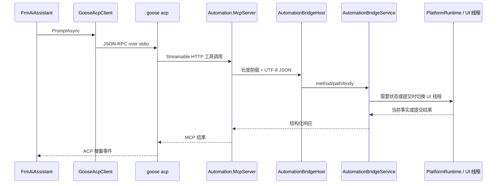
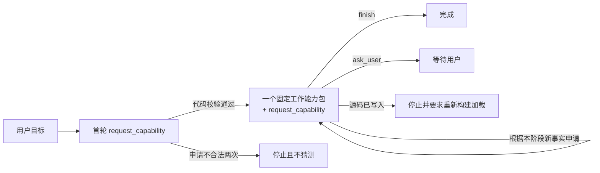
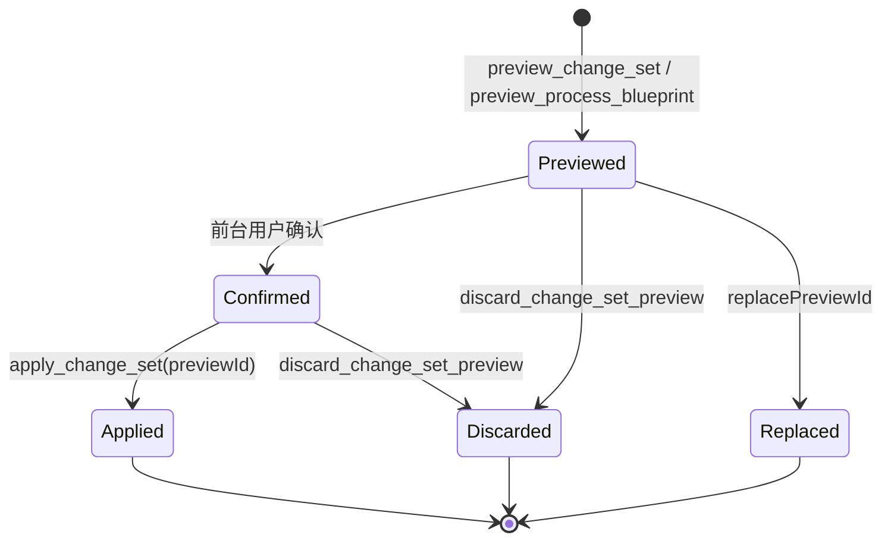

# EW-AI、MCP 与 Bridge

## 当前链路

```mermaid
sequenceDiagram
    participant UI as FrmAiAssistant
    participant ACP as GooseAcpClient
    participant Goose as goose acp
    participant MCP as Automation.McpServer
    participant Pipe as AutomationBridgeHost
    participant Bridge as AutomationBridgeService
    participant Runtime as PlatformRuntime / UI 线程

    UI->>ACP: PromptAsync
    ACP->>Goose: JSON-RPC over stdio
    Goose->>MCP: Streamable HTTP 工具调用
    MCP->>Pipe: 长度前缀 + UTF-8 JSON
    Pipe->>Bridge: method/path/body
    Bridge->>Runtime: 需要状态或提交时切换 UI 线程
    Runtime-->>Bridge: 当前事实或提交结果
    Bridge-->>MCP: 结构化响应
    MCP-->>Goose: MCP 结果
    Goose-->>UI: ACP 增量事件
```

Goose 不直接连接 WinForms，也不直接访问 Named Pipe。它只看到 MCP Profile 暴露的工具；MCP 进程通过 `AutomationBridgeClient` 与当前平台实例的 Bridge 通讯。

## 按需启动

正常 HMI 启动不主动启动 AI 辅助进程。以下场景调用 `FrmMain.EnsureAiInfrastructureStarted`：

- 平台编辑器首次显示；
- HMI 打开平台编辑器；
- 用户进入 AI 功能。

启动顺序是：验证 Goose 配置和托管上下文、启动 `AutomationBridgeHost`、再由 `AutomationMcpServerManager` 启动独立 MCP 进程。任一步失败只禁用 EW-AI 并报警，不改变流程运行状态。

关闭时顺序相反：先释放 Goose 客户端，再停止 MCP，最后停止 Bridge，防止子进程读取线程与 UI 同步授权请求形成互锁。

## ACP 会话

`GooseAcpClient` 隐藏启动 `goose acp`，通过标准输入输出发送换行分隔 JSON-RPC：

1. `initialize`
2. `session/new`，注入当前 Automation MCP HTTP 地址
3. `session/prompt`
4. 必要时 `session/cancel`

每轮 prompt 会附加当前编辑器实际选择到的最深层对象。选择只帮助定位，不代表用户授权修改。Provider、Model、平台集成上下文和 UTF-8 PowerShell 环境只覆盖当前 Goose 子进程。

ACP 流式过程仍可在当前前台显示并进入底层取证日志，但正常完成只持久化通过代码校验的 `finish/ask_user.message`。工具调用前的分析性 assistant 片段、推理片段、重复阶段总结和多阶段拼接文本不进入持久历史；用户停止或后续异常时才用已完成阶段的有限输出形成部分结果。同一个业务请求内继续使用同一个 Goose 原生会话，不重复注入阶段摘要；业务请求结束后，末轮输入达到“上下文窗口 55% 减去输出预留”的压力线，或末轮输入与工具结果估算量组合达到该线时标记 `deferred_until_next_user_request`，下一次用户请求开始前建立新会话并注入最终消息、结构化交接或最近阶段的机械证据。进程丢失、配置重置和工具面不可信仍立即使用同一可信恢复链。

每个业务对话持有一个长期存在的 Goose ACP `sessionId`。每次用户请求先把当前会话工具面切到只含 `request_capability` 的 `TaskCoordinator`；代码批准一个申请后，在同一 `sessionId` 内切换到对应固定 Profile。协调器和工作阶段使用同一会话级输出配置，默认输出预算为 16384 tokens、temperature 为 0.3；旧平台默认 8192/0.7 在加载时迁移，其他用户自定义值保持不变。协调输出通过决定工具后的立即终止收敛，不用进程级 token 上限连带截断后续工作。所有工作 Profile 都额外携带同一个控制面工具，因此模型能在完成当前读取或写入后，直接根据刚得到的事实申请下一能力、结束或询问用户。每轮第一条成功提交的决定立即锁定，客户端随即发送 `session/cancel` 终止该模型轮，权限处理器同时拒绝决定后的额外工具；后续 `request_capability` 只计入违约诊断而不覆盖路由。系统不提前生成完整阶段序列，也没有关键词路由或规划失败兜底。

MCP 进程按固定 Profile 共享复用，各业务对话的 ACP 会话、取消和阶段状态彼此独立。能力变化通过 Goose 1.46 的会话扩展接口 `_goose/unstable/session/extensions/add/remove/list` 原地重挂 Automation MCP；`skills`、`tom` 和 `developer` 也按当前 Profile 动态挂载。`SourceReview` 的 Developer 配置只允许 `read/tree`，权限回调再次拒绝其他 Developer 工具；`_goose/unstable/tools/list` 返回的目录记录为 `surface.snapshot`，目录含额外项时不再误判成有效工具面扩权。`SourceDevelopment` 才开放完整 Developer。切换成功必须保持原 `sessionId`；缺少必需工具或白名单不一致时立即停止当前任务，不静默创建新会话。附件只发送一次并由原生会话保留。不得通过全局 `/tool-profile` 切换活动任务，避免并发会话串台。

AI 前台内部按当前职责分层：`AiConversationCoordinator` 统一拥有会话、任务运行时、单轮执行、取消和历史收尾，`GooseAcpEventReader` 解析 ACP 工具结果，`AiPreviewConfirmationCoordinator` 归一化预演状态并去重，`AutomationBridgePreviewClient` 是前台确认/拒绝的最小 Named Pipe 客户端。`FrmAiAssistant` 只组合这些对象并负责输入、气泡和 Web 展示；模板、渲染和审核对话框分别位于对应 partial 文件。

标准测试仍以场景 ID 绑定固定夹具和机械验收规则，但每个场景的逐轮用户语句可以在前台直接编辑、增加或删除。运行时请求必须携带实际语句，服务端校验场景 ID、1～12 轮、单轮 1～4000 字符及单场景总计不超过 20000 字符；未保存的当前编辑值也可直接运行。“保存语句”只把相对内置默认值的差异写入当前配置目录的 `AiStandardTests.json`，“恢复默认语句”清空这些覆盖，不修改测试夹具和验收代码。`standard_test.started` 记录本次真实语句，保证后续日志分析能够区分默认测试和人工改写。

## 工具 Profile

`Automation.Protocol/AutomationToolProfiles.cs` 保存档位名称，`McpServer/McpToolProfile.cs` 是工具集合的权威来源。档位分两层：

- `Editor`、`Diagnostic`：用户选择的权限外壳，不直接作为常规任务的模型工具面。
- `RuntimeDiagnostic`：独立诊断实例，只提供运行现场取证，不提供平台开发和配置写入。
- `TaskCoordinator`：每次用户请求先切入此工具面，只开放无副作用的 `request_capability`，不加载 Developer、Skills 或 Automation TOM，不读取平台事实，也不直接执行用户任务；以第一条成功决定为准。
- `ProcessDesign`、`ProcessReview`、`ProcessCreate`、`ProcessEdit`、`ResourceEdit`、`RuntimeControl`、`SourceReview`、`SourceDevelopment`、`PlatformConfiguration`：工作阶段的最小业务工具加 `request_capability` 控制面。独立变量、数据结构和报警维护归入 `ResourceEdit`，源码只读与写入分离；工作阶段启用 Skills/TOM，源码阶段再按只读或完整权限动态挂载 Developer。

能力申请不会改变用户权限。只读权限申请写入、运行或源码开发，或未开启完全权限时申请平台迁移，代码会拒绝该申请并让协调模型改为询问用户或结束；不会擅自降级成另一任务。`McpServer/Program.cs --verify-profile` 校验能力包边界、申请 Schema、必需工具、退役工具和工具描述。文档不复制完整工具清单，以免与 Profile 漂移。

## 动态能力调度

复合请求不把多个 Profile 并成一个大工具集，也不要求最初就知道全部步骤。`AiConversationCoordinator` 在协调轮和工作轮之间循环：

```mermaid
flowchart LR
    U["用户目标"] --> C["首轮 request_capability"]
    C -->|"代码校验通过"| W["一个固定工作能力包\n+ request_capability"]
    W -->|"根据本阶段新事实申请"| W
    W -->|"finish"| F["完成"]
    W -->|"ask_user"| Q["等待用户"]
    C -->|"申请不合法两次"| S["停止且不猜测"]
    W -->|"源码已写入"| B["停止并要求重新构建加载"]
```

动态决定仍受机械边界约束：

- `ProcessReview` 进入写入或运行前，必须至少成功读取当前流程、资源或运行状态；只读取 Schema、Guide 或让模型复述历史不算当前事实。
- `ProcessReview` 只评审静态配置：优先用 `validate_proc/get_proc_overview` 建立范围，再按疑点读取流程图、指令详情、引用和变量使用。日志、快照和“为什么刚才没动作”等现场症状必须切到 `RuntimeDiagnostic`，不在静态评审工具面重复开放诊断工具。
- `ProcessReview` 结束必须提交 `reviewHandoff`。只有 `status=proven_defect`、finding 逐项引用宿主机械事实且 `repairability=safe_without_external_facts`，才能以 `basis=proven_review_finding` 进入 `ProcessEdit`；仍需用户选择或外部事实的 finding 只能保留为待决问题。`configuration_gap/unresolved/no_defect` 不能被后续模型改写成已证明缺陷。当前用户直接指定具体修改时使用 `basis=direct_user_change`。
- `ProcessReview` 中成功的校验、概览、流程图、指令详情、引用、变量使用和批量审计结果由宿主机械绑定为 `verifiedFacts`，记录对象、事实键、工具调用、JSON Pointer 和结果哈希；模型 finding 必须通过 `evidenceFactRefs` 关联这些事实，该字段本身不进入模型输入 Schema。最终交接最多携带 100 项机械事实，但不是截取最先返回的 100 项：先保留 finding 明确引用的事实，再补流程与批量审计摘要。最终答复先渲染权威事实区，再显示模型解释，数量冲突以机械事实为准。
- `ProcessCreate/ProcessEdit` 必须取得 `change_set.apply` 的 committed 与 `configurationSaved`；`PlatformConfiguration` 必须取得对应 migration apply 证据；`ResourceEdit` 必须明确返回 `configurationSaved`。无副作用的预演编译失败返回 `issues[path/rule/message/suggestedRepair]` 和 `recovery.sideEffects=none/safeToRetry=true`；模型一次修正当前修复包中的全部问题，同阶段最终成功提交后只保留失败计数用于分析，不标记为不安全部分写入。
- 配置阶段只有实际调度过写入工具后才建立 mutation 状态；只加载 Skill、读取契约或因为 `max_tokens` 暂停不会伪造“未提交写入”。实际写入失败且不能证明 `sideEffects=none`，或写入尝试最终没有取得保存证据时，才禁止继续写入和运行。预演被拒绝、用户说“先给我看/确认后再做”也立即停在边界。
- `ProcessDesign` 声称完成或进入后续能力前，必须至少成功调用一次 `get_process_design_guide`；流程写入直接进入 `ProcessCreate`，该能力自行读取设计知识、发现必要资源并创建，不先绕行纯方案阶段。简单流程可以一次创建完整实现；复杂流程先创建安全骨架，再转入 `ProcessEdit` 按稳定 ID 补齐。一旦 `ProcessCreate` 开始预演或写入，也必须取得设计知识读取证据后才能结束。普通文本声称“已参考知识库”不构成证据。
- `SourceReview/SourceDevelopment` 使用 `search_platform_source` 做根目录内的受限字面量检索，再配合 Developer `read/tree` 精确读取。纯读取不使运行实例过期；direct `write/edit` 标记源码已改变，`SourceDevelopment` 中的 Shell 标记修改状态不确定，两者都停止后续能力并要求重新构建加载。
- 协调模型的申请不是授权或事实；原生会话保留阶段对话和工具结果，但代码只接受工具结果中的机械证据。宿主从成功的资源解析、指令能力解析、ChangeSet apply 和 validate 结果提取阶段产物，包括已创建对象、稳定 ID、实际绑定和 Readiness 摘要。阶段摘要不在正常切换时重复注入；只有原生会话意外丢失或可信滚动时才注入这些结构化产物和有限最终输出，也不扩大副作用授权。已完成阶段的输出和副作用事实持久化，后续失败或用户停止时不恢复整单请求，防止重复提交。
- 工作轮没有提交决定时不会记录为完成：执行器合并本能力阶段多轮证据并在原会话最多续写 3 次，直到提交 `request_capability` 后才一次性记录阶段。`max_tokens` 后的第一次续写要求立即执行可验证动作；再次达到输出上限且没有工具进展时记录 `capability.stage.stalled` 并停止，不再用第三轮重复推理。能力切换记录 `transition.started/prepared/completed/failed/cancelled`，Goose 实际核验工具面后记录 `surface.verified`，避免“已路由但未开工”没有证据。
- 同一能力与同一目标连续重复、阶段数超过预算、缺少结构化申请或连续两次申请不合法都会停止任务，不调用词法分类器猜测用户意图。
- 阶段轨迹按能力记录工具调用数、结果体积、上下文占比、非工具耗时、首次预演尝试/成功耗时、首次成功预演前失败数以及两类聚合解析调用数；少量已恢复的工具失败只记录为 `recovered`，不把最终成功误报为不安全。原生会话输入达到“上下文窗口 55% 减去输出预留”的压力线，或最近输入与工具结果组合提前达到该线时，宿主在阶段边界滚动到新会话并只注入有限可信恢复上下文，避免在接近窗口末端才处理超长历史。

`request_capability` 使用按 action 分支的条件 Schema：`run_stage` 接收能力、目标、修改依据和可选授权证据，`finish/ask_user` 接收最终消息或问题；刚完成的评审还携带结构化 `reviewHandoff`。普通流程与资源写入由 ChangeSet 预演确认形成最终闸门，不再要求协调器从自然语言中逐字截取授权；运行控制、平台配置和源码修改仍必须在 `authorizationQuote` 中逐字引用当前用户消息。历史、附件和模型生成内容不能单独扩大这些高风险副作用授权。

## ChangeSet V2 写入链

当前公开的流程结构写入只有以下状态机：

```mermaid
stateDiagram-v2
    [*] --> Previewed: preview_change_set / preview_process_blueprint
    Previewed --> Confirmed: 前台用户确认
    Previewed --> Discarded: discard_change_set_preview
    Previewed --> Replaced: replacePreviewId
    Confirmed --> Applied: apply_change_set(previewId)
    Confirmed --> Discarded: discard_change_set_preview
    Applied --> [*]
    Discarded --> [*]
    Replaced --> [*]
```

`preview_process_blueprint` 是新建单个流程当前创建阶段的模型友好入口：简单流程可输入完整实现；复杂流程先输入顺序 Step 和按功能块命名的 `config.placeholder`，创建 `autoStart=false`、Readiness 为 `incomplete` 的安全骨架。`ProcessBlueprintCompiler` 只把本次创建阶段确定性展开为同一个 ChangeSet V2；重试策略由模型声明业务入口、判断、总尝试次数、业务状态复位/结果清理和耗尽出口，编译器生成独立的 process/double 内部计数器及不可绕过的初始化、每次尝试的业务变量清理和单次累加，不复用或改造公共变量。骨架提交并验证后，模型切换到 `ProcessEdit`，回读稳定 ID，再按可独立审查的功能块逐段 `preview_change_set → 确认 → apply → 回读`。这样原子性仍约束每次提交的数据一致性，但不再要求一个用户目标或复杂流程只使用一次预演；中断时保留已提交且不可运行的骨架，不重放已完成阶段。

蓝图目标只允许局部 key：同一步骤内用 `operationKey`，跨步骤默认只填 `stepKey` 并进入目标步骤首条有效指令；确需跳入步骤中段时必须同时填写 `entryMode=operation` 和目标 `operationKey`。稳定 `operationId/stepId` 不属于新建蓝图。带回环的标准重试必须声明 `retries[]`：`maxAttempts` 表示包含首次在内的总尝试次数，计数器为流程级 double，重试判定固定为 `counter < maxAttempts`，每次尝试入口先完成声明的结果清理/状态复位；编译器拒绝漏加计数、漏初始复位、绕过每次清理或失败出口回到重试入口的蓝图。固定业务报警使用 `alarm.raise`，编译为需要人工确认并写入报警日志的语义事件；普通提示才使用 `popup.message`，未知现场报警资源使用占位而不是猜测。新建流程若存在从入口不可达的有效指令，编译器直接拒绝预演，外部资源占位也不能被控制流绕过。Blueprint 不新增 Bridge 写入协议；后续补齐和修改继续使用原子动作 `preview_change_set`。

预演阶段由 `AiChangeSetCompiler` 在流程、变量和资源快照上编译语义或原生指令，计算可保存性和 readiness，并冻结编译结果与基础状态哈希。前台确认只更新预演记录的确认状态。

`apply_change_set` 只接受 `previewId`。Bridge 再检查确认状态、过期时间和基础状态哈希，然后把冻结的流程与变量快照交给 `ProcessVariableConfigurationService`；它与手工编辑复用同一刷新、失败回滚和底层事务，不在 apply 时重新接收或重新编译模型生成的 ChangeSet。提交结果返回稳定对象身份和受影响流程，供下一阶段精确读取。

存在活动 `EditorSession` 时，`apply_change_set` 以 `EDITOR_SESSION_ACTIVE` 无副作用拒绝提交，避免正式对象换源破坏人工草稿。仅取消草稿时可重试原已确认预演；若先保存草稿导致基础状态变化，则必须重新预演。

## Bridge 线程边界与传输

- 管道名固定为 `AutomationBridgePipe`。
- 报文是 4 字节长度前缀加 UTF-8 JSON；请求和响应都有大小上限。
- Named Pipe 接受和基础 JSON 处理在后台线程进行。
- 读取 WinForms/Store 当前状态、预演注册和正式提交通过 `ExecuteOnUiThread` 串行进入 UI 线程。
- 基础参数类型、数量和大小应尽量在 MCP 或 Bridge 工作线程拒绝，避免无效请求占用 UI 线程。

## 日志与取证

- AI 执行分析：`D:\AutomationLogs\AIExecution\Analysis\`
- AI 完整底层报文：`D:\AutomationLogs\AIExecution\` 的对应会话目录
- Bridge 异常：`D:\AutomationLogs\Bridge\`
- 统一结构化旁路：`D:\AutomationLogs\Structured\`

`turnId/seq` 用于关联用户输入、模型片段、工具开始/结束、预演、确认、提交和轮次结束。正常排查先看紧凑分析日志，只有证据不足时再看完整 ACP/MCP/Bridge 报文。

轮次结束同时记录任务能力包、工具调用数、失败数、工具结果总字节和 `trajectory` 评估。持久输出体积使用 `assistantResponseChars/decisionMessageChars/persistedCandidateChars` 区分；能力决定记录 `termination_requested`，轮次结束再用 `terminationObserved/terminationOutcome` 区分取消是否真正被 ACP 观察。轨迹预算只标记需要复盘的低效路径，不中断模型；权限与副作用仍由能力包、Schema、确认状态机和 Bridge 契约机械约束。

## 已收敛边界

旧 intent、patch、`create_batch`、流程 create/delete/reorder/copy 路由和 ChangeSet `processes/deleteProcesses` 字段已经删除，源码只保留 ChangeSet V2 写入状态机。Profile 和架构测试中的退役词只用于反向门禁，不是可调用能力。

`AutomationBridgeService.cs` 只保存实例依赖、共享限制和预演状态。路由、协议、流程、变量、资源、迁移和诊断位于职责 partial；`JObject/JArray` 只保留在 JSON 传输、动态原生指令字段和响应投影边界，公共 MCP 参数使用强类型 DTO。Bridge/Profile/Schema 和预演状态机由 `Automation.Core.Tests` 自动验证。

## AI 助手优化目标与决策原则

AI 助手的首要目标是：让模型在当前能力包内顺畅取得完成任务所需的事实，连续完成读取、判断、预演、确认、提交和验证，并在证据不足时明确停在需要补充事实的位置。外围能力的价值是缩短完成路径并守住真实安全边界，不是让模型不断撞上本可预先消除的校验错误。衡量优化是否有效，优先看首次有效预演时间、完成目标所需失败次数和无归属耗时，而不是新增了多少规则或拦截了多少请求。

整体设计分成两层：

- **模型工作台**：每个 Profile 提供足以完成当前阶段的紧凑工具面、目的感知的聚合查询和正向短工作流。工作阶段允许顺序调用多个工具；复杂流程可以先提交可独立审查和保存的安全骨架，再按功能块补齐，不要求一次 Blueprint 或一次预演完成全部业务目标。
- **代码护栏**：权限、状态机、Schema、稳定身份、资源兼容性、编译、readiness、安全和证据绑定由代码确定性执行。能够机械推导的默认值、重试结构、复位、局部关联和错误归并由工具或编译器生成；护栏正常时应处在后台，只在存在真实歧义、无效结构或副作用风险时阻止推进，并返回可以直接指导下一次修正的结构化结果。

后续遇到低效、反复试错或错误结果时，按以下顺序归因，不先假定是 Prompt 问题：

1. 模型拿不到当前事实：修正上下文路由、聚合查询契约或知识数据质量，使一次目的明确的调用返回候选、兼容性和证据缺口。
2. 模型无法表达合理意图：修正 Profile 工具面、强类型 Schema、语义操作或编译器，不要求模型猜原生类型名、私有字段或隐含迁移。
3. 模型反复写错确定性结构：由代码合成、规范化或给出多问题修复包，避免用 Prompt 教模型手工拼接机械样板。
4. 工具已经提供充分事实与表达能力，但模型仍在语义判断、歧义处理或风险取舍上稳定出错：才在对应 Prompt 或 Skill 增加 1～3 句短而通用的正向规则，并删除重叠表述。
5. 工具没有开始、会话状态丢失、轮次异常终止或日志链断裂：按运行实现问题处理，不通过业务规则掩盖。

明确禁止把以下做法作为默认优化方向：

- 不因单次测试失败追加案例化训话、否定句清单或近义规则；先用日志恢复实际轨迹并确认稳定问题类别。
- 不要求复杂流程一次性完整生成、一次性通过全部运行条件；ChangeSet 阶段只需自身可审查、可保存且不制造虚假可运行状态。
- 不把所有工具、完整递归 Schema、完整历史或重复阶段摘要同时塞给模型；减少无关输入，但不得通过隐藏真实状态制造表面简洁。
- 不让模型手工维护可由编译器确定的重试计数、复位顺序、内部局部 key 或其他样板结构。
- 不把“校验更严格”直接等同于“AI 更可靠”。校验必须对应明确不变量，并尽可能在模型提交前通过解析结果、Schema 和语义工具给出可行动信息。
- 不用猜测资源、变量、原生指令类型或删减版探针预演来探索平台能力；优先调用目的感知的解析和能力查询工具。
- 不用增加输出 Token 掩盖工具发现、Schema 体积、错误反馈或会话连续性问题。默认输出预算为 `16384`，它提供复杂阶段的完成余量，但不是允许无限探索的阶段预算。

每项 AI 优化在实现前至少检查：它是否减少模型取得事实所需的往返；是否缩短 `firstPreviewAttemptMs` 或 `firstSuccessfulPreviewMs`；是否减少首次成功前的工具失败、输入 Token、工具结果字节和无归属耗时；是否能由代码消除一次确定性重试；是否仍由机械契约守住权限和安全；是否在其他 Prompt、Skill、Schema 或文档中已有重复规则。简单完整流程应优先一次创建，复杂或事实不全的流程应优先形成安全骨架和短闭环，两者不应被统一成大而全的单次提交策略。

验证优化时先从分析日志还原 `request_capability`、事实读取、解析、预演、提交和回读的真实阶段轨迹，再判断瓶颈属于模型、上下文、工具契约、知识数据还是运行实现。短测试验证直接改动的契约；真实 AI 标准测试由用户显式启动并记录准确开始时间，不在构建或普通回归中自动执行。设计目标不是消灭模型的一切错误，而是在机械安全边界内提供可恢复、可分阶段、低试错成本的自主工作路径。

## 上下文与 Prompt 分层

- `Assets/Goose/system.md` 以 Goose 官方 `crates/goose/src/prompts/system.md` 为功能规则基底，只替换 EW-AI 品牌身份并追加真实性、工业安全等跨任务约束。修改前先对照官方当前模板；同步官方变化后重新应用自定义区块，并递增 `GooseRuntimeProvisioner.SystemPromptVersion`。
- `Assets/Goose/automation.md` 只保存 Automation 跨任务路由、事实边界和稳定工具反馈方法：纯方案不进入写入工作流，现有流程评审与当前配置写入分别路由到独立 Skill；项目存在可用资源不自动扩大目标。流程写入按目标/失败出口、聚合解析、功能块预演、提交回读的短闭环推进；复杂流程允许安全骨架后逐块补齐。结构化错误用于一次修正当前修复包，不构造删减版探针；使用独立的 `IntegrationContextVersion` 和 `.automation-context-version`，修改时不联动 System Prompt 版本。
- 两个托管 Markdown 同时作为 Manifest 资源和程序目录副本发布。运行时优先读 Manifest，失败后读目录副本；两者均失败只禁用 EW-AI 并报警，不阻断 HMI 或平台初始化。
- 只读流程检查使用 `automation-process-review` Skill；创建、修改、重构和复制使用 `automation-process-authoring` Skill。新建流程由 Skill 指导使用 Process Blueprint 创建完整简单流程或复杂流程安全骨架，已提交骨架的后续补齐与既有对象修改使用原子 ChangeSet；两者最终进入同一预演、确认和提交状态机。
- 受管 Prompt、上下文和 Skill 在版本相同时仍核对内置资源内容；同版本内容漂移会重新同步，避免不同机器以同一版本运行不同规则。高于内置版本的本机文件仍按既有策略保留并校验。
- 具体参数、枚举、模式矩阵、数量边界、资源候选和指令技巧来自 Schema、行为 Catalog、资源工具和按需 Guide，不复制到常驻 Prompt。
- `get_process_design_guide` 是唯一的按需流程设计知识入口。服务端自动附带短 `core`，调用方通常只选一个主主题；已审核知识块包含该场景自身的失败、超时和恢复写法，另一主题承担独立职责时才追加。功能块可以包含经人工指定、AI 甄别和抽象后的历史项目写法，但只影响职责分层、阶段组织和闭环检查。
- `McpServer/ProcessKnowledge/` 只保存已完成甄别的可用规范：`catalog.json` 负责能力、设备、工艺和风险标签，`blocks/*.md` 保存完整写法，内部来源摘要不返回给运行时 AI。旧项目证据和审核过程留在 Transform 运行目录；AI 完成审核与归纳后才把结果登记到目录，并由 `get_process_design_guide` 按主题返回。
- Automation 源码开发知识由 `get_platform_development_context` 按 `hmi`、`platform-api`、`custom-function` 精确加载；目标不明确时才读取 `catalog`。源码定位使用 `search_platform_source` 的字面量、目录、扩展名和最多 100 条结果边界，不把 Shell 开放给只读源码能力。
- Prompt 主要陈述长期稳定的身份、真实性和安全边界；平台路由进入 `automation.md`，任务步骤进入 Skill，字段与行为进入工具契约。某类可靠复现的问题若不能仅靠代码契约表达，允许增加 1～3 句短而通用的行为规则并递增对应资源版本；确定性、安全和数据完整性仍由代码执行，不为单次措辞或单个案例增加补丁式训话。

## 批量审计覆盖契约

`audit_proc_batch` 对每个 `procOffset/procLimit` 流程批次生成保持原始顺序的完整 finding 集合。单页最多返回 300 条，并同时返回 `findingOffset/findingLimit/returnedFindingCount/hasMoreFindings/nextFindingOffset`；续读必须携带上一页 `indexRevision`，配置变化时以 `AUDIT_REVISION_CHANGED` 拒绝混合不同快照。只有当前批次 finding 读完后才返回可用的 `nextProcOffset`。

`findingSummary.bySeverity/byCode` 是完整批次的附加导航索引，不替代、隐藏或合并 `findings`。禁用步骤和禁用指令始终保留为精确配置事实；是否构成缺陷由 Readiness、引用、运行证据或已验证业务目标判断。

## AI 事实权威来源

| 事实 | 权威来源 |
| --- | --- |
| 工具是否存在及所属 Profile | `McpServer/McpToolProfile.cs` |
| MCP 参数入口 | `Automation.Protocol` DTO、`AutomationMcpTools` 签名和生成 Schema |
| 原生指令类型与字段 | `OperationDefinitionRegistry`、`StructuredOperationCompiler` |
| 原生运行行为、通信重试和接收结果判定 | `OperationBehaviorCatalog`、`ProcessEngine.Operations.*` |
| 语义 kind、Schema 和编译结果 | `SemanticOperationKinds`、`AiOperationCompilerRegistry` 及对应编译器 |
| 资源配置 | 对应 Store；Bridge/MCP 只做候选和详情投影 |
| 配置可保存性 | `AiChangeSetCompiler`、`ProcessDefinitionService` |
| 流程可运行性 | `ProcessReadinessService` 和实际启动闸门 |
| 运行实例、终态与 CT 样本 | `EngineSnapshot.RunId/State/TerminationReason`、`ProcessEngine.GetLatestCycleTimeSamples`、运行黑匣子 |
| 预演、确认、哈希和提交状态 | `AutomationBridgeService` 的结构化响应 |
| 已提交对象身份 | `createdObjects/affectedProcesses` 返回的稳定 ID |

其他层只能引用、投影或验证这些事实。出现冲突时删除非权威副本并修正生成链，不在更上层增加一句 Prompt 压制冲突。

## ChangeSet 与工具设计约束

- 一个 ChangeSet 是可独立审查和保存的阶段，不要求一次完成用户的全部目标。分阶段读取、提交、回读和修正是正常路径，不重新引入会话外草稿缓存或大而全的单次协议。
- 目标流程名称不确定时使用 `resolve_proc_target` 一次提交多个线索。流程评审仍可用 `discover_project_resources` 做通用候选发现；`ProcessCreate/ProcessEdit` 使用 `resolve_authoring_inputs`，每个 requirement 表达一个有稳定 key 和 purpose 的绑定意图，并在同一结果中返回变量类型、作用域、归属和兼容性，避免先搜索再逐项读取。业务动作先用 `resolve_operation_capability` 对照语义 kind 和平台实际注册的原生类型，不把“扫码”等描述直接当作 `operaType`。
- 聚合解析工具的查询组、类别、名称和数量由 Schema 约束；无效参数在 MCP 内返回结构化 `INVALID_ARGUMENT`，不把普通试探错误升级成 ACP 传输失败。资源结果显式返回解析状态、兼容性和 `bindingAllowed`，只有唯一精确且用途兼容的命中允许直接绑定；单个模糊候选也不是事实。既有原生指令做少量同类型字段修改时使用 `get_native_operation_field_contract` 获取紧凑字段契约，只有改类型或递归结构不明确时才读取完整原生契约。
- Process Blueprint 只简化单个新流程的声明，不保存第二份模型、不绕过 ChangeSet，也不用于既有对象的局部修改。
- 配置保存只检查结构、`saveRequired` 和确定性不变量；缺少 `runRequired`、晚绑定资源或未完成业务目标可以保存为 `incomplete`。启动闸门再严格拦截。
- 用户要求占位或骨架时，未知动作使用 `config.placeholder`，由 Readiness 保持 `incomplete` 并阻止启动；固定延时、普通弹框、猜测变量和常量状态不能作为缺失动作或反馈的替代品。
- 占位指令及其 `Note` 不是可执行事实。确认真实动作后必须用 `operation.replace` 完整替换，不允许用 `operation.update` 把占位说明渐进改造成猜测配置。
- 字符串清空使用显式语义 `variable.clear`，编译为 `ModifyValue.ClearOutput`；`variable.set value=""` 不再承担“缺字段”和“写空值”两种含义。清空只允许 string 变量、替换模式且不得同时配置操作数。
- 同类型变量复制使用 `variable.copy(sourceVariable,targetVariable)`；编译器负责生成原生 `ModifyValue`、填充变量操作数并校验源目标类型，不要求模型读取原生“修改变量” Schema。
- 变量公开语义保持：列表分页读取、按名称或索引精确读取、配置按单变量增删改、运行值按单变量设置。ChangeSet 只承载与流程同阶段提交的逐变量声明，配置提交默认保留当前运行值。
- 预演中的局部 `key` 只在本阶段关联新对象；`operationKey` 必须指向当前 ChangeSet 最终结构内的新指令并在预演时解析。Blueprint 中 `operationKey` 与 `stepKey` 分别绑定目标指令 key 和目标步骤 key，不可互换；提交后的目标统一使用稳定 `opId`。历史 `#PENDING-GOTO#` 只兼容读取并阻止启动，不再生成、跨阶段补齐或自动解析。符号跳转在结构变化后重算，不以旧物理索引继续编辑。
- 工具描述保持短而完整，参数类型和基础校验由 Schema/MCP/Bridge 工作线程承担，行为知识按需读取。`ProcessCreate` 只保留创建闭环所需的 11 个工具，`ProcessEdit` 保留 18 个精确编辑工具；Blueprint 的重复语义联合通过 `$defs/$ref` 只传一份，Schema 预算固定为 48KB。`request_capability` 只在 `ProcessReview` 暴露 finding/reviewHandoff 结构，其他 Profile 不承担无关评审字段。不要设置首次必读缓存、`TOOL_GUIDE_REQUIRED` 或近义工具来规避一次模型误用。
- 数量和体积限制必须来自协议、内存、UI 或实测模型边界，并由服务端执行；大对象优先摘要、分页、步骤读取或有限稳定 ID 批量读取。

## 修改联动检查

| 修改内容 | 必须同步检查 |
| --- | --- |
| 原生指令 | 模型默认值、Registry、Engine 分发、递归 Schema、行为 Catalog、资源引用、readiness、编译与运行测试 |
| 语义 kind | Protocol DTO、kind 集合、Schema、编译器注册、字段/资源策略、readiness、Profile 测试 |
| 资源类型 | Store/API、发现与精确读取、Bridge/Client/MCP、Profile、引用类型、资源快照、保存/运行缺失策略 |
| ChangeSet | DTO、MCP Schema、后台基础校验、编译器、冻结预演、状态哈希、前台确认、事务提交、稳定身份和 Profile 回归 |
| 跳转或结构移动 | 稳定 ID、局部 key 作用域、跨步骤目标、预演严格解析、物理地址重算、历史异常阻断、删除失效证据和提交后回读 |
| Prompt 或 Goose 部署 | 官方模板差异、自定义区块、Manifest/目录副本、独立版本号、进程环境变量、缺失降级和哈希日志 |
| 工具或路由 | `McpToolProfile`、`Program --verify-profile`、强类型参数、退役工具门禁及是否真的提供新能力 |
| AI 前台 | UI 线程、取消/关闭竞态、单活动预演、选择层级、内部事件隔离和 Markdown 渲染 |
| 日志 | `turnId/seq` 全链关联、主日志紧凑事实、完整报文仅作取证、高速循环不逐指令同步写盘 |

删除或回滚方案时，同步删除代码、Profile、描述、Schema、Markdown、版本、测试和日志字段；任一层残留都会重新制造错误路由。
