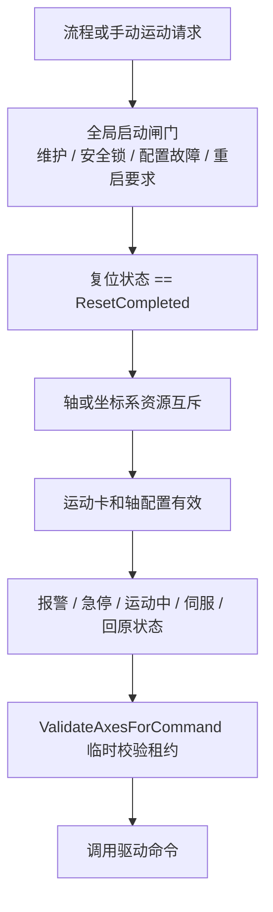

# 运动控制与安全

## 当前设备抽象

流程引擎和手动调试依赖 `IMotionRuntime` 与 `IIoRuntime`：

- 平台使用 `MotionControl/Core/MotionCtrl`，其下连接 `MotionControl/Drivers/` 中的雷赛 LTDMC/LeiSei3000 适配实现。
- `PlatformRuntimeComposer` 创建运动与 IO 实现，并注入 `EngineContext`、`ManualMotionService` 和 `PlatformRuntime`。

运动控制目录不得依赖 WinForms 或直接弹窗，`Tests/ArchitectureBoundaryRegression.ps1` 对该边界提供门禁。界面提示由 `ManualMotionService.CommandRejected` 和 UI 适配层处理。

## 实机初始化

`FrmMain.InitializePlatform` 加载并校验卡配置。如果没有配置运动卡，平台跳过运动初始化，非运动流程仍可使用。存在卡配置时按以下顺序执行：

1. `InitCardType`
2. `InitCard`
3. `DownLoadConfig`
4. `SetAllAxisSevonOn`
5. `SetAllAxisEquiv`
6. 启动轴状态监视任务

初始化失败会记录错误并禁用运动操作，不应阻止 MES、通讯和可创建的 HMI 继续工作。

## 运动命令的多层门禁

单纯拿到 `IMotionRuntime` 不能绕过这些规则：

- `ManualMotionService` 先检查全局闸门、运动配置重启标记和复位状态。
- `ProcessEngine` 对流程运动指令检查复位状态并管理资源所有权。
- `MotionCtrl.ValidateAxesForCommand` 检查卡初始化、轴报警、急停、到位、伺服使能和回原状态。
- `MotionCtrl` 的具体运动命令要求同线程的校验租约，防止直接调用底层命令跳过轴状态检查。

## 资源互斥

`ProcessEngine` 是轴和坐标系占用的协调者：

- 资源键由卡号和轴号或坐标系号组成。
- 流程执行句柄和手动操作使用不同 owner。
- 同一轴不能同时被两个流程实例或流程与手动操作占用。
- 多轴命令先整体预留，再逐轴获取；部分启动失败时停止已尝试轴并释放能够确认停止的资源。
- 流程结束、报警或停止时释放该句柄拥有的所有运动资源。

## 监视与异常

轴监视任务周期读取 IO 状态，并降低频率读取位置、速度、到位、回原、伺服和报警码。状态写入 `AxisStatusCache`，流程和 UI 读取缓存而不是各自高频访问驱动。

出现以下不确定状态时，系统优先停机和锁定：

- 轴监视线程异常；
- 手动运动监控超时或停止轴失败；
- 流程停止后运动资源不能确认释放；
- 配置事务回滚不完整；

`PlatformSafetyCoordinator.Lock` 记录原因、停止手动运动并向所有流程发送停止命令。安全锁在工程师确认原因前不会因页面刷新或重试而自动清除。

## 配置变更与重启

运动设备配置变更后设置 `MotionConfigRestartRequired`。在当前进程中继续使用旧驱动对象与新配置存在不确定性，因此所有新的轴运动都被拒绝，直到平台重启并按新配置重新初始化硬件。

## 阅读入口

| 问题 | 入口 |
| --- | --- |
| 手动运动为什么被拒绝 | `Runtime/Motion/ManualMotionService.cs` |
| 实机轴状态校验 | `MotionControl/Core/MotionCtrl.ValidateAxesForCommand` |
| 流程运动资源占用 | `ProcessEngine.TryAcquireMotionResources` 及 Motion operations |
| 运动卡实际适配 | `MotionControl/Drivers/LeiSei3000.cs`、`MotionCtrl.InitCardType` |
| 轴监视故障 | `FrmMain.Monitor/HandleAxisMonitorFailure` |
| 全局安全锁 | `Runtime/Lifecycle/PlatformLifecycleServices.cs` 中的 `PlatformSafetyCoordinator` |

所有安全停机入口已统一到 `PlatformSafetyCoordinator.StopAllProcesses`；旧的 `FrmMain.StopAllProcsForSafety` 已删除，并由架构门禁阻止回流。
