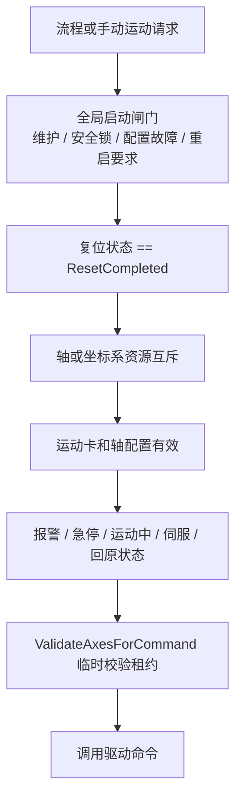

# 运动控制与安全

## 当前设备边界

流程引擎和手动调试依赖 `IMotionRuntime` 与 `IIoRuntime`：

- 平台使用实例级 `MotionControl/Core/MotionCtrl`，直接持有雷赛驱动以及 Axis、EPSON、汇川、汇川 V4 六轴工站实现。
- `PlatformRuntimeComposer` 创建运动与 IO 实现，并注入 `EngineContext`、`ManualMotionService` 和 `PlatformRuntime`。

运动融合以 3.0 的成熟代码框架和运行语义为核心，但不恢复静态全局容器、静态窗体引用或平行运行路线；4.0 内没有 LegacyAdapter 或应用适配层。运动控制目录不得依赖 WinForms 或直接弹窗，`Automation.Core.Tests/Architecture/ArchitectureBoundaryRegression.ps1` 对该边界提供门禁。界面提示由 `ManualMotionService.CommandRejected` 交给当前页面显示。

## 实机初始化

`PlatformDeviceCoordinator.Initialize` 加载已经校验的设备配置。控制卡当前只允许一张雷赛 EtherCAT 总线卡，没有用户可配置的主站、从站或多卡拓扑。如果没有配置运动卡，平台跳过物理轴初始化，但仍初始化机器人六轴工站。存在卡配置时按以下顺序执行：

1. `InitCardType`
2. `InitCard` 内部确认只发现一张物理卡、检查总线、下载 `card_0.ini`、初始化轴参数并自动上使能
3. IO 可读后立即同步检查一次急停；随后幂等重申配置下载、全轴上使能和脉冲当量
4. 初始化 Axis、EPSON、汇川和汇川 V4 六轴工站
5. 释放刹车前再次同步检查急停，确认所有物理轴均已上使能后再放闸
6. 启动设备状态监视任务

启动自动上使能是 3.0 有意保留的产品行为，让操作人员打开程序即可使用，不是待修复的异常。报警轴不会被强行使能。两次急停采样保护的是机械放闸边界，不改变 `InitCard` 内的自动上使能语义。初始化失败会记录错误并禁用相应运动操作，不应阻止 MES、通讯和可创建的 HMI 继续工作；机器人暂时离线时由工站后台继续重连。

雷赛轴配置使用单一当前契约：`EncoderType`、`HomeMethod`、`NegativeSoftLimit` 和 `PositiveSoftLimit`。绝对值编码器的节点地址只由驱动通过 SDK 查询，不进入用户拓扑配置。`HomeMethod <= 0` 沿用 `card_0.ini`；位置清零是驱动内“编码器清零、等待 100ms、指令位置清零”的原子入口。

## 运动命令的多层门禁

```mermaid
flowchart TD
    Request["流程或手动运动请求"] --> Global["全局启动闸门\n维护 / 安全锁 / 配置故障 / 重启要求"]
    Global --> Reset["复位状态 == ResetCompleted"]
    Reset --> Resource["轴或坐标系资源互斥"]
    Resource --> Config["运动卡和轴配置有效"]
    Config --> Axis["报警 / 急停 / 运动中 / 伺服 / 回原状态"]
    Axis --> Lease["ValidateAxesForCommand 临时校验租约"]
    Lease --> Driver["调用驱动命令"]
```

单纯拿到 `IMotionRuntime` 不能绕过这些规则：

- `ManualMotionService` 先检查全局闸门、运动配置重启标记和复位状态。
- `ProcessEngine` 对流程运动指令检查复位状态并管理资源所有权。
- 轴工站的点位、偏移和料盘流程指令统一进入 `AxisMotionStation`，不再旁路为另一套原始插补调用。
- `MotionCtrl.ValidateAxesForCommand` 检查卡初始化、轴报警、急停、到位、伺服使能和回原状态。
- `MotionCtrl` 的具体运动命令要求同线程的校验租约，防止直接调用底层命令跳过轴状态检查。

## 资源互斥

`ProcessEngine` 是轴和坐标系占用的协调者：

- 资源键由卡号和轴号或坐标系号组成。
- 流程执行句柄和手动操作使用不同 owner。
- 同一轴不能同时被两个流程实例或流程与手动操作占用。
- 多轴命令先整体预留，再逐轴获取；部分启动失败时停止已尝试轴并释放能够确认停止的资源。
- 流程结束、报警或停止时释放该句柄拥有的所有运动资源。

## 监视与异常

设备监视任务周期读取 IO 状态，并降低频率读取位置、速度、到位、回原、伺服和报警码。状态写入 `AxisStatusCache`，流程和 UI 读取缓存而不是各自高频访问驱动。监视任务还主动巡检六轴工站：普通整站运动中出现轴报警、急停或正负硬/软限位时，工站会联停全部绑定轴。回原、单轴运动和找限位保持 3.0 的独立语义，不挂这条整站联锁。

出现以下不确定状态时，系统优先停机和锁定：

- 轴监视线程异常；
- 配置为系统急停的逻辑输入激活；
- 整站运动中的报警、急停或正负限位；
- 手动运动监控超时或停止轴失败；
- 流程停止后运动资源不能确认释放；
- 配置事务回滚不完整；

`PlatformSafetyCoordinator.Lock` 记录原因、停止手动运动并向所有流程发送停止命令。设备协调器同时停止所有六轴工站和全部已配置物理轴（包括没有绑定工站、可从卡调试页直接操作的轴），确认停稳后抱闸、释放六轴工站并关闭雷赛卡。安全锁在工程师确认原因前不会因页面刷新或重试而自动清除。IO 的 `EffectLevel` 在底层映射为逻辑值，急停和刹车生命周期不得再次取反。

IO 的使用类型完整沿用 3.0：`通用`、`急停`、`复位`、`启动`、`暂停`、`停止`、`刹车`。五种系统控制信号必须是输入，刹车必须是输出；当前运动设备生命周期直接消费急停和刹车，其余标签继续保留成熟项目的配置语义。

## 配置变更与重启

运动设备配置变更后设置 `MotionConfigRestartRequired`。在当前进程中继续使用旧驱动对象与新配置存在不确定性，因此所有新的轴运动都被拒绝，直到平台重启并按新配置重新初始化硬件。

## 阅读入口

| 问题 | 入口 |
| --- | --- |
| 手动运动为什么被拒绝 | `Runtime/Motion/ManualMotionService.cs` |
| 实机轴状态校验 | `MotionControl/Core/MotionCtrl.ValidateAxesForCommand` |
| 流程运动资源占用 | `ProcessEngine.TryAcquireMotionResources` 及 Motion operations |
| 雷赛原生调用 | `MotionControl/Drivers/LeiSei3000.cs`、`MotionCtrl.InitCardType` |
| 六轴工站实现 | `MotionControl/Stations/`、`MotionCtrl.CreateMotionStation` |
| 设备监视故障 | `PlatformDeviceCoordinator.MonitorAxes/HandleMonitorFault` |
| 全局安全锁 | `Runtime/Lifecycle/PlatformLifecycleServices.cs` 中的 `PlatformSafetyCoordinator` |

流程停止统一进入 `PlatformSafetyCoordinator.StopAllProcesses`；设备停止与释放统一进入 `PlatformDeviceCoordinator`。旧的 `FrmMain.StopAllProcsForSafety` 已删除，并由架构门禁阻止回流。
