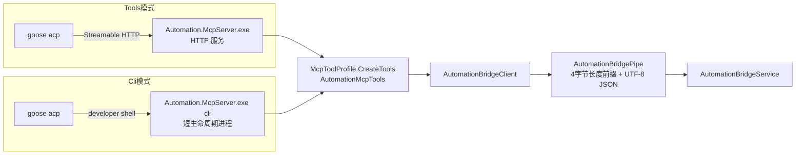

# MCP CLI 工具接入模式（ToolMode）

本文记录 2026-07-22 新增的 `ToolMode` 双模式：同一批 MCP 工具既可以按现状注入 Goose 会话（`Tools`，默认），也可以作为命令行工具按需发现和调用（`Cli`）。MCP HTTP Server 完整保留，两种模式共用同一份工具声明、Profile 集合、Schema 生成和 Bridge 管道链路。

## 模式切换

`GooseConfig.json`（`<exe>/Config/GooseConfig.json`，读写见 `Runtime/GooseConfigStorage.cs`）新增键：

- `ToolMode = "Tools"`（默认）：现状，`session/new.mcpServers` 注入 Automation MCP HTTP 地址。
- `ToolMode = "Cli"`：会话不注入任何 mcpServers，模型经 developer shell 执行 `Automation.McpServer.exe cli` 子命令调用工具。

缺键时按默认值 `Tools` 迁移补写；非法值按现有严格校验报错（`GooseConfigStorage.ReadToolMode` / `Validate`）。`TryApplyStartupSafetyDefaults` 不重置 `ToolMode`，改动跨重启保持。

切换需要重启平台进程，原因：

1. 环境变量、`mcpServers`、MOIM 上下文文件都在 Goose 子进程启动时一次性装配（`GooseAcpClient.EnsureProcessStarted` / `NewSessionAsync`），运行中的会话不切换。
2. MCP HTTP 实例的启动决策在 `FrmMain.StartMcpServerOnStartup`，已启动的实例随平台进程退出才关闭。
3. 手动改文件不触发设置页的热切换比较（`appliedConfig` 同样从文件重新加载，对比不出差异）。

## 两条通道同源



- 工具集合唯一来源仍是 `McpServer/McpToolProfile.cs`；CLI 不维护第二份清单。
- 参数绑定与 HTTP 模式同语义：键名不区分大小写，无默认值参数即 required，反序列化使用 SDK 同款 `McpJsonUtilities.DefaultOptions`。
- 工具返回一律 JSON 透传（业务错误在 `ok:false` 及 `recovery`/`allowedTransitions` 内）。

## CLI 命令契约（`McpServer/CliCommand.cs`）

| 命令 | 输出 |
|---|---|
| `cli list [--full]` | 当前 Profile 的工具名与描述；`--full` 附每个工具的 inputSchema |
| `cli schema <name>` | 单个工具的描述与 inputSchema |
| `cli call <name> [--json '<args>' \| --json-file <path>]` | 调用工具并输出其 JSON 返回；`--json` 缺省 `{}`；ChangeSet 等大体积参数用 `--json-file` 从 UTF-8 文件读取 |

- Profile 解析顺序：`--profile` 参数 > `AUTOMATION_MCP_PROFILE` 环境变量 > `Editor`。
- 完全权限解析顺序：`--full-permission` 参数 > `AUTOMATION_MCP_FULL_PERMISSION`（1/true）> 关闭；仅 Editor Profile 可开（与 HTTP 模式 `DynamicMcpToolRegistry.SetConfiguration` 同一约束，非 Editor 请求报用法错误）。开启后追加 FullPermission 组 8 个迁移/平台配置工具，Editor 工具数 58 → 66，CLI 覆盖率达到 74/74。
- 前台"完全权限"按钮在 Cli 模式下不再走 `/tool-profile`：`SetFullPermissionToolsAsync` 直接更新 `GooseAcpClient.FullPermissionEnabled` 并重建 Goose 进程，经 `AUTOMATION_MCP_FULL_PERMISSION` 注入子进程。
- 退出码：0 = 调用已执行；1 = 本地故障（如 Bridge 未运行）；2 = 用法错误（未知工具、缺必填参数、JSON 无效，参数解析失败会回显实际收到的参数前缀）。
- 入口在 `McpServer/Program.cs` 按 `--verify-profile` 先例拦截，不启动 HTTP 与托盘。
- 反序列化失败的 message 翻译为 JSON 层事实（字段路径、期望 JSON 类型、实际收到的值）；出错字段位于 `actions[N].operation` 时，`recovery` 附带该指令的 `semanticKind` 与 `contractTool`（`get_semantic_operation_schema`），把恢复导向单 kind 精确读取，而不是检索整个 ChangeSet Schema。

## Cli 模式的会话装配（`GooseAcpClient`）

- `session/new.mcpServers` 为空数组；`ReloadAutomationExtensionAsync` 直接返回。
- `--with-builtin developer,skills,tom` 不变，developer 提供 shell；`GOOSE_SHELL` 指向随程序发布的 `GooseShell/bash.exe`（UTF-8 Git Bash 适配器），真实 bash 经 `AUTOMATION_GOOSE_SHELL` 定位到 `D:\AutomationTools\Git\bin\bash.exe`（与 git 同属 AutomationTools 部署，`GooseRuntimeEnvironment.TryValidate` 一并校验），适配器保留宿主进程保护；PowerShell 时代的引号剥落问题在 bash 下不存在，内联 `--json` 恢复可用。
- 当前子进程环境变量：`AUTOMATION_MCP_CLI_PATH`（由 `AutomationMcpServerManager.ResolveMcpServerExecutablePath` 解析，已改为 public）、`AUTOMATION_MCP_PROFILE`（取 `config.ToolProfile`）；Tools 模式显式 Remove。
- `GOOSE_MOIM_MESSAGE_FILE` 改指 `Assets/Goose/automation-cli.md` 的部署副本（独立版本 `GooseRuntimeProvisioner.CliIntegrationContextVersion`）。
- 追加部署 Skill `automation-mcp-cli` 到 `<Goose工作目录>/.agents/skills/`（`GooseRuntimeProvisioner.TryEnsureMcpCliSkill`）。
- ToolMode 变化归入 `FrmAiAssistant.SaveWebConfig` 的 `requiresGooseProcessRestart`，下次会话按新模式装配。

## 上下文与 Skill 分层

- `Assets/Goose/automation-cli.md`：与 `automation.md` 同层的任务入口/契约分层/证据路由，只把调用机制替换为 `cli list/schema/call`，不复制字段级事实。
- `Assets/Goose/Skills/automation-mcp-cli/SKILL.md`：只承载 CLI 机制（命令、bash JSON 引用、退出码、大输出落盘、预演确认行为）。流程编写方法仍由 `automation-process-authoring` 单一承担，两个 Skill 都部署时按 description 各取所需。
- 部署与校验沿用既有双通道：Manifest 内嵌资源优先、程序目录 `Assets/Goose/` 副本回退；`GooseRuntimeProvisioner` 对 cli 上下文和 Skill 做锚点与退役路由校验，失败只禁用 EW-AI。

## 预演确认兼容（`FrmAiAssistant`）

`TryPromptPreviewConfirmation` 的判定不变（`data.previewId` + `confirmed=false`），Cli 模式下增加两条取文本路径：

- `ExtractAllToolResultText`：拼接 tool_result 全部 content 项文本，兼容 shell 输出位置。
- `TryExtractPreviewJsonObject`：shell 输出夹带非 JSON 文本时，从后向前定位包含 `data.previewId` 的完整 JSON 对象。

两条路径只在 `toolMode = Cli` 时启用，Tools 模式行为不变；确认/拒绝仍直连 Bridge 管道（`/bridge/previews/confirm|reject`）。

## 运行诊断中心

`FrmRuntimeDiagnostics.CreateDiagnosticConfig` 固定 `ToolMode = Tools`：RuntimeDiagnostic 会话使用独立的 runtime_diagnostic MCP 实例，且以纯 `acp` 启动（无 developer shell），不随编辑器 ToolMode 切换。

## Cli 模式标准测试与调优

### 测试场景

`Runtime/AiStandardTestSuite.cs` 的 `cli_loop_sum`「Cli 模式循环累加」：prompt 要求创建循环流程“标准测试_1到100相加”（1 到 100 累加，结果写入变量“标准测试_累加结果”）。评估检查：流程已创建、指令 ≥ 3、变量已声明、存在指向前序指令的回边 `Goto`、跳转结构有效。

### 运行方式

UI 路径（完整链路，含前台确认窗）：

1. 用新构建重启平台（`bin\Debug\Automation.exe`）。
2. `Config/GooseConfig.json` 设 `"ToolMode": "Cli"`；模型服务指向目标 endpoint（本机 llama.cpp 示例：`http://172.16.50.172:8080/v1`，模型 ID 以 `/v1/models` 返回为准）。
3. 打开 AI 页面，把工具模式切到 `Editor`（启动安全默认每次重置为 Diagnostic，Diagnostic 无 `preview_change_set`）。
4. 标准测试勾选「Cli 模式循环累加」运行；shell 权限请求按现有 `session/request_permission` 流程处理；预演弹窗确认后模型才会 `apply_change_set`。

无头 harness（自动允许权限、自动经 Bridge 管道确认预演、最多 N 轮“继续”）：

```powershell
# 前提：平台编辑器已启动（Bridge 管道在监听）
python Scripts/Invoke-McpCliSessionTest.py --log Logs/cli_session_test.jsonl --rounds 3
```

`Scripts/Invoke-McpCliSessionTest.py` 复刻 `GooseAcpClient` 的 Cli 模式装配（空 mcpServers、`GOOSE_MOIM_MESSAGE_FILE` 指向 `automation-cli.md`、`AUTOMATION_MCP_CLI_PATH/PROFILE`、OpenAI 兼容 endpoint），每轮结束后按名称核对目标流程与变量并输出 goal state。

### 首轮调优结论（2026-07-22，Qwen3.6-35B 本地模型）

按失败频次排序的三类问题及处置：

1. **PowerShell JSON 引用**（最高频）：模型把 `'{"a":1}'` 写成 `'{\"a\":1}'`（单引号内 `\"` 原样进入解析器）、`--json $true`、双引号包裹含双引号的 JSON，甚至落回写 `.cmd/.ps1/.cs` 文件绕道。处置：`automation-mcp-cli` Skill 给出两种已验证写法（单引号原样包裹 / `ConvertTo-Json -Compress`）和失败反例；新增 `--json-file` 作为大参数通道；`--json` 解析失败回显实际收到的参数前缀。
2. **机制 Skill 未加载**：模型直接按 `automation-cli.md` 的调用格式开跑，跳过 `automation-mcp-cli`。处置：`automation-cli.md` 把 `load_skill(automation-mcp-cli)` 提前为“首次 `cli call` 前”的第一步（`CliIntegrationContextVersion` 递增）。
3. **ChangeSet 目标字段笔误**：`targetStep` 写成 `stepKey`（Schema 与 Bridge 错误均明确为 `stepId/key`），模型编辑修正 4 次未命中后 `end_turn`。Schema 与错误文本已是最精确事实，此类恢复失败属于模型能力边界；harness 用多轮“继续”覆盖，UI 场景由用户补充一句即可。

### 第二轮调优结论（2026-07-22 下午，UI 实测驱动）

1. **Skill 版本碰撞导致陈旧内容存活**：仓库曾提交又 Revert 一版引用 `get_process_design_faq`（不存在的工具）和“automation.md 检查清单”（不存在的内容）的 Skill，版本号未递增，部署到 Goose 工作目录（编辑器会话 cwd 是 `HmiDevelopmentSourceLocator.ProjectRoot`，不是 `GooseConfig.WorkingDirectory`）的陈旧副本因“版本相等”永远不被覆盖，模型被引导调用不存在的工具并凭空发现 ChangeSet 结构。处置：修复内容并递增 `.automation-skill-version` 到 3，同步全部部署副本。**规则：Skill/上下文内容变更必须递增对应版本号，Revert 也要递增。**
2. **嵌套字段静默丢弃**：模型按 `get_proc_detail` 的运行时结构（steps/ops）嵌套进 `process.create`，STJ 默认忽略未知字段，预演“成功”但 stepCount=0，造成假成功和多轮困惑。处置：CLI 反序列化开启 `JsonUnmappedMemberHandling.Disallow`，未知字段立即报出字段名与 DTO 类型（仅 Cli 通道，HTTP 模式行为不变）。
3. **ChangeSet 骨架发现成本高**：模型花十余步试出“process.create 不含 steps、step.append 不含 ops、三层用局部 key 关联、kind 枚举位置”。处置：`automation-process-authoring` 新增《ChangeSet V2 骨架》一节（字段经 `cli schema` 逐一核对），并明确提交契约与运行时读取结构是两层事实。

第三轮 harness 实测（同模型同任务）：第一轮 169.7s / 40.7k token 完成 `preview → apply`，流程“标准测试_1到100相加”两步骤、变量声明提交成功，`validate_proc` 返回 `ready/runnable`；`cli.error`/`bridge.error` 均为 0，失败调用 5 次且全部当场恢复。对比基线（百步内未完成、工具调用 50+ 次、最终放弃）显著改善。

### 第三轮调优结论（2026-07-22 傍晚）

1. **变量声明与 `flow.goto` 字段试错**：UI 实测（1到107相加，turn 40 调用/11 失败/已完成）中剩余失败集中在 `variables[]` 字段（发明了 `key`/`defaultValue`、`policy` 与 `value` 类型写错）和 `flow.goto` 目标（发明了 `targetOperationKey`）。处置：骨架示例补全 `variables` 声明（`name/scope/ownerProcess/type/value/policy` 全字段）与 `flow.goto` 的 `target.operationKey`，并标注字符串契约字段在 `ConvertTo-Json` 下必须写成 `'1'`（Skill v4）；`automation-mcp-cli` 补一句“`cli schema` 只接受工具名，kind 不是工具”（v3）。
2. **harness 自身 bug**：`goal_state` 用 `limit=200` 调 `list_variables`，被 Bridge 范围校验（1..100）拒绝，导致两轮误报 `variableCreated:false`。已修为 100。

第五轮复测（修复后全链路）：**单轮 GOAL REACHED**——244.8s / 40.9k token，cli 调用 12 次（preview 8 次中 2 次编译失败当场修正、apply 1 次），Get-Content 分段读取 12 次，失败调用 5 次全部恢复；提交后 `validate_proc` = `ready/runnable`，变量声明同步提交。基线（>100 调用未完成）→ 单轮完成，本地小模型下进入稳定可用区间。

### 第四轮调优结论（2026-07-24，通用 CLI Agent / Git Bash 终端实测）

依据 `Logs/llm_io.jsonl`（Kimi Code CLI 经 OpenAI 兼容端点，任务「新增循环流程 1 到 4444 相加」）：全链路成功，preview confirmed → apply committed，12 次 shell 调用中 5 次失败全部当场恢复。按浪费调用数排序的问题及处置：

1. **shell 方言混淆**（3 次连续失败，最高频）：模型已先加载 `automation-mcp-cli` Skill，仍依次写出 cmd 的 `"%AUTOMATION_MCP_CLI_PATH%" cli list`（bash 按作业符解析，报 `fg: no job control`）、PowerShell 的 `$env:VAR=...; & $env:VAR cli list`（bash 语法错误），第三次才改用 `export CLI=... && "$CLI" cli list`。Skill 的「shell 是 Git Bash」原先只出现在 JSON 引用一节，命令节没有环境变量引用方式的正面事实。处置：命令节顶部补 Git Bash 环境变量引用契约——直接 `"$AUTOMATION_MCP_CLI_PATH"`、每次 shell 调用都是新进程（自定义 export 不保留）、不要 echo 后硬编码字面量路径，并附两种失败写法的实际报错作为反例（Skill v6）。
2. **语义 kind 选择偏差**（1 次失败）：`sum += i` 误用 `variable.add` 并把 `amount` 写成字符串 `"i"`。结构化错误（字段路径 + 期望类型 + `semanticKind`/`contractTool`）引导模型两次调用内恢复。根因是骨架示例只演示了常量自增 `variable.add`，未给变量间运算的 kind 路由。处置：骨架补一条路由事实——常量自增用 `variable.add`，变量间运算用 `variable.compute`（字段仍以其精确 Schema 为准）（authoring Skill v6）。
3. **`policy: "create"` 撞已有变量**（1 次失败）：`i`/`sum` 已是 public 变量，create 策略编译失败。模型 `list_variables` 后改 `update` 一次通过。Bridge 错误文本本身足够精确，处置：骨架 `policy` 说明补一句「`create` 要求同名变量尚不存在，无法确认时用缺省 `reuse`」（authoring Skill v6）。

经验：结构化错误的恢复引导（`recovery.semanticKind/contractTool`、字段路径）本轮全部一次命中，问题集中在 shell 方言与 kind 路由这类「机制事实缺失」，适合在 Skill 层补正面事实，不需要改 Bridge 或提示词训话。

## 验证事实

- `Automation.McpServer.exe --verify-profile` 通过（Profile 未变）。
- 冒烟（平台编辑器运行中）：`cli list`（Diagnostic 49 / Editor 58）、`cli schema preview_change_set`、`cli call list_procs` / `list_variables` 返回与 HTTP 模式一致的 JSON；Profile 门禁、未知工具、缺必填参数、非法 JSON 的退出码分别为 2/2/2/2，业务错误为 stdout JSON。
- Goose Cli 会话实测（harness 两轮，本地 Qwen3.6-35B）：MOIM 注入、`cli list/schema/call` 链路、`--json-file` 与 Bridge 结构化错误往返均工作；失败集中在模型侧 JSON 引用与字段恢复（见上调优结论），未暴露平台侧缺陷。预演确认窗与 apply 的完整 UI 链路仍待一轮人工回归。
