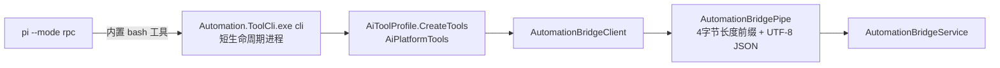

# ToolCli 工具接入模式

本文记录 2026-08 的 AI 链路迁移：Goose ACP 与 MCP HTTP 协议形态整体删除，`Automation.McpServer.exe` 改名瘦身为 `Automation.ToolCli.exe`，`cli list/schema/call` 子命令成为平台工具的唯一调用通道；AI 子进程由 Goose 替换为 Pi（`pi --mode rpc`），模型经 Pi 内置 bash 工具（Windows 下自动使用 Git Bash）按需发现和调用工具。原 `ToolMode` 双模式与 `ToolMode` 配置键随之删除，不再存在 Tools/Cli 切换。

## 唯一通道同源



- 工具集合唯一来源是 `ToolCli/AiToolProfile.cs`（原 `McpServer/McpToolProfile.cs`）；CLI 不维护第二份清单。
- 参数绑定：键名不区分大小写，无默认值参数即 required，反序列化开启 `JsonUnmappedMemberHandling.Disallow`，未知字段立即报出字段名与 DTO 类型。
- 工具返回一律 JSON 透传（业务错误在 `ok:false` 及 `recovery`/`allowedTransitions` 内）。

## CLI 命令契约（`ToolCli/CliCommand.cs`）

| 命令 | 输出 |
|---|---|
| `cli list [--full]` | 当前 Profile 的工具名与描述；`--full` 附每个工具的 inputSchema |
| `cli schema <name>` | 单个工具的描述与 inputSchema |
| `cli call <name> [--json '<args>' \| --json-file <path>]` | 调用工具并输出其 JSON 返回；`--json` 缺省 `{}`；ChangeSet 等大体积参数用 `--json-file` 从 UTF-8 文件读取 |

- Profile 解析顺序：`--profile` 参数 > `AUTOMATION_TOOL_PROFILE` 环境变量 > `Editor`。
- 完全权限解析顺序：`--full-permission` 参数 > `AUTOMATION_TOOL_FULL_PERMISSION`（1/true）> 关闭；仅 Editor Profile 可开（非 Editor 请求报用法错误）。开启后追加 FullPermission 组 8 个迁移/平台配置工具。
- 前台"完全权限"开关直接更新 `PiRpcClient.FullPermissionEnabled` 并重建 Pi 进程，经 `AUTOMATION_TOOL_FULL_PERMISSION` 注入子进程。
- 退出码：0 = 调用已执行；1 = 本地故障（如 Bridge 未运行）；2 = 用法错误（未知工具、缺必填参数、JSON 无效，参数解析失败会回显实际收到的参数前缀）。
- 入口在 `ToolCli/Program.cs` 按 `--verify-profile` 先例拦截；HTTP 服务与托盘已随 MCP 形态删除。
- 反序列化失败的 message 翻译为 JSON 层事实（字段路径、期望 JSON 类型、实际收到的值）；出错字段位于 `actions[N].operation` 时，`recovery` 附带该指令的 `semanticKind` 与 `contractTool`（`get_semantic_operation_schema`），把恢复导向单 kind 精确读取，而不是检索整个 ChangeSet Schema。

## Pi 会话装配（`PiRpcClient`）

- 子进程命令行：`pi --mode rpc --no-skills --skill <skill目录>... [--provider X] [--model Y]`，路径参数一律使用正斜杠。
- 当前子进程环境变量：`PI_CODING_AGENT_DIR`（指向 `%APPDATA%\Automation\Pi\agent`，其中 `APPEND_SYSTEM.md` 由 `Assets/Pi/automation-cli.md` 部署而来）、`AUTOMATION_TOOLCLI_PATH`、`AUTOMATION_TOOL_PROFILE`（取 `config.ToolProfile`）、完全权限开启时 `AUTOMATION_TOOL_FULL_PERMISSION=1`。
- Skill 隔离：`--no-skills` 关闭全部自动发现（含 `~/.agents/skills`），`--skill` 显式加载 `%APPDATA%\Automation\Pi\skills\<name>\SKILL.md`；项目级隔离由 Pi 原生参数完成，不再需要 Goose 时代的 `GOOSE_SKILLS_PROJECT_ONLY` 补丁。
- Pi 内置 bash 在 Windows 下自动使用 Git Bash，PowerShell 时代的引号剥落问题在 bash 下不存在，内联 `--json` 可用。
- Profile 与完全权限变化需要重建 Pi 进程，下次会话按新配置装配。

## 上下文与 Skill 分层

- `Assets/Pi/automation-cli.md`：任务入口/契约分层/证据路由，部署为 `APPEND_SYSTEM.md` 追加到 Pi 默认系统提示词，不复制字段级事实。
- `Assets/Pi/Skills/automation-tools-cli/SKILL.md`：只承载 CLI 机制（命令、bash JSON 引用、退出码、大输出落盘、预演确认行为）。流程编写方法仍由 `automation-process-authoring` 单一承担，两个 Skill 都部署时按 description 各取所需。
- 部署与校验沿用既有双通道：Manifest 内嵌资源优先、程序目录 `Assets/Pi/` 副本回退；Provision 对上下文和 Skill 做锚点与退役路由校验，失败只禁用 EW-AI。Skill/上下文内容变更必须递增对应版本号，Revert 也要递增。

## 预演确认（`FrmAiAssistant`）

`TryPromptPreviewConfirmation` 的判定不变（`data.previewId` + `confirmed=false`）。取文本路径切换为 Pi 结构化事件：从 `tool_execution_end.result.content[].text` 拼接工具返回文本并解析预演 JSON，不再扫描 shell 输出。确认/拒绝仍直连 Bridge 管道（`/bridge/previews/confirm|reject`）。

## 运行诊断中心

诊断会话与编辑器会话使用同一条 ToolCli 通道，Profile 分别固定为 `RuntimeDiagnostic` 与编辑器当前 Profile，互不切换；独立 MCP 实例已随 HTTP 形态删除。

## 标准测试与调优

### 测试场景

`Runtime/AiStandardTestSuite.cs` 的 `cli_loop_sum`「循环累加」：prompt 要求创建循环流程“标准测试_1到100相加”（1 到 100 累加，结果写入变量“标准测试_累加结果”）。评估检查：流程已创建、指令 ≥ 3、变量已声明、存在指向前序指令的回边 `Goto`、跳转结构有效。

### 运行方式

UI 路径（完整链路，含前台确认窗）：

1. 用新构建重启平台（`bin\Debug\Automation.exe`）。
2. `Config/AiConfig.json` 指向目标模型服务（本机 llama.cpp 示例：`http://172.16.50.172:8080/v1`，模型 ID 以 `/v1/models` 返回为准）；配置键见 `AGENTS.md` 配置文件清单。
3. 打开 AI 页面，把工具 Profile 切到 `Editor`（启动安全默认每次重置为 Diagnostic，Diagnostic 无 `preview_change_set`）。
4. 标准测试勾选「循环累加」运行；预演弹窗确认后模型才会 `apply_change_set`。

无头 harness（自动经 Bridge 管道确认预演、最多 N 轮“继续”）：

```powershell
# 前提：平台编辑器已启动（Bridge 管道在监听）、pi.exe 与 Automation.ToolCli.exe 已部署
python Scripts/Invoke-PiRpcSessionTest.py --toolcli <Automation.ToolCli.exe 路径> --log Logs/pi_session_test.jsonl --rounds 3
```

`Scripts/Invoke-PiRpcSessionTest.py` 复刻 `PiRpcClient` 的子进程装配（`pi --mode rpc --no-skills --skill ...`、`PI_CODING_AGENT_DIR`、`AUTOMATION_TOOLCLI_PATH/AUTOMATION_TOOL_PROFILE`），从 `tool_execution_end` 事件解析预演并经管道确认，每轮结束后按名称核对目标流程与变量并输出 goal state。

### 历史调优结论（Goose 时代，2026-07）

以下结论记录的是 Goose + MCP CLI 时代的实测，机制名称以本文新链路为准；其中 bash JSON 引用、Skill 版本递增、ChangeSet 骨架与结构化错误恢复等经验在当前链路仍然成立。

1. **PowerShell JSON 引用**（最高频）：模型把 `'{"a":1}'` 写成 `'{\"a\":1}'`、双引号包裹含双引号的 JSON，甚至落回写 `.cmd/.ps1/.cs` 文件绕道。处置：机制 Skill 给出已验证写法（单引号原样包裹）和失败反例；新增 `--json-file` 作为大参数通道；`--json` 解析失败回显实际收到的参数前缀。
2. **机制 Skill 未加载**：模型直接按集成上下文的调用格式开跑，跳过机制 Skill。处置：集成上下文把“读取机制 Skill 的 SKILL.md”提前为“首次 `cli call` 前”的第一步。
3. **ChangeSet 目标字段笔误**：`targetStep` 写成 `stepKey`（Schema 与 Bridge 错误均明确为 `stepId/key`），模型编辑修正多次未命中后结束。Schema 与错误文本已是最精确事实，此类恢复失败属于模型能力边界；harness 用多轮“继续”覆盖，UI 场景由用户补充一句即可。
4. **Skill 版本碰撞导致陈旧内容存活**：版本号未递增时，已部署的陈旧副本因“版本相等”永远不被覆盖，模型被引导调用不存在的工具。**规则：Skill/上下文内容变更必须递增对应版本号，Revert 也要递增。**
5. **嵌套字段静默丢弃**：模型按 `get_proc_detail` 的运行时结构（steps/ops）嵌套进 `process.create`，STJ 默认忽略未知字段，预演“成功”但 stepCount=0。处置：CLI 反序列化开启 `JsonUnmappedMemberHandling.Disallow`，未知字段立即报出字段名与 DTO 类型。
6. **shell 方言混淆**：模型依次写出 cmd 的 `%VAR%`（bash 按作业符解析）与 PowerShell 的 `$env:VAR`（bash 语法错误）。处置：机制 Skill 命令节顶部给出 Git Bash 环境变量引用契约——直接 `"$AUTOMATION_TOOLCLI_PATH"`、每次 shell 调用都是新进程、不要 echo 后硬编码字面量路径，并附失败写法的实际报错作为反例。
7. **语义 kind 选择偏差与 `policy: "create"` 撞已有变量**：结构化错误的恢复引导（`recovery.semanticKind/contractTool`、字段路径）一次命中；常量自增用 `variable.add`、变量间运算用 `variable.compute`、`create` 要求同名变量尚不存在等路由事实已补入 `automation-process-authoring` 骨架。

经验：结构化错误的恢复引导全部一次命中，问题集中在 shell 方言与 kind 路由这类「机制事实缺失」，适合在 Skill 层补正面事实，不需要改 Bridge 或提示词训话。

## 验证事实

- `Automation.ToolCli.exe --verify-profile` 通过（Profile 未变）。
- 冒烟（平台编辑器运行中）：`cli list`（Diagnostic 49 / Editor 58）、`cli schema preview_change_set`、`cli call list_procs` / `list_variables` 返回结构化 JSON；Profile 门禁、未知工具、缺必填参数、非法 JSON 的退出码分别为 2/2/2/2，业务错误为 stdout JSON。
- Pi RPC 会话经 `Scripts/Invoke-PiRpcSessionTest.py` 实测：`--skill` 显式加载、`cli list/schema/call` 链路、`--json-file` 与 Bridge 结构化错误往返、预演事件解析与管道确认均工作。
