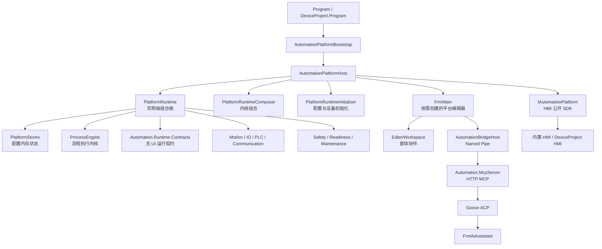

# Automation 架构导航

本文档集记录 2026-07-22 的当前实现，目标是让第一次进入仓库的人能够回答三个问题：程序从哪里启动、数据经过哪些边界、出现问题应该先看哪里。

文档描述的是“现在的程序”，不是理想化重写方案。已知问题单独记录在[技术债清单](07-技术债清单.md)中，避免把目标架构误当成已经完成的事实。

## 建议阅读顺序

1. [启动与生命周期](01-启动与生命周期.md)
2. [配置与持久化](02-配置与持久化.md)
3. [流程编辑与运行](03-流程编辑与运行.md)
4. [平台编辑器](04-平台编辑器.md)
5. [EW-AI、MCP 与 Bridge](05-AI与Bridge.md)
6. [运动控制与安全](06-运动与安全.md)
7. [技术债清单](07-技术债清单.md)和[重整路线图](08-重整路线图.md)

## 当前系统全景

`PlatformRuntime` 已替代旧的进程级 `SF` 全局容器；每个宿主实例显式拥有 Store、引擎、设备运行时和平台服务。`PlatformRuntimeComposer` 负责内核组合，`PlatformRuntimeInitializer` 负责配置加载与发布，`PlatformDeviceCoordinator` 负责设备和轴监视，`PlatformSystemStatusService` 维护系统状态。HMI 启动不创建隐藏编辑器；用户打开平台编辑器时，`FrmMain` 才按需创建并附加到已经运行的同一实例。

## 逻辑层与主要职责

| 逻辑层 | 当前主要入口 | 负责什么 | 不应负责什么 |
| --- | --- | --- | --- |
| 进程入口 | [`Application/Program.cs`](../../Application/Program.cs) | 启动准备、选择 HMI 或编辑器、运行消息循环 | 业务配置和设备细节 |
| 生命周期宿主 | [`Runtime/Hosting/AutomationPlatformHost.cs`](../../Runtime/Hosting/AutomationPlatformHost.cs) | 单实例状态、SDK、初始化和安全关闭 | 直接实现流程指令 |
| 组合根 | [`Runtime/Hosting/PlatformRuntime.cs`](../../Runtime/Hosting/PlatformRuntime.cs) | 持有实例级 Store、服务和设备接口 | 隐式全局定位 |
| 配置状态 | [`Stores/`](../../Stores)、[`Stores/README.md`](../../Stores/README.md) | 加载、校验、内存状态和持久化 | 弹窗和窗体导航 |
| 流程内核 | [`Engine/`](../../Engine)、[`Engine/README.md`](../../Engine/README.md) | 流程定义、编译、编辑、就绪分析、执行与状态快照 | 编辑器布局和配置存储 |
| 运行契约 | [`Automation.Runtime.Contracts/`](../../Automation.Runtime.Contracts) | 流程状态、终止原因、报警交互、日志和弹窗端口 | Store、WinForms、设备实现 |
| 设备适配 | [`MotionControl/`](../../MotionControl)、[`PLC/`](../../PLC)、[`Communication/`](../../Communication) | 对接硬件与通讯实现 | 读取平台窗体 |
| 平台编辑器 | [`Editor/`](../../Editor)、[`Editor/README.md`](../../Editor/README.md) | 按功能组织 WinForms 页面、编辑会话和用户交互 | 作为非 UI 模块的服务定位器 |
| AI 接入 | [`Bridge/`](../../Bridge)、[`Bridge/README.md`](../../Bridge/README.md)、[`McpServer/`](../../McpServer)、[`Editor/Ai/FrmAiAssistant.cs`](../../Editor/Ai/FrmAiAssistant.cs) | 精确读取、预演确认、提交和诊断 | 绕过正式配置与运行门禁 |
| 设备工程 SDK | [`Automation.DeviceSdk/`](../../Automation.DeviceSdk) | 向独立 HMI 暴露稳定平台能力 | 暴露 `PlatformRuntime` 或平台窗体 |

## 入口索引

| 想理解的问题 | 先看 | 再看 |
| --- | --- | --- |
| 程序为什么能启动或为什么启动失败 | `Program.Main` | `AutomationPlatformBootstrap.TryPrepare`、`AutomationPlatformHost.Initialize` |
| 配置如何加载 | `PlatformRuntimeInitializer.Initialize` | 对应 `Stores/*Store.cs` |
| 流程如何启动 | `AutomationPlatformHost.TryStartProcess` | `ProcessReadinessService.Analyze`、`ProcessEngine.StartProcAt` |
| 一次编辑如何保存 | `EditorSessionCoordinator` | 指令结构看 `OperationEditingService`，流程-变量联合提交看 `ProcessVariableConfigurationService` |
| IO 调试布局如何保存 | `IoDebugConfigurationEditorService` | `IoDebugConfigurationStore.TryCommit` |
| AI 一轮任务如何流转 | `AiConversationCoordinator` | `GooseAcpClient.PromptAsync` |
| 运行中流程修改何时生效 | `ProcessEngine.PublishProc` | `ApplyPendingUpdateAfterStop` |
| AI 如何修改流程 | `AutomationMcpTools.PreviewChangeSet` | `AutomationBridgeService.HandlePreviewChangeSet/HandleApplyChangeSet` |
| 运动为什么被拒绝 | `ManualMotionService.TryValidateGate` | `MotionCtrl.ValidateAxesForCommand`、`ProcessEngine.TryValidateMotionResetGate` |
| 异常时为什么会停流程 | `PlatformSafetyCoordinator` | `PlatformDeviceCoordinator`、`RuntimeExceptionLogger` |
| 关闭时卡在哪里 | `AutomationPlatformHost.Shutdown` | `ShutdownRuntimeCore`、`FrmMain.ShutdownPlatform` |

## 常用术语

| 术语 | 当前含义 |
| --- | --- |
| `PlatformRuntime` | 单个平台实例的组合根，不是静态全局容器。 |
| `PlatformStores` | 当前实例拥有的配置内存状态集合。 |
| `ProcessDefinitionRepository` | 编辑态流程定义的内存事实源。 |
| `ProcessWorkDirectoryTransaction` | `Work/` 连续编号文件的目录级事务与恢复工具。 |
| `IProcessRuntimeControl` | 将宿主当前使用的启动、暂停、继续和停止投影为窄接口，不存配置文件。 |
| `OperationEditingService` | 指令结构编辑的草稿、跳转重算和原子提交边界。 |
| `ProcessVariableConfigurationService` | 流程结构与变量配置联合提交的刷新、历史和回滚边界。 |
| `IoDebugConfigurationEditorService` | IO 调试选择、备注、排序和关联修改的草稿与提交边界。 |
| `AiConversationCoordinator` | AI 会话、单轮任务状态、取消、执行结果和历史持久化的统一所有者。 |
| `EditorWorkspace` | 平台窗体之间的实例级协作对象。 |
| `IPlatformEditorUiAdapter` | 非 UI 模块请求刷新、选中、日志或确认时使用的 UI 边界。 |
| `Readiness` | 配置是否具备运行条件；可保存不等于可运行。 |
| `Safety Lock` | 不确定或危险状态下阻止启动并停止受影响流程的实例级锁。 |
| `ChangeSet V2` | AI 修改流程的当前公开写入协议：预演、前台确认、按 `previewId` 提交。 |

## 权威来源

这套导航不复制易漂移的完整契约。需要精确结论时按下表回到源码：

| 事实 | 权威来源 |
| --- | --- |
| MCP 当前工具集合 | [`McpServer/McpToolProfile.cs`](../../McpServer/McpToolProfile.cs) |
| 原生指令类型和字段 | [`Engine/Definitions/OperationDefinitionRegistry.cs`](../../Engine/Definitions/OperationDefinitionRegistry.cs)、[`Engine/Compilation/StructuredOperationCompiler.cs`](../../Engine/Compilation/StructuredOperationCompiler.cs) |
| 指令行为 | [`Engine/Definitions/OperationBehaviorCatalog.cs`](../../Engine/Definitions/OperationBehaviorCatalog.cs)、`Engine/Execution/ProcessEngine.Operations.*` |
| 语义指令编译 | [`Engine/Compilation/AiOperationCompilerRegistry.cs`](../../Engine/Compilation/AiOperationCompilerRegistry.cs)及各编译器 |
| 流程结构可保存性 | [`Engine/Validation/ProcessDefinitionService.cs`](../../Engine/Validation/ProcessDefinitionService.cs) |
| 流程可运行性 | [`Engine/Validation/ProcessReadinessService.cs`](../../Engine/Validation/ProcessReadinessService.cs)和实际启动闸门 |
| 生命周期状态 | [`Runtime/Hosting/AutomationPlatformHost.cs`](../../Runtime/Hosting/AutomationPlatformHost.cs) |
| 配置文件默认值与校验 | 对应 `Runtime/Configuration/*ConfigStorage.cs`、`Stores/*Store.cs` |

## 修改文档的规则

- 行为改变时，同一提交更新对应导航文档。
- 文档只解释边界、数据流和定位方法；字段列表、枚举和工具清单链接到权威实现。
- 未完成的目标写进技术债或路线图，不写成现在已经具备的架构。
